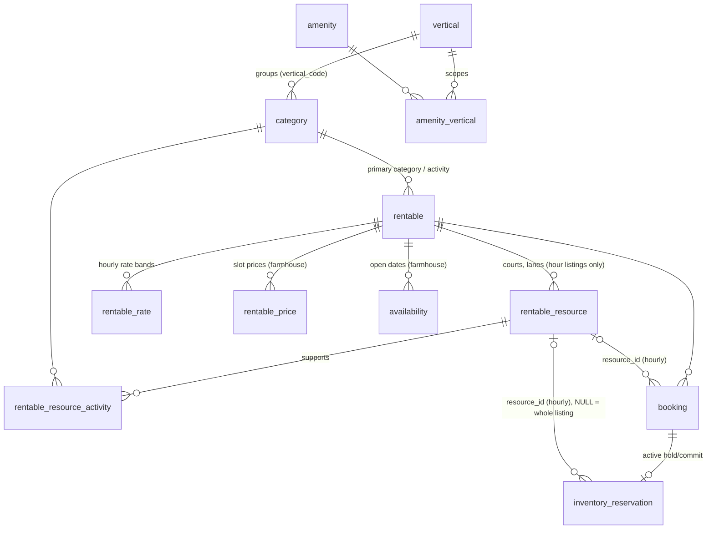

# Rentra — Farmhouse + Entertainment: implementation plan

| | |
|---|---|
| Date | 1 October 2026 |
| Scope | `Rentra/` (Next.js 16 frontend) and `rentra-backend/` (Express + Drizzle + Postgres) |
| Status | Plan only. No code or database was changed while writing it. |
| Audited at | Frontend `6010f94`, backend `bee13c0`. Line references are from these commits and will drift. |
| Audience | Developers implementing the feature, and the owner approving the decisions in §H |

---

## Progress

Phases are delivered one at a time. The owner asks for the next phase after reviewing the previous one. Work happens on branch `feat/entertainment` in both repos and is not committed until the owner asks.

| Phase | Status | Completed |
|---|---|---|
| 1 → Existing System Audit | ✅ Complete (owner gates open, see Phase 1 completion record) | 1 Oct 2026 |
| 2 → Product & UX Architecture | ✅ Complete (owner-approved) | 1 Oct 2026 |
| 3 → Database Architecture | ✅ Complete (local; Neon rehearsal with R1) | 1 Oct 2026 |
| 4 → Backend/API Changes | ✅ Complete (local) | 1 Oct 2026 |
| 5 → Owner Listing Flow | ✅ Complete (local) | 1 Oct 2026 |
| 6 → Homepage & Navigation | ✅ Complete (local; owner screenshot review open) | 1 Oct 2026 |
| 7 → Search & Filters | ✅ Complete (local) | 1 Oct 2026 |
| 8 → Entertainment Detail Page | ✅ Complete (local) | 1 Oct 2026 |
| 9 → Availability, Slots & Pricing | ✅ Complete (local) | 1 Oct 2026 |
| 10 → Booking & Payment Flow | ✅ Complete (local) | 1 Oct 2026 |
| 11 → Dashboards | ✅ Complete (local) | 1 Oct 2026 |
| 12 → Performance & Optimization | ⏳ Next | |
| 13 → QA & Edge Cases | ⬜ Not started | |
| 14 → Migration & Deployment | ⬜ Not started | |

---

## 0. How to read this document

Phases 1–14 follow the order you asked for. Each phase uses the same nine headings:
**Objective → Existing code impact → Database impact → Backend changes → Frontend changes → UX/UI requirements → Edge cases → Testing → Acceptance criteria.**
A heading with nothing to do says "None" rather than being left out.

The cross-cutting inventories come after the phases (§A–§I): what to reuse, modify, add and remove; the database change summary; breaking changes; implementation order; open decisions; and review checklists per role. Phases are ordered by topic. **§G gives the order to build them in**, which is different.

### Glossary

These terms have one meaning throughout the document and the code.

| Term | Meaning |
|---|---|
| **Vertical** | One of the two top-level categories a guest switches between: `farmhouse` and `entertainment`. In code and the database it is a **vertical**. In the UI it is the tab label ("Farmhouse", "Entertainment"). |
| **Category** | The existing `category` table. For farmhouse it is the property type (today only `farmhouse`). For entertainment it is the **activity**: box cricket, pickleball, bowling and so on. Every category belongs to exactly one vertical. |
| **Activity** | An entertainment category, seen from the guest's side ("What are you playing?"). |
| **Resource** | One bookable unit inside an entertainment venue: a court, lane, turf, station or track. New table `rentable_resource`. A farmhouse has no resources; the whole property is the unit. |
| **Slot booking** | Today's model. The guest picks dates and one fixed window (`day`, `night`, `full_day`) that the owner defines. `rentable.rental_unit = 'slot'`. |
| **Time booking** | The new model. The guest picks a date, a start time and a duration on a grid, and a resource is assigned. `rentable.rental_unit = 'hour'`, `booking.slot = 'hourly'`. |
| **Operating day** | The calendar date whose opening hours contain the booking's start. A gaming zone open 6 PM–2 AM on Saturday has Saturday as the operating day for a 1 AM end. |
| **Step** | The granularity of start times on the grid: 30 or 60 minutes. |
| **Buffer** | Changeover minutes blocked before or after a booking. This already exists for slots (`bufferBeforeMinutes`/`bufferAfterMinutes`). |

---

## 1. Executive summary

### What the audit found

1. **The core data model was already built for more than farmhouses.** The main table is `rentable`, not `properties`. Categories carry `form` and `default_rental_unit`, and listings carry `rental_unit`, `fulfilment` and `total_units` (`rentra-backend/src/services/db/schema/index.js:685-798`). Nothing reads those columns yet. The design brief was "goods rental is a feature, not a rewrite", and the same applies to entertainment.
2. **The booking engine is already interval-based.** Every visit stores `starts_at`/`ends_at` plus buffer-inclusive `blocked_start_at`/`blocked_end_at`. Double booking is stopped by a Postgres GiST exclusion constraint on `tstzrange(blocked_start_at, blocked_end_at)` (`drizzle/0008_customer_reservations.sql:167-169`). An hourly booking is just a different interval, so the hardest guarantee (no double booking, enforced by the database) carries over.
3. **What blocks entertainment today:**
   - Slots are a closed set (`day | night | full_day`) in DB enums, Zod schemas, code and UI.
   - Every listing is one exclusive unit: `units = 1`, `resource_key = 'property'`, `total_units = 1`, and the exclusion constraint is keyed on the listing only.
   - Discovery, cards, the listing page, the partner wizard, checkout copy and the home page assume a farmhouse.
   - `farmhouse` is hard-coded as a slug in at least three places.
4. **Dated search takes the listing write lock on every candidate.** `previewBookingQuote` → `withListingInventory` (`booking/quotes.js:102-105`). Quote creation does the same, and the lock `FOR UPDATE`s every order, booking and reservation the listing has ever had (`booking/inventory.js:67-71`). Farmhouses survive this at today's volume. An hourly venue with 20–40 bookings a day will not. This must be fixed as part of the entertainment work (Phase 12, items P1–P3).
5. **Two deployment hazards exist before any entertainment code is written:**
   - Migrations 0040–0051 are merged locally but not applied to the hosted Neon database (`docs/DATABASE-REVIEW.md` §20).
   - `drizzle-orm`'s migrator applies **all pending migrations in one transaction** (`node_modules/drizzle-orm/pg-core/dialect.js:60-71`). Postgres refuses to use an enum value in the same transaction that added it (error `55P04`). Any migration that does `ALTER TYPE … ADD VALUE` must not use the new value anywhere else in that release's SQL. The test helper applies one transaction *per file* (`test/helpers/disposable-db.js`), so this bug would pass the tests and fail in production.

### Decisions this plan takes (owner can overturn any of them in §H)

| # | Decision | Why |
|---|---|---|
| 1 | One `rentable` table for both verticals. No `entertainment_listing` table. | Reviews, payouts, documents, support, disputes, saved places, admin review, verification and analytics all hang off `rentable`. A second table would duplicate all of them. |
| 2 | Add a small `vertical` lookup table and `category.vertical_code`. Each entertainment activity is a `category` row. | Categories already drive SEO routes (`/[city]/[category]`), filters and the admin catalogue. `/surat/box-cricket` starts working with no new route code. |
| 3 | An entertainment listing is a **venue**. Its courts, lanes and stations are `rentable_resource` rows, and each resource lists the activities it supports. | Multi-sport turfs (cricket and football in the same cage) are common. Modelling the court as the bookable thing stops the same turf being sold twice under two listings. The per-listing mutex keeps working because everything stays inside one listing. |
| 4 | The booking model is chosen by the existing `rentable.rental_unit` column: `'slot'` (farmhouse, unchanged) or `'hour'` (new). | This reuses a column that already exists, is copied from the category on create, and is immutable after category creation (`catalogues/service.js:346-347`). |
| 5 | Hourly bookings reuse `booking`, `booking_order`, `booking_quote`, `inventory_reservation`, payments, refunds and payouts. The additions are `booking.resource_id`, `inventory_reservation.resource_id` and the enum value `booking_slot = 'hourly'`. | The money and lifecycle code is the most tested and riskiest code in the system. It stays as it is. |
| 6 | The exclusion constraint becomes per *(listing, resource)*. Farmhouse rows keep `resource_id = NULL`, so their behaviour is identical. | The database still guarantees one court cannot be sold twice. |
| 7 | Prices for hourly venues live in a new `rentable_rate` table: per activity, weekday or weekend, and time band (e.g. "Peak 6–11 PM ₹1,200/hr"). | This mirrors the existing `rentable_price` weekday/weekend design, plus time bands, which every sports-booking app uses. |
| 8 | Open days for hourly venues come from **weekly opening hours** in `booking_config`, not from `availability` rows. Closures are owner blocks. | Sports venues are open every day by default. Making owners "open dates" one by one is a farmhouse habit. `DATABASE-REVIEW.md` §8 already lists rule-based open dates as the intended future. |
| 9 | URLs: `/` stays the Farmhouse home (its layout is locked), and a new `/entertainment` route is the Entertainment home. `/search?vertical=entertainment` handles search, and `/[city]/[activity]` handles SEO landing pages. The header tabs are plain links. | This is the Airbnb pattern (`/`, `/experiences`, `/services`). Both homes stay static and ISR-cached, and each tab is a crawlable URL. A `?tab=` query would make the home page dynamic. |
| 10 | The vertical has a launch switch, `vertical.status`: `hidden` → `partners` → `public`. Tabs render only when two or more verticals are `public`. | The backend and frontend deploy separately (Render and Vercel). The switch lets venues onboard and be reviewed before guests see anything, and switching it back hides the vertical instantly. |
| 11 | **V1 scope is exclusive time rental.** One booking takes one whole resource for a time range. That covers box cricket, pickleball, badminton, bowling lanes, football and multi-sport turfs, gaming stations and rooms, and private hire of a trampoline arena or kart track. **Per-person ticketed sessions** (60 jumpers sharing one trampoline session) are designed in Phase 15 and deferred. | Shared capacity needs a sum-based capacity rule that a GiST exclusion constraint cannot enforce. Shipping exclusive rental first keeps the database guarantee simple. |
| 12 | V1 allows one time-booked visit per order: one court, one contiguous time range. Booking several courts or several separate hours in one checkout is V2. | This keeps the existing unique index `booking_order_localday_slot_idx (order_id, local_day, slot)` valid with no change. The V2 change is described. |

### What ships in V1 and what is deferred

**V1 ships:**
- vertical tabs in the header
- the Entertainment home
- entertainment search, filters and cards
- the venue detail page with a time-slot picker
- hourly quote → hold → pay → confirm
- hour-based cancellation bands
- reminders adjusted for same-day bookings
- the partner wizard for venues, covering courts, opening hours, hourly rates and venue documents
- a partner day timeline for each venue
- admin catalogue support for verticals, activities and amenity scopes
- admin review of venue submissions
- staff, customer and admin booking displays showing the time and court
- the launch switch
- the performance fixes P1–P4

**Deferred:**
- per-person ticketing (Phase 15)
- multi-court or multi-hour carts (V2)
- date-specific hourly price overrides (Phase 9, optional table `rentable_rate_override`)
- recurring weekly bookings
- an "All" tab
- coaching or membership packages

---

## 2. Research: what comparable products do

The owner prefers decisions grounded in what other sites do, so here is a short summary. These are patterns observed in public product flows, not specifications.

| Product | Pattern | What Rentra takes from it |
|---|---|---|
| **Airbnb** (Homes / Experiences / Services) | Icon tabs centred in the header, with an underline on the active one. Each tab is its own URL (`/`, `/experiences`, `/services`). Each tab has its own search fields: Homes uses Where / When / Who, Experiences uses Where / When / Who with a single date range, Services uses Where / When / Type. On scroll the tabs and the big bar collapse into one compact pill. | Link tabs, a separate route per vertical, different search fields per vertical, and the tabs hide when the search docks. Rentra's existing docking (`data-search-docked`) already does the collapse. |
| **Playo, Hudle, KheloMore** (Indian sports-venue booking) | Venue page → choose sport → horizontal date strip → start time → duration (± stepper) → court ("any" or a specific one) → price → pay. Peak and off-peak hourly prices. Venues list sports offered, court count, amenities (floodlights, parking, washrooms, changing rooms, equipment on rent) and opening hours. | The time-slot picker layout, peak/off-peak rate bands, court as the bookable unit, multi-sport venues, and the amenity taxonomy. |
| **BookMyShow / District "Activities"** | Ticketed sessions for trampoline parks, go-karting and gaming arcades: a fixed session start, a quantity of tickets and a per-person price. | This confirms per-person ticketing is a different model. It is deferred to Phase 15 and designed now so the schema does not block it. |
| **Booking.com / MakeMyTrip** | Free-cancellation windows shown on the card and in checkout; price shown before login. | Show the cancellation band in hours on the hourly checkout, and keep "From ₹X/hr" separate from the authoritative quote, as farmhouse already does. |

---

## Phase 1 → Existing System Audit — ✅ Complete (1 Oct 2026)

### Objective

Record what exists, so every later phase changes the real code rather than an assumed design.

### Existing code impact

**Architecture**

| Layer | Facts |
|---|---|
| Repos | Two independent git repos under a plain folder. `Rentra/` is Next 16.3.4, React 19, Tailwind and Redux Toolkit, deployed on Vercel. `rentra-backend/` is Express 4, Drizzle and postgres.js on Neon Postgres, deployed on Render, with a separate worker process (`src/cron`). They deploy separately, so the frontend must tolerate missing API fields. |
| Backend layering | `routes/*.route.js` → `controllers/` (thin) → `services/` (business logic) → SQL through postgres.js tagged templates. Response envelope: `{statusCode, data, message, success, code?, errors?, redirect?, revalidate?}`. Callers branch on `code` (`README.md`). |
| Frontend data | Server components call `lib/api/endpoints.js`. Public reads use `anonymous: true`, so they stay static. Mutations go through Server Actions in `lib/actions/*` → `runApiAction` (`lib/api/action.js:28-64`), which replays the API's `revalidate` paths. Next is **not** on `cacheComponents`, so segment `revalidate` and `fetch` tags apply. `AGENTS.md` requires reading `node_modules/next/dist/docs/` before writing Next code. |
| Shared domain code | `rentra-backend/src/services/domain/*.js` is copied into `Rentra/lib/domain/`. `booking-policy.js` and `listing-share.js` are byte-identical. The others have been reformatted by Prettier, and **`cancellation.js` has drifted in behaviour** (the frontend copy ignores `policy_snapshot.cancellation`). `docs/MIGRATION.md:110-128` still claims the Drizzle schema is mirrored byte-for-byte in the frontend. That is false: `Rentra/lib/db` does not exist. |
| Tests | Both repos use `node:test` with `assert/strict`. Backend DB tests use a disposable local Postgres (`PORTAL_TEST_DATABASE_URL`, `test/helpers/disposable-db.js`). The frontend has no Playwright dependency; regression scripts in `Rentra/scripts/check-*.cjs` run through `playwright-cli`. Journey QA scripts live in `Rentra-Project/qa-redesign-scripts/`. |

**Database (live snapshot in `rentra-full-paste.txt`)**

- 123 `rentable`, 1 `category` (`farmhouse`), 43 `amenity`, 366 `rentable_price`, 28,632 `availability`, 49 `booking`, 15 `booking_order`, 20 `inventory_reservation`.
- The hosted database still has the pre-0041 tables (`person`, `portal_session`, `customer_session`, `otp_token`…), which confirms 0040–0051 are not applied there.

**Booking engine (backend `src/services/booking/`)**

- **Config.** `booking_config` jsonb is validated by `bookingConfigSchema` (`schemas/zod/booking-config.js:19-33`) with strict keys `slots: {day, night, full_day}`. Each enabled slot has start and end times, `endDayOffset`, buffers, capacity, included guests and an extra-guest charge.
- **Quote.** `prepareQuote` (`quotes.js:34-79`) requires `status='live'` and `total_units === 1`. It prices with `priceVisitsMinor` (`domain/booking-money.js`): override, else weekend or weekday rate, plus extra guests, plus an 8% fee. It snapshots the cancellation bands, which are in **days** (`domain/pricing.js:23-27`).
- **Inventory.**
  - `prepareInventoryCheck` (`inventory.js:247-280`) requires an `availability` row for every half (`full_day` = `day` + `night`).
  - It rejects overlaps with owner blocks and with bookings.
  - It rejects `total_units ≠ 1` (`:200`).
- **Hold.** `createCheckoutHold` (`checkout.js:37-88`) inserts `booking_order` (`held`), a `booking` and an `inventory_reservation` per visit, then `payment_order` and `payment_execution`. The hold expires at `min(now + 10 min, first visit start)`.
- **Confirm, expire, cancel.** Confirmation is `settleVerifiedPayment`. Expiry is `expireInventoryHolds`, run by the worker and lazily by writers. Cancellation is `cancellationEntitlement`, which works in milliseconds against the band days.
- **Availability writes.** Only `openBookingDates` (`owner-settings.js:52-66`) writes `availability`, inserting both `day` and `night` for each date.

**Discovery**

- `GET /discovery/search` runs a keyset-batched candidate SQL (`services/db/discovery.js:44-66`), then one full quote per candidate when dates are given, then an in-memory sort and pages of 12.
- `GET /discovery/listings`, `/nearby` and `/similar` always price the **night** slot (`db/queries.js:35-45, 78-81`).
- The registry is `{cities, areas, categories, amenities}` and is not cached on the server.

**Owner flow**

- The wizard has 10 steps (`Rentra/lib/domain/listing-steps.js:29-74`): `basics, location, capacity, amenities, rules, pricing, terms, photos, ownership, review`.
- `capacity` requires `farmSize` (`listing-completion.js:92`).
- Booking hours are edited on the calendar page, not in the wizard (`BookingCalendarSettings.jsx`).
- The category is picked from a select on `NewListingStart.jsx:132-156`.
- On create, the backend copies `category.form` → `rentable.form`, derives `fulfilment`, and copies `default_rental_unit` → `rentable.rental_unit` (`auth/listings.js:156-202`).

**Homepage and navigation**

- The home is locked: full-bleed `HeroPhotos` with `SearchBar` and intent chips, `TrustStrip`, `CityRow` "Near {City}" rails, `OccasionPicker`, city chips, an owner CTA and a dark footer (`Rentra/app/(marketing)/page.js`, `RENTra-UI-REDESIGN-PLAN.md`, `DESIGN.md`).
- The header is one fixed 68px row: logo, the docked search pill (invisible until docked), navigation and "List your place" (`components/rentra/SiteChrome.jsx:38-60`).
- No category or tab concept exists anywhere.

**Dashboards**

- **Partner:** dashboard KPIs, property table, bookings list and detail, portfolio calendar (week/month/agenda with Day/Night lines) and a per-listing calendar with schedule, price-override and block forms.
- **Customer:** bookings list (no time shown), booking detail (`date · slot label · guests`, arrival and departure), cancel, book again (slot select) and reviews.
- **Admin:** properties review (Gate 2), verification, catalogues (cities, areas, categories, amenities), bookings, finance and operations.
- **Staff (caretaker):** assigned visits and evidence capture.

**Auth and roles**

- `"user".role` ∈ `customer | client`, enforced by a lookup FK. Clients go through Gate 1 (`client_application`) and must be `active` to write listings. Admins are a separate `admin_user` with capability permissions. Caretakers are `client_staff`.
- Guards: `requireRole`, `requireActiveClient`, `requireAdmin`, `requirePortalCapability` (`middlewares/auth.middleware.js`).
- **Entertainment needs no new role.** A venue owner is a `client` like a farmhouse owner.

**Hard-coded farmhouse assumptions that must change**

| Where | What |
|---|---|
| `Rentra/app/(marketing)/page.js:52,111,143` | `registry.categories.find(c => c.slug === 'farmhouse')`, and `/farmhouse/intent/...` links. |
| `Rentra/components/rentra/SiteChrome.jsx:110` | Footer "Farmhouses near you" uses the `farmhouse` category. |
| `Rentra/components/rentra/CityRow.jsx:49-54` | "Luxury farmhouses near {city}…" |
| `Rentra/components/rentra/listing/ListingSections.jsx:60-89, 408` | KeyFacts Guests/Bedrooms/Farm size/Pool; `{categoryName ?? 'Farmhouse'} owner`. |
| Listing page copy | "About this farmhouse", "What this farm has", "Similar farmhouses near {area}", `LodgingBusiness` JSON-LD, OG alt "Rentra farmhouse listing". |
| `Rentra/components/customer/Checkout.jsx:139-146` | Purpose presets (Pool day, Pre-wedding shoot…). |
| `Rentra/components/customer/checkout/parts.jsx:37-42, 153-178` | "next day" only for `night`; StayFacts Dates/Visit type/Guests. |
| `Rentra/components/rentra/ListingCard.jsx:56-58` | `Up to N guests · N BR`. |
| `Rentra/lib/domain/discovery.js:14-49` and backend copy | `DISCOVERY_INTENTS` are all farmhouse, not scoped by vertical; the slot parser defaults to `night`. |
| Slots outside `SLOTS` | `slot-icons.js:4`, `PricingSection.jsx:6-10`, `BookingCalendarSettings.jsx:25`, `checkout/parts.jsx:40`, `discovery.js:126`. |
| Backend `db/queries.js:35-45, 78-81, 337-341` | Night-only card prices and next dates. |
| Backend `schemas/zod/listing.js:84-90`; `domain/listing-completion.js` | `farmSize` required. |
| Backend `admin/verification.js:20-27` | Checklist wording about "guests" and the "property". |
| Backend `seed-amenities.js` | An amenity *group* already uses the slug `entertainment` (dj_allowed, sound_system…). Its label will collide with the new tab name in admin and partner screens. |

### Database impact

None in this phase. Phase 3 lists the changes.

### Backend changes

None. Problems found during the audit that should be fixed regardless of entertainment:
- `src/scripts/seed-gujarat-partners.js:7` has a fallback database URL with credentials. **Rotate it and remove the fallback.**
- `src/scripts/seed.js:146-154` creates `admin@gmail.com` / `Admin@123`. Guard every seed with `NODE_ENV !== 'production'` and a confirmation prompt.
- `location.approachNote` is validated but never stored (`auth/listings.js:239-260`).
- The `PortfolioCalendar.jsx:239` "Owner closed" branch reads a column dropped in 0045.

### Frontend changes

None.

### UX/UI requirements

None.

### Edge cases

- Docs that no longer match the code: `DESIGN.md:321` (DiscoveryFilters summary pill), `DESIGN.md:250/329` ("hero never autoplays", but `HeroPhotos` auto-advances every 3s), `MIGRATION.md` (schema copy rule), and the README test counts. Treat the code as the source of truth and fix the docs while implementing.

### Testing

Before starting, record a baseline:
- `npm test` in both repos
- `npm run smoke` (backend)
- `npm run ci` (frontend)
- `Rentra/scripts/check-*.cjs`
- `qa-redesign-scripts` journeys

Every later phase must keep these green.

### Acceptance criteria

- The team agrees on this audit.
- The hosted database has had 0040–0051 applied (§20 runbook) before any Phase 3 migration is written against it.

### Completion record (1 Oct 2026)

**Baseline recorded before any change.** The hosted Neon database was not touched. Backend tests ran with `DATABASE_URL` and `PORTAL_TEST_DATABASE_URL` pointed at a disposable local Postgres 14 on `127.0.0.1:55432`, because `npm test` loads `.env`, which points at Neon.

| Check | Before | After Phase 1 |
|---|---|---|
| Backend `npm test` | 144 tests: 141 pass, 3 skipped, 0 fail | 145 tests: 142 pass, 3 skipped, 0 fail (new seed-guard test) |
| Backend `npm run db:check` | 52 migrations verified | Same |
| Backend `npm run lint` | **Red before this work:** 512 problems (508 `prettier/prettier`, 2 `no-unused-vars`, 1 `prefer-const`, 1 `no-console`) | 510. The removed file carried 2; no new problems |
| Frontend `npm test` | 36 pass | 36 pass |
| Frontend `npm run lint` | **Red before this work:** 55 problems (54 `prettier/prettier` and 1 `@next/next/no-assign-module-variable`, all in `scripts/design/theme-*.mjs`) | 55, unchanged |
| Frontend `next build` (isolated `RENTRA_BUILD_FIXTURE=1`) | Pass; `/` is static with a 5-minute revalidate, which confirms the audit's ISR inference | Pass |
| Backend `npm run smoke`, journey scripts | Not run: smoke boots against the hosted database, and the journeys need the full QA stack | Not run |

Because `npm run ci` fails on these pre-existing lint errors in both repos, CI is not a usable gate until someone formats the repos. That should be a separate formatting-only commit, to avoid diff noise for concurrent work.

**Changes made** (uncommitted, branch `feat/entertainment`):

| Repo | File | Change |
|---|---|---|
| backend | `src/scripts/seed-guard.js` **(new)** | `seedDatabaseUrl(script)`. It requires `DATABASE_URL` and has no fallback. It refuses `NODE_ENV=production`, and refuses any non-local host unless `SEED_ALLOW_HOST=<that exact host>` is set. |
| backend | `src/scripts/seed.js`, `seed-gujarat-partners.js`, `seed-owner-listings.js`, `seed-amenities.js` | Connect only through `seedDatabaseUrl`. **The hard-coded Neon URL with credentials was removed from `seed-gujarat-partners.js`.** Verified: `npm run db:seed` and `npm run seed:partners` now refuse the Neon host from `.env`. `seed-admin.js` is unchanged, because it is the intended way to create a production admin. |
| backend | `src/scripts/check-db.js` **(deleted)** | An unreferenced debug script holding a second hard-coded Neon URL with credentials. |
| backend | `test/scripts/seed-guard.test.js` **(new)** | Covers local allow, missing URL, remote refusal, wrong opt-in host, correct opt-in, production refusal and an invalid URL. |
| backend | `docs/MIGRATION.md` | The shared-schema section is rewritten to match reality: there is no frontend schema copy; migrations are hand-written SQL because the snapshots stop at 0039; the single-transaction migrator and the `55P04` enum hazard; the domain-copy rule. The CORS paragraph is corrected (allowlist through `CORS_ALLOWED_ORIGINS`, not "echoes every origin"). |
| backend | `README.md`, `docs/API.md` | Test count (145) and route count (291, from `npm run routes`). CORS wording corrected. `API.md`'s route list is flagged as incomplete. |
| root | `Rentra-Project/README.md` | The CORS variable name is corrected to `CORS_ALLOWED_ORIGINS`. |
| frontend | `components/partner/PortfolioCalendar.jsx` | Removed the "Owner closed" branch, which read `blocked_by_client`, a column dropped in 0045. |
| frontend | `lib/domain/booking-availability.js` | Removed `legacyAvailabilityDays`. It had no callers, read the dropped `blockedByClient`, and would have reported every date as closed. The backend copy had already removed it. |

**Owner actions still open.** These are gates for later phases, not blockers for Phase 2:

1. **Rotate the Neon database password now.** Two scripts committed it to git history (`seed-gujarat-partners.js`, `check-db.js`). Removing the files does not remove it from history, and anyone with repo access can read it. Rotate it in the Neon console, then update `.env` and the Render environment variables.
2. **Apply migrations 0040–0051 to Neon** using the `DATABASE-REVIEW.md` §20 runbook, before Phase 3 migrations are written against it. This is release R0 in Phase 14. I did not run it, because it changes production.
3. ~~Decide `location.approachNote`~~. Decided 1 Oct 2026: remove the field (Phase 5).
4. ~~`DESIGN.md` drift~~. Fixed in Phase 2: autoplay confirmed as intended.
5. ~~Agree the audit~~. Agreed by the owner on 1 Oct 2026.

---

## Phase 2 → Product & UX Architecture — ✅ Complete (1 Oct 2026)

### Objective

Define how two verticals with different booking models share one product without duplicating it. That covers information architecture, URLs, the tab behaviour, the search model, page composition, copy and accessibility.

### Existing code impact

This phase extends the locked home and header (`DESIGN.md` header spec at `:249`, and the redesign plan's ground rule 1). The owner has explicitly asked for header tabs, so they are an approved change to the locked composition. Nothing else on the farmhouse home changes. Update `DESIGN.md` and `RENTra-UI-REDESIGN-PLAN.md` to record it (decision D12 in the plan's numbering).

### Database impact

None. Phase 3 holds the data model.

### Backend changes

None.

### Frontend changes

Phases 6–11 hold the frontend changes. This phase only fixes the contracts they implement.

### UX/UI requirements

**Information architecture**

```
Rentra
├── Farmhouse  (vertical, slot booking)         /                     ← existing home, unchanged layout
│   └── farmhouse (category)                    /surat/farmhouse, /surat/farmhouse/area/vesu, …/intent/with-pool
└── Entertainment (vertical, time booking)      /entertainment
    ├── box-cricket                             /surat/box-cricket
    ├── pickleball, badminton, bowling, turf, gaming-zone, trampoline-park, go-karting …
    └── vertical landing                        /surat/entertainment  (all activities in a city)
Search                                          /search?vertical=farmhouse|entertainment&…
Listing                                         /listing/{slug}-{code}   (one route; page adapts by vertical)
```

**URL rules**

- `vertical` defaults to `farmhouse` everywhere (API and UI), so every existing link and bookmark keeps its meaning.
- A category implies its vertical. If `category` and `vertical` disagree, the API answers `422 VERTICAL_MISMATCH`. The UI never builds a mismatched URL.
- **When a tab is switched on `/search`:**
  - keep `city`, `area` and the first date (`dates[0]` ↔ `date`);
  - drop `slot`, `mode`, `guests` and `amenities` (farmhouse to entertainment), or `category`, `start`, `duration` and `players` (entertainment to farmhouse);
  - drop `min`/`max`, because the price units differ (per visit vs per hour).
- **Tabs on other pages** link to the vertical's home (`/` or `/entertainment`).

**Header tabs** (the reference image)

```
md+ (not docked)   [logo]          [🏡 Farmhouse]  [🏏 Entertainment]           Explore  Saved  Bookings  (avatar)   List your place
                                    ‾‾‾‾‾‾‾‾‾‾‾‾‾                         ← 2px underline on active tab
md+ (docked)       [logo]          [ Surat · Box cricket · Sat 4 Oct · 6 PM  🔍 ]   …nav…
< md               [mark] [pill……………………] [nav]        tabs move into the page (hero top / above search fields)
```

- Each tab is an icon plus a short label. This follows the owner's stated preference for icons with short labels.
- Tabs are links using `aria-current="page"`, **not** an ARIA `tablist`, because they navigate between routes. The customer bookings tabs already use this pattern (`BookingHistory.jsx:72-91`).
- **Placement on md+:** the centre of the 68px header row, which today is empty until the search pill docks. When `[data-search-docked]` is set, the tabs fade out and the pill fades in, using the existing `docked:` CSS variant. No header height values change. This matters because the header height is coupled to `SearchBar.jsx:39`, `HeaderSearch.jsx:178`, `ScreenSkeleton.jsx:276` and the listing rail's `top-20`.
- **Placement below md:** a two-item tab row at the top of the hero, above the search bar, and above `SearchFields` on `/search` and taxonomy pages.
- **Which pages show tabs:** `/`, `/entertainment`, `/search` and taxonomy pages. Listing, saved, help, checkout, customer and portal pages do not.
- Tabs render only when the registry returns two or more `public` verticals (the launch switch).
- **Icons:** two custom duotone SVGs in the Emerald & Champagne tokens: a farmhouse with a tree, and a cricket bat with a ball. Size 28–32px, inline, no extra requests. On hover the icon lifts 2px over 150ms with an ease-out; there is no animation under `prefers-reduced-motion`. Airbnb's 3D illustrations are not copied; `PRODUCT.md` says not to imitate another marketplace.

**Search model per vertical**

| | Farmhouse (unchanged) | Entertainment (new) |
|---|---|---|
| Segment 1 | Where (city/area) | Where (city/area). The same panel is reused. |
| Segment 2 | When (single / consecutive / separate dates, ≤10) | **What**: an activity icon grid from the registry ("What are you playing?") |
| Segment 3 | Visit type (`SLOTS`) | **When**: a single date with quick chips Today, Tomorrow, This weekend, plus the calendar |
| Segment 4 | Who (guests) | **Time**: Any time / Morning (6–12) / Afternoon (12–5) / Evening (5–9) / Late (9+), plus an optional exact start, plus duration (1 hr default, ± stepper) |
| Filters panel | q, property type, price per visit, cancellation, amenities | q, activity, **price per hour**, indoor/outdoor, players, cancellation, amenities scoped to entertainment |
| Card | `Up to 12 guests · 3 BR · highlight`, "From ₹X / night" | `Box cricket · Pickleball · 3 courts`, "From ₹800 / hr". When a date is set: the next three free start times as chips. |

**Entertainment home**

It keeps the locked skeleton, so both homes feel like one product:
1. **Hero.** `HeroPhotos` uses entertainment listing photos. Until three or more live venues have photos, it falls back to curated local images, which carry no listing claim. Eyebrow: "Turfs, courts and play zones across Gujarat". H1: "Book a court, lane or game in minutes." Then the entertainment search bar, then activity chips (`/{city}/{activity}`).
2. **TrustStrip** with entertainment items. Only true claims are allowed, e.g. "Live court availability", "Price shown before you pay", "Cancellation window shown upfront". "Verified" may be used only where `physicallyVerified` is true.
3. **CityRow** per city: "Play near {City}".
4. **ActivityPicker** replaces OccasionPicker: "What are you playing?" as a tile grid of activities that have at least one live venue in the selected city.
5. "Explore by city" chips → `/{city}/entertainment`.
6. Owner CTA: "Own a turf, court or play zone?" → `/partner/login`.
7. The same dark footer, with a second column "Play near you".

**Venue detail page (wireframe)**

```
[gallery]
Smash Arena · Vesu, Surat        ★ 4.6 (38)   ♡  ⤴     [Verified]
[🏏 Box cricket] [🥒 Pickleball]                                      ┌──────── rail (sticky) ─────────┐
3 courts · up to 12 players · Artificial turf · Outdoor · Open today 6 AM–1 AM  │ Activity  [Box cricket ▾]        │
About this venue …                                                    │ Sat 4  Sun 5  Mon 6  Tue 7 …    │
Courts:  Court 1 (40×80 ft, turf, floodlit)  Court 2 …                │ Duration  [−] 1 hr [+]          │
Opening hours (today highlighted)                                     │ 6 PM ₹1,200 · 7 PM ₹1,200 · …   │
Prices: Weekday 6 AM–6 PM ₹800/hr · 6 PM–1 AM ₹1,200/hr; Weekend …    │ Court  [Any available ▾]        │
Amenities · Venue rules · Reviews · Host · Cancellation · Map · Similar venues   │ Total ₹1,296  [Reserve]         │
                                                                      └─────────────────────────────────┘
```

**Copy rules**

- Never say "guests", "stay", "night" or "check-in" on entertainment surfaces. Use "players", "booking", "time" and "arrive by".
- Show times in 12-hour form with "next day" when the end falls after midnight: "11:00 PM – 1:00 AM (next day)".
- One label source per concept: `SLOTS` for farmhouse slots, `describeVisit()` for any visit (Phase 10).

**Accessibility**

- Touch targets are at least 44px for the tabs, time chips and stepper. Focus is visible.
- Each time chip has a full accessible name, e.g. "6:00 PM, ₹1,200, 2 courts free". Chips use `aria-pressed`.
- Use `role="group"` with a label on each picker cluster. Respect reduced motion.
- No horizontal page overflow at 390px and 1440px. axe WCAG AA must report 0 violations (`RENTra-UI-REDESIGN-PLAN.md:57-58`).

### Edge cases

- **Only one public vertical:** no tabs are rendered, so production looks exactly as it does today.
- **A city with farmhouses but no venues:** the Entertainment home and search show an honest `EmptyState` ("No venues in Surat yet"), a link to other cities and the owner CTA. Nothing is fabricated.
- **A guest lands on `/surat/box-cricket` from Google while the vertical is `partners`:** answer 404, not an empty page.
- **The amenity group label "Entertainment"** (DJ, sound system) collides with the tab name. Relabel the group "Music & games" in `AmenitiesSection.jsx:6-15`; the slug stays.

### Testing

- Design review of tabs, home and detail at 390, 768, 1024 and 1440px, in light and dark if dark is enabled.
- Owner sign-off on screenshots before Phase 6 is merged. The owner picks design pieces one at a time; see `project-home-ui-restore` memory and the redesign plan.

### Acceptance criteria

- The owner approves: tab placement and icons, the Entertainment home composition, the venue page wireframe, and the decisions in §H.
- `DESIGN.md` and the redesign plan record the change to the header.

### Completion record (1 Oct 2026)

**Owner decisions** (answered 1 Oct 2026):

| Question | Answer |
|---|---|
| Header tab design (icon + label, ink underline, centred, fading to the docked pill, hero pill links on mobile) | **Approved as shown** |
| Hero autoplay vs `DESIGN.md` "never autoplay" | **Keep autoplay.** `DESIGN.md` now matches the code |
| §H defaults D1–D12 | **All accepted** (§H marked confirmed) |
| `location.approachNote` (validated, never stored) | **Remove the field.** Scheduled in Phase 5 |

**Deliverables** (uncommitted, branch `feat/entertainment`):

| File | What |
|---|---|
| `docs/design/entertainment/` **(new)** | Static review mockups built from the `DESIGN.md` tokens and the local Plus Jakarta Sans: `farmhouse-header.html` (tabs on the locked home, `?docked=1` for the docked state), `entertainment-home.html` and `venue.html` (`?sheet=1` for the mobile picker sheet). Shared `mock.css`, `chrome.js` and `icons.js`. `icons.js` holds the **draft SVGs to port in Phase 6**: the two duotone tab icons and eight 24px activity icons (cricket, pickleball, badminton, bowling, football, gaming, trampoline, kart), plus UI icons. Every page carries a "mockup, sample data" banner, and striped boxes stand in for photos, so no fake listing could be mistaken for real. |
| `docs/design/entertainment/shots/` **(new)** | 9 screenshots at 2× scale: header at 1440, 1024 and 390, docked at 1440; Entertainment home at 1440 and 390; venue page at 1440 and 390, plus the 390 sheet. |
| `DESIGN.md` | Header line updated (68/60px, tabs in the centre until docked, coupled heights). Hero autoplay is recorded as intended (two places). The *Discovery search* section is rewritten to match the shipped docking `SearchFields` and `HeaderSearch` pill. New sections: *Vertical tabs*, *Vertical vocabulary*, *Entertainment pieces*. |
| `RENTra-UI-REDESIGN-PLAN.md` | Decisions **D12** (header vertical tabs, hidden while only one vertical is public) and **D13** (autoplay intended). Ground rule 1 notes the header may carry the tabs. |
| `PRODUCT.md` | "Open Decisions" records the approved Entertainment vertical, and that it stays unbookable until launch. |

**Verification**

- All mockup pages load with no script errors, no failed requests and **no horizontal overflow at 390, 1024 and 1440px**. This was checked with Playwright on system Chrome.
- Two layout faults were found and fixed during review:
  - With absolute centring, the tabs collided with the navigation at 1440. They are now centred in the free space between the logo and the navigation.
  - The docked pill overlapped the navigation labels. The navigation now folds to icons when docked, as `CustomerNavigation` already does.
- A venue-page grid min-width overflow at 390 was also fixed.
- `npx prettier --check` passes on `DESIGN.md`, `RENTra-UI-REDESIGN-PLAN.md` and `PRODUCT.md`.
- No application code was changed in this phase, so the test, lint and build results from Phase 1 still apply.

**Not done in this phase (by design):**
- No component code. `VerticalTabs`, the icon components and the Entertainment home are built in Phase 6.
- No axe run on the mockups. axe applies to the real components in Phases 6–8.

**Gate for Phase 3:** Neon must be on migration 0051 (release R0). The owner should also have rotated the leaked database password.

---
## Phase 3 → Database Architecture — ✅ Complete (1 Oct 2026)

### Objective

Add entertainment to the existing normalised schema: one listing table, one booking ledger, and one double-booking guarantee. Only the facts that really differ get new structure: verticals, resources, activities per resource, hourly rates and opening hours.

### Existing code impact

- **Drizzle schema** `rentra-backend/src/services/db/schema/index.js`: new tables, new columns and two enum values.
- **Exclusion constraint** `reservation_active_overlap_excl`: replaced. It is custom DDL, and Drizzle does not model it (`0008:163`).
- **Trigger functions:**
  - `catalogue_reference_guard` (0035) is replaced to add vertical and booking-model checks.
  - `version_listing_child` (0025) is attached to the new child tables.
  - `rentra_notification_event` (0017) is replaced in Phase 10.
- **Operations overlap monitors** (`services/operations/overview.js:20`, `incidents.js:50`) join reservations on `rentable_id` + `resource_key`. Once one listing has several courts, they would report **false double bookings**, so they must also key on `resource_id`.
- **Seeds:** new `src/scripts/seed-entertainment.js`. The existing seeds stay as they are.

### Database impact

#### Entity relationships after the change



#### Why this shape

| Option considered | Verdict |
|---|---|
| Separate `entertainment_venue` and `entertainment_booking` tables | **Rejected.** The following all reference `rentable` or `booking` and would be duplicated: reviews, payouts, statements, documents, support, disputes, booking cases, saved places, visit evidence, notifications, admin review and verification. |
| Category hierarchy (`category.parent_id`), with top-level categories as verticals | **Rejected.** The existing `farmhouse` category would be both a vertical and a leaf, and every category query would need recursion. A two-row lookup is clearer. |
| Vertical as a Postgres enum | **Rejected.** New values need `ALTER TYPE`, which has the one-transaction hazard. `DATABASE-REVIEW.md` §13 prefers `varchar` + CHECK or a lookup table for new work, as `role` already does. |
| One listing per activity product (a "cricket" listing and a "football" listing for the same turf) | **Rejected.** The same physical turf could be sold twice, because the mutex and the exclusion constraint are per listing. A venue with resources keeps every conflict inside one listing. |
| Store the booking model on the vertical | **Rejected.** `category.default_rental_unit` → `rentable.rental_unit` already exists and is immutable. A vertical may hold both models later, e.g. a party hall sold by day slots under Entertainment. |

#### New and changed objects

Every new discriminator uses `varchar` + CHECK. The only enum changes are two `ADD VALUE`s that existing columns need.

**1. `vertical`** (new lookup)

| Column | Type | Rule |
|---|---|---|
| `code` | `varchar(24)` PK | `^[a-z][a-z0-9_]*$`; `farmhouse`, `entertainment` |
| `slug` | `varchar(40)` unique | URL slug; must not equal any category slug of *another* vertical (service check) |
| `name` | `varchar(60)` | Tab label |
| `status` | `varchar(12)` | CHECK `hidden \| partners \| public`. `hidden`: nobody sees it. `partners`: owners can create listings and admins can review. `public`: guests see it. |
| `sort_order` | `integer` | Tab order |
| `version` | `integer` | Optimistic concurrency for admin edits (catalogue pattern) |
| `created_at`, `updated_at` | `timestamptz` | |

**2. `category`** (changed)
- `vertical_code varchar(24) NOT NULL DEFAULT 'farmhouse' REFERENCES vertical(code)`. Backfilled to `farmhouse`; the default keeps older writers valid, and the admin form passes it explicitly from Phase 4. **Immutable** after create, like `form` and `rental_unit` (`catalogues/service.js:346-347`).
- `icon_key varchar(40) NULL`. One of a fixed set that the frontend ships (`cricket`, `pickleball`, `bowling`, `football`, `badminton`, `gaming`, `trampoline`, `kart`, `farmhouse`…). An unknown key falls back to a generic icon.
- Index `category_vertical_idx (vertical_code, is_active, sort_order)`.

**3. `amenity_vertical`** (new join)
- Columns `(amenity_id, vertical_code)` PK. An amenity can belong to both verticals (parking, CCTV, first aid, Wi-Fi, wheelchair access, drinking water, generator, floodlights).
- Backfill: every existing amenity → `farmhouse`.

**4. `rental_unit` enum:** `ADD VALUE 'hour'`.

**5. `booking_slot` enum:** `ADD VALUE 'hourly'`.

**6. `rentable_resource`** (new): courts, lanes, stations, turfs.

| Column | Type | Rule |
|---|---|---|
| `id` | `uuid` PK | |
| `rentable_id` | `uuid` FK → `rentable` `ON DELETE RESTRICT` | Bookings reference resources, so a listing with resources is never cascade-deleted. |
| `name` | `varchar(60)` | Unique per listing, case-insensitive ("Court 1", "Lane 4", "PS5 Room A") |
| `capacity` | `integer` | 1–500; maximum players |
| `is_indoor` | `boolean NULL` | NULL means not stated |
| `details` | `jsonb` | Object. Activity-specific facts validated by Zod (`size`, `surface`, `format` such as "6-a-side", `equipment` such as "PS5"). Never used for booking logic. |
| `sort_order`, `is_active` | | Inactive resources are never sold. Deactivation is refused while future active bookings exist. |
| `created_at`, `updated_at` | | |

Unique `(id, rentable_id)` exists for composite FKs. This mirrors `area_id_city_idx`.

**7. `rentable_resource_activity`** (new)
- `(resource_id, rentable_id, category_id)`, PK `(resource_id, category_id)`.
- FK `(resource_id, rentable_id)` → `rentable_resource(id, rentable_id)` `ON DELETE CASCADE`.
- `rentable_id` is stored so the generic `version_listing_child()` trigger works unchanged.

**8. `rentable_rate`** (new): hourly rate bands.

| Column | Type | Rule |
|---|---|---|
| `id` | `uuid` PK | |
| `rentable_id` | FK `ON DELETE CASCADE` | Same as `rentable_price` |
| `category_id` | FK → `category` | The activity this band prices |
| `day_kind` | `varchar(8)` | CHECK `weekday \| weekend` (Sat/Sun, as `booking-dates.js:43-46` defines it) |
| `start_minute` | `smallint` | 0–1439, minutes from local midnight of the operating day |
| `end_minute` | `smallint` | `> start_minute` and ≤ 1800 (06:00 next day, for venues open past midnight) |
| `hourly_rate_minor` | `bigint` | Paise per hour, 0–50,000,000 (`minor()` helper) |

Exclusion `rentable_rate_no_overlap`: `rentable_id =, category_id =, day_kind =, int4range(start_minute, end_minute) &&`. Bands for one activity and day kind cannot overlap. Full coverage of opening hours is checked by the service, because a constraint cannot know the hours.

**9. `booking`** (changed)
- `resource_id uuid NULL`, FK `(resource_id, rentable_id)` → `rentable_resource(id, rentable_id)`.
- CHECK `booking_resource_slot_chk`: `(slot::text = 'hourly') = (resource_id IS NOT NULL)`.
- Partial index `booking_resource_start_idx (resource_id, starts_at) WHERE resource_id IS NOT NULL`.

**10. `inventory_reservation`** (changed)
- `resource_id uuid NULL`, FK `(resource_id, rentable_id)` → `rentable_resource(id, rentable_id)`.
- `NULL` means the whole listing. That is every farmhouse row, and a venue-wide owner closure.
- Exclusion constraint rebuilt on `(rentable_id, COALESCE(resource_id, '00000000-0000-0000-0000-000000000000'), tstzrange)`.
- The `units = 1 AND resource_key = 'property'` CHECK stays. `resource_key` becomes redundant; it is contracted in a later release (expand → migrate → contract, `DATABASE-REVIEW.md` §17).

**11. `document_type` enum:** add `rent_agreement`, `shop_establishment` and `gst_certificate`. Many venues are leased. The existing `authorisation_letter`, `noc`, `electricity_bill` and `property_tax` remain valid.

**12. `customer_measurement`** (changed; ships in Phase 4 as migration 0055, together with the insert code whose `ON CONFLICT` target changes)
- `vertical varchar(24) NOT NULL DEFAULT 'unknown'` is added to the primary key.
- The event CHECK is extended with `vertical_switched`, `times_viewed` and `time_selected`.

**`rentable` itself needs no new columns.**
- `rental_unit` holds the model.
- `capacity` is maintained as `max(resource.capacity)` for hour listings, so the generic capacity prefilter in discovery (`db/discovery.js`) keeps working.
- `booking_config` holds opening hours.
- `house_rules` holds venue rules.
- `deposit_minor` and `cancellation_tier` are reused.
- The farmhouse-only columns (`bedrooms`, `farm_size`, `farm_size_unit`, `pool_size`, `check_in_from`, `check_out_by`) are already nullable or defaulted, and stay empty for venues.

#### The enum hazard (read before writing any migration)

`drizzle-orm` 0.45.3 runs every pending migration inside **one** transaction (`pg-core/dialect.js:60-71`). Postgres allows `ALTER TYPE … ADD VALUE` inside a transaction, but any *use* of the new value in that same transaction fails with `55P04 unsafe use of new value`. A "use" means casting the literal, inserting it, or a CHECK comparing it as the enum.

Rules for this release:
1. Put `ADD VALUE` statements in their own migration, and **never reference `'hour'` or `'hourly'` as enum literals in any SQL shipped in the same deploy.** Compare through text (`slot::text = 'hourly'`), which never parses the literal as the enum.
2. Do not seed entertainment categories (`default_rental_unit = 'hour'`) in a migration. Seed them with `npm run seed:entertainment` after `db:migrate` has committed, or create them in the admin UI.
3. `test/helpers/disposable-db.js` applies one transaction per file, so it hides this bug. Add one integration test that applies 0000–0051 with the helper and then runs the **real** drizzle `migrate()` for 0052+ (Phase 13, test DB-1).

#### Migration files

All are hand-written SQL, as 0040–0051 are. `drizzle/meta` snapshots stop at 0039, so **`npm run db:generate` must not be used**: it diffs against a stale snapshot.

- Journal entries continue the hand-entered sequence: idx 52 `when: 1790591200000`, idx 53 `1790591300000`, idx 54 `1790591400000`.
- Run `npm run db:check` after editing the journal.
- Separate statements with `--> statement-breakpoint`.
- Open each file with a `DO $$ … RAISE EXCEPTION` pre-check, as 0041 and 0047 do.

**`drizzle/0052_verticals.sql`**

```sql
DO $$ BEGIN
  IF EXISTS (SELECT 1 FROM category WHERE form <> 'fixed' OR default_rental_unit::text <> 'slot') THEN
    RAISE EXCEPTION '0052: a category is not a fixed slot category; tag verticals manually first';
  END IF;
  IF EXISTS (SELECT 1 FROM rentable WHERE rental_unit::text <> 'slot') THEN
    RAISE EXCEPTION '0052: a rentable is not slot-booked; review before tagging verticals';
  END IF;
END $$;
--> statement-breakpoint
CREATE TABLE vertical (
  code varchar(24) PRIMARY KEY CHECK (code ~ '^[a-z][a-z0-9_]*$'),
  slug varchar(40) NOT NULL UNIQUE CHECK (slug ~ '^[a-z0-9]+(-[a-z0-9]+)*$'),
  name varchar(60) NOT NULL,
  status varchar(12) NOT NULL DEFAULT 'hidden' CHECK (status IN ('hidden','partners','public')),
  sort_order integer NOT NULL DEFAULT 0,
  version integer NOT NULL DEFAULT 1,
  created_at timestamptz NOT NULL DEFAULT now(),
  updated_at timestamptz NOT NULL DEFAULT now()
);
--> statement-breakpoint
INSERT INTO vertical (code, slug, name, status, sort_order) VALUES
  ('farmhouse', 'farmhouse', 'Farmhouse', 'public', 10),
  ('entertainment', 'entertainment', 'Entertainment', 'hidden', 20);
--> statement-breakpoint
ALTER TABLE category ADD COLUMN vertical_code varchar(24) REFERENCES vertical(code) ON UPDATE RESTRICT ON DELETE RESTRICT;
--> statement-breakpoint
ALTER TABLE category ADD COLUMN icon_key varchar(40) CHECK (icon_key IS NULL OR icon_key ~ '^[a-z0-9_]{1,40}$');
--> statement-breakpoint
UPDATE category SET vertical_code = 'farmhouse', icon_key = COALESCE(icon_key, 'farmhouse');
--> statement-breakpoint
ALTER TABLE category ALTER COLUMN vertical_code SET NOT NULL;
--> statement-breakpoint
CREATE INDEX category_vertical_idx ON category (vertical_code, is_active, sort_order);
--> statement-breakpoint
CREATE TABLE amenity_vertical (
  amenity_id uuid NOT NULL REFERENCES amenity(id) ON DELETE CASCADE,
  vertical_code varchar(24) NOT NULL REFERENCES vertical(code) ON DELETE RESTRICT,
  PRIMARY KEY (amenity_id, vertical_code)
);
--> statement-breakpoint
CREATE INDEX amenity_vertical_vertical_idx ON amenity_vertical (vertical_code);
--> statement-breakpoint
INSERT INTO amenity_vertical (amenity_id, vertical_code) SELECT id, 'farmhouse' FROM amenity;
```

**`drizzle/0053_time_booking.sql`**

```sql
ALTER TYPE rental_unit ADD VALUE IF NOT EXISTS 'hour';
--> statement-breakpoint
ALTER TYPE booking_slot ADD VALUE IF NOT EXISTS 'hourly';
--> statement-breakpoint
ALTER TYPE document_type ADD VALUE IF NOT EXISTS 'rent_agreement';
--> statement-breakpoint
ALTER TYPE document_type ADD VALUE IF NOT EXISTS 'shop_establishment';
--> statement-breakpoint
ALTER TYPE document_type ADD VALUE IF NOT EXISTS 'gst_certificate';
--> statement-breakpoint
CREATE TABLE rentable_resource (
  id uuid PRIMARY KEY DEFAULT gen_random_uuid(),
  rentable_id uuid NOT NULL REFERENCES rentable(id) ON DELETE RESTRICT,
  name varchar(60) NOT NULL CHECK (length(btrim(name)) BETWEEN 1 AND 60),
  capacity integer NOT NULL CHECK (capacity BETWEEN 1 AND 500),
  is_indoor boolean,
  details jsonb NOT NULL DEFAULT '{}'::jsonb CHECK (jsonb_typeof(details) = 'object'),
  sort_order integer NOT NULL DEFAULT 0,
  is_active boolean NOT NULL DEFAULT true,
  created_at timestamptz NOT NULL DEFAULT now(),
  updated_at timestamptz NOT NULL DEFAULT now()
);
--> statement-breakpoint
CREATE UNIQUE INDEX rentable_resource_id_rentable_idx ON rentable_resource (id, rentable_id);
--> statement-breakpoint
CREATE UNIQUE INDEX rentable_resource_name_idx ON rentable_resource (rentable_id, lower(name));
--> statement-breakpoint
CREATE INDEX rentable_resource_active_idx ON rentable_resource (rentable_id, sort_order) WHERE is_active;
--> statement-breakpoint
CREATE TABLE rentable_resource_activity (
  resource_id uuid NOT NULL,
  rentable_id uuid NOT NULL,
  category_id uuid NOT NULL REFERENCES category(id) ON DELETE RESTRICT,
  PRIMARY KEY (resource_id, category_id),
  CONSTRAINT resource_activity_resource_fk FOREIGN KEY (resource_id, rentable_id)
    REFERENCES rentable_resource (id, rentable_id) ON DELETE CASCADE
);
--> statement-breakpoint
CREATE INDEX resource_activity_category_idx ON rentable_resource_activity (category_id, rentable_id);
--> statement-breakpoint
CREATE TABLE rentable_rate (
  id uuid PRIMARY KEY DEFAULT gen_random_uuid(),
  rentable_id uuid NOT NULL REFERENCES rentable(id) ON DELETE CASCADE,
  category_id uuid NOT NULL REFERENCES category(id) ON DELETE RESTRICT,
  day_kind varchar(8) NOT NULL CHECK (day_kind IN ('weekday','weekend')),
  start_minute smallint NOT NULL CHECK (start_minute BETWEEN 0 AND 1439),
  end_minute smallint NOT NULL CHECK (end_minute > start_minute AND end_minute <= 1800),
  hourly_rate_minor bigint NOT NULL CHECK (hourly_rate_minor BETWEEN 0 AND 50000000),
  CONSTRAINT rentable_rate_no_overlap EXCLUDE USING gist (
    rentable_id WITH =, category_id WITH =, day_kind WITH =, int4range(start_minute, end_minute) WITH &&)
);
--> statement-breakpoint
CREATE INDEX rentable_rate_lookup_idx ON rentable_rate (rentable_id, category_id, day_kind, start_minute);
--> statement-breakpoint
ALTER TABLE booking ADD COLUMN resource_id uuid;
--> statement-breakpoint
ALTER TABLE booking ADD CONSTRAINT booking_resource_fk FOREIGN KEY (resource_id, rentable_id)
  REFERENCES rentable_resource (id, rentable_id) ON DELETE RESTRICT;
--> statement-breakpoint
-- Text comparison on purpose: the enum literal 'hourly' must not be parsed in this transaction (55P04).
ALTER TABLE booking ADD CONSTRAINT booking_resource_slot_chk CHECK ((slot::text = 'hourly') = (resource_id IS NOT NULL));
--> statement-breakpoint
CREATE INDEX booking_resource_start_idx ON booking (resource_id, starts_at) WHERE resource_id IS NOT NULL;
--> statement-breakpoint
ALTER TABLE inventory_reservation ADD COLUMN resource_id uuid;
--> statement-breakpoint
ALTER TABLE inventory_reservation ADD CONSTRAINT reservation_resource_fk FOREIGN KEY (resource_id, rentable_id)
  REFERENCES rentable_resource (id, rentable_id) ON DELETE RESTRICT;
--> statement-breakpoint
-- Drizzle does not model exclusion constraints: preserve this custom DDL in future migrations.
ALTER TABLE inventory_reservation DROP CONSTRAINT reservation_active_overlap_excl;
--> statement-breakpoint
ALTER TABLE inventory_reservation ADD CONSTRAINT reservation_active_overlap_excl EXCLUDE USING gist (
  rentable_id WITH =,
  (COALESCE(resource_id, '00000000-0000-0000-0000-000000000000'::uuid)) WITH =,
  tstzrange(blocked_start_at, blocked_end_at, '[)') WITH &&
) WHERE (state IN ('held', 'committed'));
--> statement-breakpoint
CREATE TRIGGER resource_content_version BEFORE INSERT OR UPDATE OR DELETE ON rentable_resource
  FOR EACH ROW EXECUTE FUNCTION version_listing_child();
--> statement-breakpoint
CREATE TRIGGER resource_activity_content_version BEFORE INSERT OR UPDATE OR DELETE ON rentable_resource_activity
  FOR EACH ROW EXECUTE FUNCTION version_listing_child();
--> statement-breakpoint
CREATE TRIGGER rate_content_version BEFORE INSERT OR UPDATE OR DELETE ON rentable_rate
  FOR EACH ROW EXECUTE FUNCTION version_listing_child();
--> statement-breakpoint
CREATE FUNCTION resource_activity_guard() RETURNS trigger LANGUAGE plpgsql AS $$
DECLARE listing_vertical varchar(24); listing_unit text;
BEGIN
  SELECT c.vertical_code, r.rental_unit::text INTO listing_vertical, listing_unit
    FROM rentable r JOIN category c ON c.id = r.category_id WHERE r.id = NEW.rentable_id;
  IF listing_unit IS DISTINCT FROM 'hour' THEN
    RAISE EXCEPTION 'Only time-booked listings have bookable resources' USING ERRCODE = '23514';
  END IF;
  PERFORM 1 FROM category WHERE id = NEW.category_id AND is_active
    AND vertical_code = listing_vertical AND default_rental_unit::text = 'hour' FOR SHARE;
  IF NOT FOUND THEN RAISE EXCEPTION 'Choose an active activity from this vertical' USING ERRCODE = '23514'; END IF;
  RETURN NEW;
END $$;
--> statement-breakpoint
CREATE TRIGGER resource_activity_reference_guard BEFORE INSERT OR UPDATE ON rentable_resource_activity
  FOR EACH ROW EXECUTE FUNCTION resource_activity_guard();
```

In the same file, `CREATE OR REPLACE FUNCTION catalogue_reference_guard()` keeps every existing check from 0035 and adds four:
1. On rentable insert, or a change to `category_id` **or `rental_unit`**: `NEW.rental_unit::text` must equal the category's `default_rental_unit::text`.
2. On a rentable category change: the old and new categories must share `vertical_code`. A listing never moves between verticals.
3. On `rentable_amenity` insert or change: the amenity must have an `amenity_vertical` row for the listing's vertical.
4. Every comparison goes through `::text`, so no enum literal is parsed.

**`drizzle/0054_time_booking_notifications.sql`** (body in Phase 10)

- `CREATE OR REPLACE FUNCTION rentra_notification_event()`: an hourly reminder 2 hours before start, and no reminder when it would fire within 15 minutes of confirmation.

**Later release (contract):** `DROP` the `resource_key` column and its CHECK term once the monitors read `resource_id` (Phase 12). The optional `rentable_rate_override` table ships only with date-specific hourly pricing (Phase 9).

#### Drizzle schema edits (`schema/index.js`)

- **Enums:**
  - `rentalUnit` → add `'hour'`
  - `bookingSlot` → add `'hourly'`
  - `documentType` → add `'rent_agreement'`, `'shop_establishment'`, `'gst_certificate'`
  - `availabilitySlot` **unchanged** (day/night only)
- **New tables:**
  - `vertical`, `amenityVertical`
  - `rentableResource` (with `uniqueIndex('rentable_resource_id_rentable_idx').on(t.id, t.rentableId)`)
  - `rentableResourceActivity`
  - `rentableRate`
- **New columns:**
  - `category.verticalCode`, `category.iconKey`
  - `booking.resourceId` and `inventoryReservation.resourceId`, each with its composite `foreignKey`
  - `booking` gets the `booking_resource_slot_chk` check
- **Comments:**
  - Keep the "exclusion constraint lives in SQL" comment on `inventoryReservation` and update it to mention `resource_id`.
  - Update the comment on `availability` to say it applies to slot listings only.
- Keep the `minor()` helper for `hourlyRateMinor`.

#### Seed script `src/scripts/seed-entertainment.js`

Add an npm script `seed:entertainment`. The script is an idempotent upsert by slug and refuses to run unless `DATABASE_URL` is set explicitly; there is no fallback URL.

**Categories**

All with `vertical_code = 'entertainment'`, `form = 'fixed'`, `default_rental_unit = 'hour'`, `is_active = true`:

| slug | name | icon_key |
|---|---|---|
| `box-cricket` | Box cricket | cricket |
| `pickleball` | Pickleball | pickleball |
| `badminton` | Badminton | badminton |
| `bowling` | Bowling | bowling |
| `turf` | Sports turf | football |
| `gaming-zone` | Gaming zone | gaming |
| `trampoline-park` | Trampoline park | trampoline |
| `go-karting` | Go-karting | kart |

**Amenities**

- **Existing amenities also mapped to `entertainment`:** `parking`, `cctv`, `wifi`, `first_aid`, `wheelchair`, `ro_water` (labelled "Drinking water"), `generator`, `floodlights`.
- **New amenities:**
  - Group `play`: `equipment_rental` (value type `charge`, filterable), `coaching` (filterable), `scoreboard`, `spectator_seating`.
  - Group `facilities`: `washrooms`, `changing_rooms` (filterable), `lockers`, `cafeteria`, `air_conditioned` (filterable).
- **Filterability:** unchanged in Phase 3. `is_filterable` is global; per-vertical filters are decided in Phase 7.

**Guards**

The amenity slugs used by intents must be added to the "cannot deactivate" guard in `catalogues/service.js:317-325`: `floodlights`, `air_conditioned`, `equipment_rental`.

### Backend changes

- Schema and migrations as above.
- Update `services/operations/overview.js:20` and `incidents.js:50`. The overlap condition becomes "same `rentable_id` AND (`a.resource_id IS NOT DISTINCT FROM b.resource_id` OR either is NULL)". This mirrors how venue-wide blocks interact with court bookings.

### Frontend changes

None. The frontend has no database access.

### UX/UI requirements

None.

### Edge cases

- **Existing reservations** all have `resource_id = NULL`. They map to the sentinel key, so the rebuilt exclusion constraint accepts them exactly as before. The pre-check in 0052 proves no non-slot data exists.
- **A venue-wide closure** (`resource_id NULL`) and a court booking at the same time are *not* rejected by the database, because their keys differ. They are rejected by the application under the listing mutex: `createOwnerBlock` already refuses any overlap with any reservation (`inventory.js:301`), and the hourly conflict check treats a NULL-resource block as covering every resource. This is the one guarantee that is application-level only. It is safe because every writer holds the listing mutex, and the overlap monitors report it.
- **Deleting a resource** is impossible once a booking references it (`ON DELETE RESTRICT`). Deactivate it instead.
- **Rate bands that leave gaps** inside opening hours are allowed by the database and refused by the pricing save (`PRICE_GAP`). A quote that finds no band fails closed with `PRICE_MISSING`.
- The `part02_backup` schema still depends on old enum types (commit `078bcfa`). This migration adds enum values but drops none, so it is unaffected.

### Testing

- `npm run db:check`.
- Apply 0000–0054 to a disposable database:
  - with the per-file helper;
  - **and** with the real `migrate()` from the 0051 state (test DB-1).
- Constraint tests:
  - Two active reservations on the same resource that overlap → `23P01`.
  - Different resources, same time → OK.
  - Same rentable, NULL resource, overlapping → `23P01` (farmhouse unchanged).
  - `booking` with `slot='hourly'` and no `resource_id` → `23514`.
  - Resource activity from the farmhouse vertical → `23514`.
  - Rentable category change across verticals → `23514`.
  - Rate bands overlapping → `23P01`.
- A pre-check failure test: insert a `rental_unit='day'` rentable, then 0052 must raise.

### Acceptance criteria

- The migrations apply cleanly on a Neon branch restored from production, in one `db:migrate` run.
- All existing tests pass unchanged.
- Farmhouse quote, hold, pay and cancel flows produce byte-identical quote hashes before and after the migration on the same data. The pricing inputs did not change.
- `db:check` passes, and there is no `db:generate` diff work.

### Completion record (1 Oct 2026)

Built and verified on a disposable local PostgreSQL 14 (`127.0.0.1:55432`). **The hosted Neon database was not touched.** All changes are uncommitted on branch `feat/entertainment` in `rentra-backend/`.

**Changes made**

| File | Change |
|---|---|
| `drizzle/0052_verticals.sql` | `vertical` lookup (farmhouse `public`, entertainment `hidden`); `category.vertical_code` (NOT NULL, FK) and `icon_key`; `amenity_vertical`, backfilled to farmhouse. Opens with a pre-check that refuses non-slot categories or listings. |
| `drizzle/0053_time_booking.sql` | Enum values `rental_unit 'hour'`, `booking_slot 'hourly'` and three venue document types; tables `rentable_resource`, `rentable_resource_activity`, `rentable_rate` (no-overlap exclusion); `booking.resource_id` and `inventory_reservation.resource_id` with composite FKs. The exclusion constraint is rebuilt per (listing, court), with the NULL sentinel for farmhouses. Adds content-version triggers on the 3 new tables, `resource_activity_guard`, and replaces `catalogue_reference_guard` (body of 0035 kept, 3 checks added). |
| `drizzle/0054_time_booking_notifications.sql` | `rentra_notification_event()` with an hourly reminder 2 hours before start and none within 15 minutes of confirmation. The body is taken from `pg_get_functiondef` at the 0051 head; only the reminder insert differs. |
| `drizzle/meta/_journal.json` | Entries 52–54 (`when` 1790591200000–1790591400000). Additive only; `npm run db:check` passes (55 files). |
| `src/services/db/schema/index.js` | Mirrors all of the above. Verified by a script comparing every Drizzle table and column, and its nullability, against a fully migrated database: no differences. |
| `src/scripts/seed-entertainment.js` **(new)**, `package.json` (`seed:entertainment`) | 8 activities (box cricket, pickleball, badminton, bowling, sports turf, gaming zone, trampoline park, go-karting), 9 new venue amenities, and 8 shared amenities mapped to entertainment. It goes through `seed-guard`, and never changes vertical status or existing amenity flags. Ran twice on a migrated database: the second run added 0 mappings (idempotent). |
| `src/scripts/seed-amenities.js`, `src/services/catalogues/service.js`, `test/helpers/listing-review-fixture.js` | New amenities are mapped to farmhouse, so the new amenity guard does not break admin amenity creation or existing fixtures. The catalogue deactivation guard also protects `floodlights`, `air_conditioned` and `equipment_rental` (future intents). |
| `src/services/operations/overview.js`, `incidents.js` | The overlap monitor joins on the resource: "same court, or either side is the whole listing". Two courts busy at once is no longer a false double booking. |
| `test/helpers/disposable-db.js` | A `through` option stops at a migration tag. `migrateWithDrizzle()` applies the rest with the **real** drizzle migrator in one transaction, as `npm run db:migrate` does. |
| `test/integration/entertainment-schema.integration.test.js` **(new)** | Covers the Phase 3 test list (below). |
| `docs/rollback/0052-0054_entertainment.down.sql` **(new)** | Manual rollback with a "no time-booked data yet" pre-check. Tested: migrate, then roll back (constraint restored, tables gone), then re-apply cleanly. |

**Deviations from the plan text, and why**

- **`category.vertical_code` has `DEFAULT 'farmhouse'`.** Every existing category writer stays valid: the admin catalogue, `seed.js` and 3 test fixtures. From Phase 4 the admin form must pass the vertical explicitly.
- **`customer_measurement` moved out of 0054 to Phase 4 (as 0055).** Its primary key changes, and the measurement insert code's `ON CONFLICT` target must change in the same release. 0054 is now notifications only.
- **`floodlights` and `parking` were not made filterable.** `is_filterable` is global, so the change would add filters to the farmhouse panel. Per-vertical filterability is decided in Phase 7.
- **New amenity Hindi and Gujarati labels are left empty** until a translator supplies them. Untranslated labels are not invented.

**Verification**

- **New integration test:**
  - It builds the database at 0051, seeds farmhouse data, then applies 0052–0054 in one drizzle transaction. There is no `55P04`. A demonstration confirmed Postgres raises `unsafe use of new value` when the hazard is present.
  - It checks the backfill: vertical rows, the farmhouse category, the amenity mapping and the enum values.
  - Farmhouse overlap is still refused (`23P01`).
  - Venues:
    - a slot venue in an hourly category is refused (`23514`);
    - a duplicate court name, ignoring case, is refused (`23505`);
    - a farmhouse activity on a court is refused (`23514`);
    - an activity on a farmhouse is refused (`23514`);
    - a court belonging to another listing is refused (`23503`);
    - the same court overlapping is refused (`23P01`); a different court at the same time is OK; back-to-back slots are OK.
  - Moving a listing across verticals or booking models is refused (`23514`). Amenity scope is enforced, then allowed once the amenity is mapped.
  - Rates: overlapping bands are refused (`23P01`); an end after 06:00 the next day is refused (`23514`).
  - Bookings: an hourly visit without a court is refused (`23514`), as is a slot visit with a court (`23514`).
  - Reminders: none for a booking confirmed 1 hour before start; 2 hours ahead for hourly; 24 hours for farmhouse (unchanged).
  - The overlap monitor reports 0 for two courts at the same time, and at least 1 for a venue-wide closure overlapping a court.
  - Resource changes bump `content_version`.
- **Pre-check test:** a non-slot listing makes 0052 raise, and the whole release rolls back, so the `vertical` table does not exist afterwards.
- **Full backend suite:** **147 tests, 147 pass, 0 skipped.** `CP01_TEST_DATABASE_URL` was also set, so the 3 tests skipped in Phase 1 (CP29 incidents, portal sessions) now ran and passed against the changed monitors.
- **Lint:** the new and changed test and script files pass `eslint`. `src/services/**` is lint-ignored by the repo config.
- **Farmhouse quote hashes:** the quote engine and its inputs (`rentable_price`, `booking_price_override`, `booking_config`) are untouched in this phase. The existing checkout and pricing integration tests pass unchanged.
- **Frontend:** none in this phase, by plan. The frontend has no database access.

**Gates carried forward**

- The Neon-branch rehearsal of 0052–0054 (the first acceptance criterion) happens with release R1 (Phase 14), together with the Phase 4 code. **Do not apply 0052–0054 to Neon before then.**
- Release R0 (0040–0051) is the owner's next step. Use the runbook below.

#### R0 runbook (owner): apply 0040–0051 to Neon

Read this first: `origin/master` is already at `bee13c0` (the consolidation merge). If Render auto-deploys `master`, the live API may already be running 0051 code against an older database. Check the Render deploy history before step 1.

1. **Rotate the database password** in the Neon console. Put the new URL in `rentra-backend/.env` and in the Render environment for **both** `rentra-api` and `rentra-worker`.
2. **Restore point:** Neon console → Branches → create a branch from production named `pre-r0-2026-10-01`. Copy its connection string.
3. **Use a clean `master` checkout**, so that 0052–0054 from `feat/entertainment` cannot be applied by accident:
   ```bash
   cd Rentra-Project/rentra-backend
   git worktree add ../rentra-backend-r0 master
   cd ../rentra-backend-r0 && npm ci
   ls drizzle/*.sql | tail -1        # must end at 0051_worker_performance.sql
   ```
4. **Rehearse on the branch.** Do not use `npm run db:migrate` here: the worktree has no `.env` and the script requires one.
   ```bash
   DATABASE_URL='<branch connection string>' node src/scripts/migrate.js
   DATABASE_URL='<branch connection string>' psql "$DATABASE_URL" -c "select count(*), max(created_at) from drizzle.__drizzle_migrations"
   ```
   It should end at `max(created_at) = 1790591100000` (0051). If it fails, stop and send me the error; production is untouched.
5. **Production:** Render → `rentra-worker` → Suspend. Then:
   ```bash
   DATABASE_URL='<production connection string>' node src/scripts/migrate.js
   ```
6. Render → `rentra-api` → deploy the latest `master` (`bee13c0`). When `/health` is green, resume `rentra-worker`.
7. **Check:** open the site, search with dates, open a listing, get a quote. Expect a one-time `QUOTE_CHANGED` on old quotes (§20).
8. **Clean up:** `git -C rentra-backend worktree remove ../rentra-backend-r0`. Keep the Neon restore branch for a week.

---

## Phase 4 → Backend/API Changes — ✅ Complete (1 Oct 2026)

### Objective

Teach the existing services a second booking model. The dispatch point is `rentable.rental_unit`. Make every public read vertical-aware, defaulting to `farmhouse`, so the deployed frontend keeps working before it is updated.

### Existing code impact

| Area | Files | Change |
|---|---|---|
| Domain (pure, copied to FE) | `services/domain/booking-policy.js`, `booking-dates.js`, `booking-money.js`, `pricing.js`, `cancellation.js`, `discovery.js`, `booking-record.js`, `listing-completion.js`, `listing-steps.js` (FE only), `measurement.js`, **new** `verticals.js`, **new** `hourly.js` | Extend |
| Schemas | `schemas/zod/booking.js`, `booking-config.js`, `listing.js`; `validations/discovery.validation.js` | Extend |
| Booking engine | `booking/quotes.js`, `inventory.js`, `checkout.js`, `owner-settings.js`, `owner-calendar.js`, `property-policy.js`, `cancellation.js`, `book-again.js`, `booking-cases.js`, `records.js`, **new** `venue.js`, **new** `hourly-rates.js`, **new** `time-slots.js` | Branch on model |
| Discovery | `db/discovery.js`, `db/queries.js`, `controllers/discovery.controller.js`, `routes/discovery.route.js` | Vertical filter, hourly cards, new endpoint |
| Partner | `auth/listings.js`, `db/listing-queries.js`, `routes/partner.route.js`, `controllers/listings.controller.js`, `auth/property-overview.js` | Venue steps, filters |
| Admin | `catalogues/service.js`, `admin/listings.js`, `admin/verification.js`, `routes/admin.route.js` | Verticals catalogue, review payload |
| Ops | `operations/overview.js`, `incidents.js` | Resource-aware overlap |
| Notifications | `drizzle/0054` trigger; `domain/notifications.js` unchanged (copy is generic) | Reminder timing |
| Middleware | `middlewares/rateLimit.middleware.js` | New `discoveryLimiter` |

### Database impact

Covered in Phase 3. This phase only reads and writes the new objects.

### Backend changes

#### 4.1 Model dispatch

New file `services/domain/verticals.js`, small and pure:

```js
export const DEFAULT_VERTICAL = 'farmhouse';
export const VERTICAL_PATTERN = /^[a-z][a-z0-9_]{0,23}$/;
/** The booking engine branches on this and nothing else. */
export const bookingModel = (listing) => (listing.rental_unit === 'hour' ? 'hourly' : 'slot');
```

Every engine entry point calls `bookingModel(listing)` once and delegates:
- `prepareQuote`
- `prepareInventoryCheck`
- `getBookingAvailability`
- `saveBookingConfiguration`
- `changePropertyPolicy`
- `createCheckoutHold` (visit insert)
- `listingCompletion`

The slot path is the current code, unchanged. Do not add `if (hourly)` checks inside the slot functions. Write sibling functions, so the farmhouse path stays exactly as reviewed.

#### 4.2 Opening hours: `booking_config` for hour listings

`schemas/zod/booking-config.js` adds:

```js
const hhmm = z.string().regex(/^([01]\d|2[0-3]):[0-5]\d$/);
const openWindow = z.object({ open: hhmm, close: hhmm, closesNextDay: z.boolean().default(false) }).strict();
const day = z.array(openWindow).max(2);                // [] = closed that weekday; 2 = split shift

export const hourlyBookingConfigSchema = z.object({
  model: z.literal('hourly'),
  timeZone: z.literal(BOOKING_POLICY.timeZone),
  leadTimeMinutes: z.number().int().min(0).max(10_080),
  bookingHorizonDays: z.number().int().min(1).max(180),
  stepMinutes: z.union([z.literal(30), z.literal(60)]),
  minDurationMinutes: z.number().int().min(30).max(720),
  maxDurationMinutes: z.number().int().min(30).max(720),
  bufferBeforeMinutes: z.number().int().min(0).max(120),
  bufferAfterMinutes: z.number().int().min(0).max(120),
  weeklyHours: z.object({ mon: day, tue: day, wed: day, thu: day, fri: day, sat: day, sun: day }).strict(),
}).strict().superRefine(validateHourlyConfig);   // in domain/hourly.js, shared with the FE copy
```

`validateHourlyConfig` rules:
- `min ≤ max`, and both are multiples of `stepMinutes`.
- Every `open` is aligned to `stepMinutes`.
- `close > open`, or `closesNextDay` with `close ≤ 06:00`.
- Windows inside a day do not overlap.
- A `closesNextDay` window ends at or before the next weekday's first `open`.
- Every window is at least `minDurationMinutes` long.
- At least one weekday is open.

Buffers that are not multiples of the step are allowed. The owner UI warns that they waste grid time.

Example stored value (the service adds `inventoryReady: true`, as for slots, `owner-settings.js:24`):

```json
{ "model": "hourly", "timeZone": "Asia/Kolkata", "leadTimeMinutes": 30, "bookingHorizonDays": 60,
  "stepMinutes": 60, "minDurationMinutes": 60, "maxDurationMinutes": 180,
  "bufferBeforeMinutes": 0, "bufferAfterMinutes": 0,
  "weeklyHours": { "mon": [{"open":"06:00","close":"01:00","closesNextDay":true}], "tue": [...], "sun": [...] },
  "inventoryReady": true }
```

`listingConfiguration()` in `quotes.js:24-31` becomes model-aware:
- Slot listings parse `{timeZone, leadTimeMinutes, bookingHorizonDays, slots}` exactly as today.
- Hour listings parse with `hourlyBookingConfigSchema`.
- A config whose `model` does not match `rental_unit` fails with `SCHEDULE_UNAVAILABLE`.

#### 4.3 Selection contract (quote body)

`schemas/zod/booking.js`:

```js
export const slotSelectionSchema = /* the existing bookingSelectionSchema object, byte-for-byte */;
export const hourlySelectionSchema = z.object({
  kind: z.literal('hourly'),
  rentableId: z.string().uuid(),
  currency: z.literal(BOOKING_POLICY.currency).default(BOOKING_POLICY.currency),
  activity: z.string().regex(/^[a-z0-9]+(?:-[a-z0-9]+)*$/).max(80),      // category slug
  date: localDateSchema,                                                   // operating day
  start: z.string().regex(/^([01]\d|2[0-3]):[0-5]\d$/),                     // local start on that day
  durationMinutes: z.number().int().min(30).max(720),
  resourceId: z.string().uuid().nullable().default(null),                 // null = any available
  guests: z.number().int().min(1).max(500),                               // players
}).strict();
export const bookingSelectionSchema = z.union([slotSelectionSchema, hourlySelectionSchema]);
```

**Backward compatibility.** A body without `kind` parses as a slot selection exactly as today. The saved-place and selection-JWT code (`saved-places.js:12,28-33`, `customer-selection.js:16`) imports `bookingSelectionSchema`, so it accepts both kinds automatically.

**Rules:**
- A slot selection against an hour listing fails with `SLOT_UNAVAILABLE`.
- An hourly selection against a slot listing fails with `LISTING_UNAVAILABLE`.

**V1 limit.** A start after midnight that belongs to the previous operating day is not offered. A start at 00:30 on a venue open 24 hours belongs to that calendar day's own window, so it *is* offered.

#### 4.4 Time maths and pricing (`services/domain/hourly.js`, pure)

```text
operatingWindows(config, date)        → [{ startMin, endMin }]   // endMin may exceed 1440 (closesNextDay)
candidateStarts(config, date, dur)    → start minutes s, aligned to the window open + k·step, with s < 1440 and s + dur ≤ endMin
hourlyInterval({ date, start, durationMinutes, config })
                                      → { date, slot: 'hourly', start, startsAt, endsAt, blockedStartAt, blockedEndAt, durationMinutes }
                                        // UTC instants via the same fixed IST offset as visitInterval (booking-dates.js:91-117)
dayKind(date)                         → 'weekend' | 'weekday'      // reuse the existing weekend helper
priceHourlyVisit({ bands, date, startMinute, durationMinutes })
                                      → { rentMinor, segments: [{ fromMin, toMin, hourlyRateMinor }] }
```

**Pricing.** Walk the booking minute range and split it at band boundaries:
- Accumulate `rate × minutes` in BigInt.
- Divide by 60 once, rounding half-up.
- The band is chosen by the **operating day's** `dayKind`. A Saturday 11 PM–1 AM booking is all weekend.
- A minute with no band fails with `PRICE_MISSING`.
- The fee, advance and total use the existing helpers in `booking-money.js` (`platformFeeBps` 800, `illustrativeAdvanceBps` 2500), so money rules stay in one place.
- Deposit is `rentable.deposit_minor` per visit. It is normally 0 for venues and still never collected online (`quotes.js:57`).

**Interval rules,** reused from `buildVisitIntervals`:
- `startsAt > now + leadTimeMinutes`
- `date ≤ today + bookingHorizonDays`
- `end ≤ window end`
- `durationMinutes ∈ [min, max]` and a multiple of `stepMinutes`

#### 4.5 Quote: `prepareHourlyQuote` (sibling of `prepareQuote`)

1. Require `status = 'live'`, `total_units === 1` (unchanged meaning: exclusive units), `rental_unit = 'hour'` and a valid hourly config with `inventoryReady`.
2. **Activity.** Resolve the activity slug to a category with `vertical_code = 'entertainment'` and `is_active`, offered by at least one active resource. Otherwise `ACTIVITY_UNAVAILABLE`.
3. **Candidates.** Active resources that support the activity and have `capacity ≥ guests`, ordered by `sort_order, name`.
   - If `resourceId` is given, it must be among them, otherwise `RESOURCE_UNAVAILABLE`.
   - If no resource can take the group, `CAPACITY_EXCEEDED`.
4. `hourlyInterval(...)` → visit; `priceHourlyVisit(...)` → money.
5. **Policy snapshot.** The same structure as today, with `cancellation: { bandUnit: 'hours', bands: CANCELLATION_TIERS_HOURLY[tier].bands, noShow: 0, feeOnFullRefund: tier === 'flexible' }`. Slot quotes keep their current snapshot with no `bandUnit` key, so farmhouse quote hashes do not change.
6. **Payment snapshot.** Identical logic (`quotes.js:62-74`), with one allocation for the single visit.
7. **Visit snapshot.** `{ ...interval, activity: { id, slug, name }, requestedResourceId, segments, rentMinor, feeMinor, totalMinor, depositMinor, illustrativeAdvanceMinor }`. The **assigned** resource is not part of the quote hash when the guest chose "any available", so a different free court at hold time does not cause `QUOTE_CHANGED`. Rates are per activity, so every eligible court has the same price.
8. **`checkedQuote`** runs the hourly conflict check (4.6). If no candidate resource is free, it answers `AVAILABILITY_CONFLICT` with `conflicts: [{ date, start, code: 'NO_RESOURCE_AVAILABLE' }]`.

`currentInputs` (`quotes.js:81-91`) loads `rentable_rate` rows and the active resources with their activities for hour listings, instead of `rentable_price` and `booking_price_override`. `pricingVersion` is computed by the existing `quoteDigest({ rates, overrides, schedule, totals })`, with `schedule = config` and `overrides = []`.

#### 4.6 Inventory: `prepareHourlyInventoryCheck` (sibling of `prepareInventoryCheck`)

**Inputs.**
- `getInventoryState` loads bookings and reservations, **windowed** to the visit's operating day ± 1 day (Phase 12, P2).
- The `availability` whitelist is **not** consulted for hour listings.
- Venue-wide closures are owner blocks with `resource_id NULL`.

Checks per visit:

```text
if no operating window contains [start, end)              → OUTSIDE_OPENING_HOURS
free(resource) = no held/committed reservation with
      (r.resource_id = resource.id OR r.resource_id IS NULL)
      AND overlaps(blocked interval)
freeCandidates = candidates.filter(free)
if visit.requestedResourceId and it is not free           → RESOURCE_UNAVAILABLE
if freeCandidates is empty                                → NO_RESOURCE_AVAILABLE
return { freeResourceIds: freeCandidates.map(id) }        // deterministic order
```

**Other functions:**
- `auditInventoryReadiness` gains a resource check for hour listings. Each `booking`'s `resource_id` must equal its reservation's `resource_id`, and both must be non-null. This is the application-level half of the guarantee in Phase 3.
- `validateVisits` accepts `'hourly'`.
- `closedDateIntervals` stays slot-only, because it reads `availability` rows.
- `createOwnerBlock(database, ownerId, { rentableId, resourceId = null, blockedStartAt, blockedEndAt, reason })`:
  - `resourceId` must belong to the listing.
  - The overlap refusal is resource-aware: same resource, or either side NULL.
  - The insert writes `resource_id`.

#### 4.7 Hold: `createCheckoutHold` (`checkout.js:37-88`)

The flow is unchanged until the visit loop. For an hourly quote:
1. After `revalidateBookingQuote`, call the hourly check under the same mutex and take `freeResourceIds[0]`. If it is empty, fail with `AVAILABILITY_CONFLICT`. The hold never relies on the quote's free list.
2. Insert `booking` with `slot = 'hourly'`, `resource_id = assigned`, `units_booked = 1`, `hours_known = true`, and `slot_snapshot = { ...visit, resourceId: assigned, resourceName }`.
3. Insert `inventory_reservation` with `resource_id = assigned`. If anything slipped past the application check, the exclusion constraint turns a race into `23P01`. Map that to `AVAILABILITY_CONFLICT` and retry once with the next free resource.
4. `hold_expires_at = min(now + 10 min, startsAt)`. This is the existing rule, and it already handles same-day bookings.
5. **New abuse guard,** applied to both models: refuse with `TOO_MANY_HOLDS` when the customer already has 3 orders in state `held`. Hourly inventory is contested, and holds cost nothing to create.

Confirmation (`payments/settlement.js`), expiry (`expireInventoryHolds`), late-capture refunds and cancellation release are model-agnostic and **do not change**.

#### 4.8 Public time-slot API (`services/booking/time-slots.js`)

```
GET /api/v1/discovery/listings/:code/times?date=YYYY-MM-DD&activity=box-cricket&duration=60&guests=6
```

- **Implementation:**
  - Runs inside `withListingSnapshot` (read-only, repeatable read, no mutex, `inventory.js:91-104`).
  - Uses `Cache-Control: no-store` and the new `discoveryLimiter` (120 requests/min/IP).
  - Validates with `timesQuerySchema`: date within the horizon, duration in the config's range, guests 1–500.
- **Response:**

```json
{ "date": "2026-10-04", "timeZone": "Asia/Kolkata", "activity": "box-cricket",
  "stepMinutes": 60, "durationMinutes": 60, "durations": [60, 120, 180],
  "open": [{ "open": "06:00", "close": "01:00", "closesNextDay": true }],
  "resources": [{ "id": "…", "name": "Court 1", "capacity": 12 }, { "id": "…", "name": "Court 2", "capacity": 12 }],
  "times": [ { "start": "18:00", "end": "19:00", "endsNextDay": false, "rentMinor": 120000, "peak": true,
               "freeResourceIds": ["…", "…"] } ],
  "nextOpenDate": null, "advisory": false }
```

- **What it reveals:**
  - Only free/busy information, resource names and prices. Never booking ids, customer data or hold expiry.
  - `peak` is derived: the rate is above that day's minimum for the activity. No label is stored.
- **Advisory answers:** an incomplete listing gets the same advisory empty answer as `availability` (`discovery.controller.js:150-176`), never a 503.

`GET /discovery/listings/:code/availability` for hour listings returns `days[iso] = { open: boolean, freeStarts: number }`. This feeds the date strip.
- `days` ≤ 30 and `activity` are required.
- It is computed in one snapshot with the same functions.

#### 4.9 Discovery (`db/discovery.js`, `db/queries.js`, `domain/discovery.js`)

**`parseDiscoveryQuery`**

- `vertical` (default `farmhouse`, must be a public vertical).
- For entertainment: `category` (activity), `date` (single), `start` (`HH:mm`), `duration` (minutes, default `minDuration` 60), `players`, `indoor` (`true|false`).
- Parameters belonging to the other vertical are **ignored**, not rejected, so stale shared links still work: `slot`, `mode` and multiple `dates` on entertainment; `start`, `duration` and `players` on farmhouse.
- `category` from another vertical gives `VERTICAL_MISMATCH`.

**Candidate SQL** (keyset batches, unchanged structure):
- Add `JOIN vertical v ON v.code = cat.vertical_code AND v.status = 'public' AND v.code = ${vertical}`.
- **Farmhouse:** exactly today's predicates.
- **Entertainment:**
  - Activity filter: `EXISTS (SELECT 1 FROM rentable_resource_activity ra JOIN rentable_resource rr ON rr.id = ra.resource_id AND rr.is_active WHERE ra.rentable_id = r.id AND ra.category_id = ${activityId} AND rr.capacity >= ${players})`.
  - Indoor filter on `rr.is_indoor`.
  - Undated "from" price: `MIN(hourly_rate_minor)` over `rentable_rate` for the activity, or across all activities when none is chosen.
- **Dated entertainment search** must **not** call a per-candidate quote under the mutex. It loads every candidate's config, resources, rates and windowed reservations in **one snapshot query per batch**, and runs `candidateStarts` and the free check in memory (Phase 12, P4). The card carries up to 3 `times` at or after `start`.
- **Sorting** reuses `sortDiscoveryCards`. Price sorts compare the hourly rate (undated) or the price for the chosen duration (dated).

**Cards** (`/listings`, `/listings/nearby`, `/listings/:id/similar`, search):
- Accept `vertical` (default `farmhouse`). `similar` uses the source listing's vertical, and prefers the same category.
- Farmhouse cards are unchanged and keep the night price. **This preserves the current home page.**
- Hour cards add `vertical`, `unit: 'hour'`, `activities: [{slug,name,iconKey}]`, `resourceCount`, `maxPlayers`, `isIndoor` (true/false/mixed) and `times` (dated search only).
- `priceNote`: "Per hour; platform fee extra".

**Listing detail** (`getListingByCode`, `queries.js:153-308`):
- Add `vertical` and `rentalUnit`.
- For hour listings also add:
  - `resources: [{id,name,capacity,isIndoor,details,activities:[slug]}]`
  - `activities`
  - `openingHours` (the public part of the config)
  - `rates: [{activity, dayKind, from, to, hourlyRate}]` in rupees, like `prices`
  - `venueRules`
- `prices` and `slotSchedules` remain for slot listings only.

**`getNextAvailableDates`** (`queries.js:333-344`). For hour listings, return the next dates with at least one open window and at least one free start, read from the snapshot.

**Registry** (`getDiscoveryRegistry`). The shape is additive, and old clients ignore the new keys:

```json
{ "verticals": [{ "code": "farmhouse", "slug": "farmhouse", "name": "Farmhouse", "sortOrder": 10 }, …],
  "cities": […], "areas": […],
  "categories": [{ "id": "…", "slug": "box-cricket", "name": "Box cricket", "vertical": "entertainment", "iconKey": "cricket", "rentalUnit": "hour" }],
  "amenities": [{ "slug": "floodlights", "name": "Floodlights", "verticals": ["farmhouse", "entertainment"] }] }
```

- Only `public` verticals, and their categories, are returned.
- The registry gets a 60-second in-process cache. It runs 4 queries on every search today (`discovery.controller.js:52`). Catalogue writes clear it in-process; other instances fall back to the TTL.

**Routes.** `resolveDiscoveryRoute` (`domain/discovery.js:16-31`):
- Accepts `/{city}/{verticalSlug}` as a vertical landing.
- A category slug takes precedence; the `farmhouse` vertical and category slugs are the same and mean the same thing.
- Intents are validated against the route's vertical.
- `countDiscoveryRoute` understands vertical landings.

**Intents.** `DISCOVERY_INTENTS` entries gain `vertical`. New entertainment intents are mapped to real amenities:
- `night-games` (`floodlights`)
- `air-conditioned` (`air_conditioned`)
- `equipment-on-rent` (`equipment_rental`)

`day-picnic` stays farmhouse-only.

#### 4.10 Partner APIs

| Route | Change |
|---|---|
| `GET /partner/catalogue/verticals` **(new)** | Verticals with `status IN ('partners','public')`, used by the "What are you listing?" step. |
| `GET /partner/catalogue/categories?vertical=` | Adds `vertical`, `iconKey` and `rentalUnit`. Returns only categories of verticals open to partners. |
| `GET /partner/catalogue/amenities?vertical=` | Filters through `amenity_vertical`. |
| `POST /partner/listings` | The body is unchanged; `categoryId` implies the vertical. The category's vertical must be open to partners. `rental_unit` comes from the category, enforced by the trigger. |
| `POST /partner/listings/:id/basics` | The category select is limited to the listing's vertical. `form`, `fulfilment` and `rental_unit` are re-derived from the category, which closes today's gap (`auth/listings.js:215-237`). |
| `POST /partner/listings/:id/venue` **(new)** | `{ expectedVersion, resources: [{ id?, name, capacity, isIndoor, details, activities: [slug], sortOrder, isActive }] }`. Upserts by id. A missing id, or `isActive: false`, deactivates. `RESOURCE_HAS_BOOKINGS` if the resource has future held or committed reservations. Runs under `withListingInventory`. Maintains `rentable.capacity = max(active capacity)`. Writes an audit row. |
| `POST /partner/listings/:id/calendar/schedule` | Accepts the hourly config for hour listings, using the same preview/apply HMAC flow (`owner-calendar.js:36-107`). The preview lists future bookings that fall outside the new hours. **They are honoured, not cancelled**, and the owner sees them before applying. The wizard posts here too. |
| `POST /partner/listings/:id/pricing` | Hour listings: `{ expectedVersion, previewToken?, rates: [{ activity, dayKind, from, to, hourlyRate }] }`. Preview/apply as `changePropertyPolicy` does. Validates that rates cover every open minute for every offered activity (`PRICE_GAP` lists the gaps), that bands do not overlap, and that ₹0 ≤ rate ≤ ₹5,00,000. Replace-all inside the lock. `property-policy.js:17-18` keeps rejecting `extraHourCharge` for slot listings. |
| `POST /partner/listings/:id/calendar/block` | Adds optional `resourceId`; null means the whole venue. |
| `GET /partner/listings/:id/calendar/state?date=` | Hour listings: a day timeline `{ resources, items: [{ resourceId \| null, kind: 'booking'\|'hold'\|'block', startsAt, endsAt, blockedStartAt, blockedEndAt, reference?, guests?, activity? }] }`. |
| `GET /partner/calendar` | Hour listings show in the agenda view with times and court. The slot filter is hidden for them. |
| `GET /partner/listings?vertical=` | New filter. "Unbookable" for hour listings means config missing, no active resource, or a rate gap. |

#### 4.11 Admin APIs

| Route | Change |
|---|---|
| `GET /admin/catalogues/verticals`, `GET/POST /admin/catalogues/verticals/:code` **(new)** | Edit `name`, `sort_order` and `status`. Requires a reason of at least 10 characters and the preview hash, like other catalogue writes. Capability `admin.catalogues.write`. Audit-logged. There is no create or delete in V1. |
| `POST /admin/catalogues/categories` | Requires `verticalCode`; optional `iconKey`. V1 rule: `entertainment` ⇒ `rentalUnit = 'hour'`, `farmhouse` ⇒ `'slot'`. The vertical is immutable after create. |
| `POST /admin/catalogues/amenities[/:id]` | `verticals: string[]` (at least one). |
| Property review detail | The submission snapshot (`admin/listings.js:87-110`) also captures resources with activities, `booking_config` (hours) and `rentable_rate` rows. The detail response returns them. Flagged sections may include `venue` and `hours`. |
| Verification | `CHECKLIST` becomes per vertical (Phase 5). The stored checklist keys are validated against the listing's vertical. |
| Booking records | `readBookingRecord` (`records.js:88-151`) adds `vertical`, `resource {id,name}` and `activity {slug,name}` from `slot_snapshot`. This is shared by customer, partner, admin and staff screens. |

#### 4.12 Cancellation (`domain/pricing.js`, `domain/cancellation.js`)

```js
// Hours before the visit start → refund rate. Proposed; the owner confirms (§H, D3).
export const CANCELLATION_TIERS_HOURLY = {
  flexible: { bands: [[4, 1], [0, 0]], noShow: 0 },
  moderate: { bands: [[24, 1], [6, 0.5], [0, 0]], noShow: 0 },
  strict:   { bands: [[48, 0.5], [0, 0]], noShow: 0 },
};
```

`cancellationEntitlement` reads `snapshot.cancellation.bandUnit`: `'hours'` → 3,600,000 ms per unit; anything else → 86,400,000 (today). Snapshot version `customer-v1` is still required. **Fix the frontend copy's drift in the same change**: it must read `policy_snapshot.cancellation` as the backend does.

#### 4.13 Other services

- **`book-again.js`.** Hour bookings answer `REBOOK_UNSUPPORTED` with `listingUrl`. The UI deep-links instead (Phase 10).
- **`booking-cases.js` / `case-actions.js`.** Actions that change the slot (default `'day'`, `case-actions.js:52`) are refused for hour bookings in V1 with `CASE_ACTION_UNSUPPORTED`. Cancel and full-refund actions work unchanged.
- **`audit-browser.js:143-145`.** Add `'hourly'` to the value allow-list.
- **`domain/measurement.js`.** Add browser events `vertical_switched`, `times_viewed` and `time_selected`, and an optional `vertical` field (`farmhouse | entertainment | unknown`). Keep the payload free of identifiers.

#### 4.14 Error codes (new)

All are returned in the standard envelope, and callers branch on `code`.

| Code | HTTP | When |
|---|---|---|
| `VERTICAL_MISMATCH` | 422 | `category` does not belong to `vertical` |
| `ACTIVITY_UNAVAILABLE` | 409 | The activity is not offered by any active resource |
| `OUTSIDE_OPENING_HOURS` | 409 | The start or end falls outside every window |
| `DURATION_INVALID` | 422 | Not in `[min, max]`, or not a step multiple |
| `START_INVALID` | 422 | Not aligned to the step, or after midnight |
| `RESOURCE_UNAVAILABLE` | 409 | The chosen court is not free, inactive, or not suited |
| `NO_RESOURCE_AVAILABLE` | 409 (inside `AVAILABILITY_CONFLICT.conflicts`) | Every eligible court is taken |
| `PRICE_MISSING` | 409 | No rate band covers a booked minute |
| `PRICE_GAP` | 422 | An owner rate save leaves open minutes unpriced |
| `RESOURCE_HAS_BOOKINGS` | 409 | Deactivating or removing an activity from a court with future bookings |
| `TOO_MANY_HOLDS` | 429 | The customer already has 3 held orders |
| `REBOOK_UNSUPPORTED`, `CASE_ACTION_UNSUPPORTED` | 409 | V1 limits above |

### Frontend changes

None in this phase, beyond copying the updated domain files into `Rentra/lib/domain/` in the same PR pair:
- byte-identical for `booking-policy.js`, `verticals.js` and `hourly.js`;
- the same behaviour for `discovery.js`, `cancellation.js` and `pricing.js`.

### UX/UI requirements

Error copy must say what to do next. Add these keys to the existing code→copy maps:
- `RESOURCE_UNAVAILABLE`: "Court 2 was just booked. Pick another court or time."
- `NO_RESOURCE_AVAILABLE`: "That time just filled up. Here are the nearest free times."
- `OUTSIDE_OPENING_HOURS`: "The venue is closed then."

### Edge cases

- **Two guests race for the last free court.** Both quotes succeed. The holds serialise on the listing mutex: the first takes the court, and the second gets `AVAILABILITY_CONFLICT`. With two free courts, both succeed on different courts.
- **A guest picks Court 2 and Court 2 goes, but Court 1 is free:** `RESOURCE_UNAVAILABLE` with a suggestion. Never switch court silently when the guest chose one.
- **The owner changes hours** after a guest's quote: the hold re-quotes, and the hash changes, giving `QUOTE_CHANGED`. That is the existing behaviour.
- **The owner deactivates the activity's last court** while a guest is in checkout. The hold fails with `ACTIVITY_UNAVAILABLE`. A booking that is already confirmed is unaffected.
- **A booking ends after midnight:** `endsNextDay` is true, and `local_day` is the operating day.
- **Lead time crosses midnight:** the date strip still shows today with no free starts left, and `nextOpenDate` is set.
- **The rate changes between quote and hold:** `QUOTE_CHANGED`.
- **Hold expiry** is clamped to the start time, so a booking starting in 5 minutes gets a 5-minute hold, or `VISIT_ALREADY_STARTED`.

### Testing

**Unit** (`node:test`, no database):
- `hourly.js`:
  - window maths, including `closesNextDay` and split shifts
  - aligned starts
  - lead time and horizon
  - band splitting at 18:00
  - weekend by operating day
  - rounding of 90 minutes at ₹999/hr
  - `PRICE_MISSING`
- Config `superRefine` cases.
- Selection union: a legacy body parses as slot; a mixed body is rejected.
- `cancellationEntitlement` with `bandUnit: 'hours'` at 24h ± 1 ms. The v1 snapshots give identical results to today (regression).
- `parseDiscoveryQuery`: vertical default, ignored foreign parameters, mismatch.

**Integration** (disposable database):
- quote → hold → settle → cancel for an hour listing;
- a hold race on one court (parallel promises), expecting one success and one conflict;
- two courts, expecting both to succeed;
- a venue-wide block refusing all courts;
- an owner block on one court leaving the others free;
- an expired hold freeing the court;
- `TOO_MANY_HOLDS`;
- times endpoint shape, `no-store`, and that it does not leak `booking_id`;
- registry includes only public verticals;
- the default vertical keeps farmhouse cards identical (snapshot test against the current response);
- overlap monitors report no incident for two courts at the same time, and do report one for a forged same-court overlap (inserted with the constraint disabled in a test transaction).

### Acceptance criteria

- With `entertainment.status = 'hidden'`, every existing API response is byte-identical for farmhouse requests, apart from the additive registry keys.
- An hour listing can be quoted, held, paid (Razorpay test plus the fake provider), confirmed and cancelled, with refunds computed in hours.
- A double booking of a court is impossible in a concurrent test of 50 parallel holds.

### Completion record (1 Oct 2026)

Built and verified on a disposable local PostgreSQL 14. **Neon was not touched.** Uncommitted, branch `feat/entertainment` in both repos.

**What now works (backend)**

- **Booking model dispatch** (`domain/verticals.js`). `rentable.rental_unit = 'hour'` takes the time path; every slot function is untouched except a one-line guard.
- **Opening hours.** `hourlyBookingConfigSchema` with `validateHourlyConfig` checks step alignment, durations, split shifts, closing by 06:00, and the after-midnight overlap with the next day.
- **Selection contract.** `bookingSelectionSchema` is now `slot | hourly`. A body without `kind` parses exactly as before.
- **Pure time maths and pricing** (`domain/hourly.js`):
  - operating windows and the start grid;
  - visit validation (DURATION_INVALID, START_INVALID, OUTSIDE_OPENING_HOURS, OUTSIDE_BOOKING_WINDOW);
  - band-split pricing in exact paise, rounded half up once;
  - price-gap detection.
- **Quote** (`prepareHourlyQuote`). Same shape and hashing as slot quotes. Hour-based cancellation bands are carried as `bandUnit: 'hours'`. The court is not part of the hash when the guest chose "any court".
- **New quotes need a public vertical** (`requireBookableListing`). A hidden or partners-only venue cannot be quoted, held or shown in a time grid. Existing bookings are unaffected.
- **Inventory** (`prepareHourlyInventoryCheck`):
  - courts are blocked by their own reservations and by venue-wide (NULL) closures;
  - the readiness audit checks that a booking and its reservation hold the same court;
  - owner blocks take an optional court.
- **Hold.**
  - The court is assigned under the listing mutex: the requested court, else the first free one by court order.
  - `TOO_MANY_HOLDS` caps a customer at 3 live holds, for both kinds of booking.
  - A 23P01 is not retried: under the mutex the application check is authoritative, and the constraint is the backstop.
- **Public reads:**
  - `GET /discovery/listings/:code/times` (new), and the venue date strip on `/availability`. Both are `no-store` and use the new `discoveryLimiter` at 120/min.
  - Venue cards, detail (courts, activities, hours, rate bands), next dates, similar listings (same vertical), and search with activity, date, start, duration, players and indoor.
  - Vertical landing routes (`/{city}/entertainment`); intents are scoped by vertical.
  - The registry carries `verticals`, category vertical, icon and booking model, and amenity verticals, behind a 60 s in-process cache (P5) that catalogue writes clear.
- **One shared predicate.** `publiclyListed` now also requires a public vertical, so detail, availability, cards, similar and the sitemap all respect the launch switch.
- **Owner APIs:**
  - `POST …/venue` (courts, upsert or deactivate, `RESOURCE_HAS_BOOKINGS`; capacity follows the largest court);
  - hourly pricing on `…/pricing` (preview/apply, `PRICE_GAP`, `HOURS_REQUIRED`);
  - hourly hours on `…/calendar/schedule` (lists `outsideHours`, which are kept, not cancelled);
  - court blocks on `…/calendar/block`;
  - `open-dates` refused for venues;
  - vertical-scoped catalogue (`/catalogue/verticals`, `?vertical=`);
  - create and basics keep a listing in a partner-open vertical and re-derive its booking model;
  - calendars carry courts; the edit payload carries courts and rate bands;
  - "unbookable" and publish readiness understand venues.
- **Admin APIs:**
  - the verticals catalogue (rename, reorder, launch switch with preview hash and reason; farmhouse stays public);
  - categories take `verticalCode` (default `farmhouse` for the current admin form) and `iconKey`, with the booking model per vertical enforced;
  - amenities take `verticals[]` (removal blocked while listings use it);
  - review snapshots include courts and rate bands; review sections add `venue` and `hours`.
- **Other services:**
  - booking records carry `vertical`, and per visit the court and activity;
  - book-again on a venue gives `REBOOK_UNSUPPORTED` with the venue URL;
  - change-request cases on venues give `CASE_ACTION_UNSUPPORTED`;
  - the audit allow-list includes `hourly`;
  - cancellation entitlement reads `bandUnit`.
- **Measurement:** migration `0055_measurement_vertical.sql`. It adds the `vertical` dimension to the primary key, and the events `vertical_switched`, `times_viewed` and `time_selected`. It ships together with the matching insert code.
- **Performance:**
  - **P1:** previews and quote creation read from a snapshot, never the write lock. The quote row is inserted afterwards.
  - **P2:** inventory state is windowed to the visits ±2 days, and slot calendars to their days. Unknown-hours bookings are always loaded.
  - **P3:** the listing mutex locks only rows that can still change.
  - **P5:** registry cache.
  - **P6:** rate limiter.
  - **P4 (batched dated venue search)** is deferred with a `ponytail:` note. Each dated candidate reads its own read-only snapshot, which takes no write lock.

**Frontend in this phase** (domain copies only, per plan)

- `lib/domain/{discovery,cancellation,pricing,booking-money,measurement}.js` and `lib/validation/zod/{booking,booking-config}.js` are regenerated as Prettier(backend). Before the change each was exactly Prettier(backend HEAD), except `cancellation.js`, whose drift (it ignored snapshot bands) is now fixed.
- `lib/domain/verticals.js` and `lib/domain/hourly.js` are new.
- New `intentsFor(vertical)`. The farmhouse home chips and the results-page intent chips use it, so the five farmhouse chips are unchanged. The admin catalogue impact paths use it too.

**Verification**

- **Backend `npm test`: 158 tests, 158 pass, 0 skipped**, with every DB integration suite enabled. New tests:
  - `hourly-domain.test.js` (7 pure tests).
  - `hourly-booking.integration.test.js`:
    - the end-to-end path: quote → grid → "any court" fills Court 1 then Court 2 → requested court → court and venue blocks → race → hold cap → expiry → date strip → payment confirms and commits the court → refund at hour bands;
    - **50 guests racing for 2 courts: exactly 2 holds, one per court**.
  - `venue-apis.integration.test.js`: the launch switch, registry, search, landings, catalogue, courts, `RESOURCE_HAS_BOOKINGS`, `PRICE_GAP`, preview/apply, hours with `outsideHours`, and the schema mismatch.
  - `venue-public-http.integration.test.js`: through the real Express app, hidden venues give 404 or empty everywhere, then the public cards, detail, `/times` (no-store and rate-limit headers), availability, next dates, search and route count.
- **Farmhouse contract, before and after, on the same data.** HEAD code on a 0051 database with a live farmhouse; then the real drizzle `migrate()` to 0055; then branch code. Twelve public responses were compared: registry, cards, three searches (undated, dated single, dated multi with price sort), detail, 14-day availability, next dates, similar, and two route counts. They are **identical apart from additive keys**: `filters.vertical/start/duration/players/indoor` echoed in search, card `vertical`/`rentalUnit`, and registry `verticals`. **The quote hash, pricing version and totals are identical.**
- **Lint:** `npm run db:check` passes (56 files). Backend lint is 510 problems, equal to the pre-existing baseline: all of it is Prettier formatting in `seed-gujarat-partners.js` (502, one fewer than HEAD) and in local QA scripts. Changed and new files lint clean.
- **Frontend:** `npm test` 36/36, eslint clean on `lib/domain` and `lib/validation`, `next build` passes.

**Deviations from the plan text**

- Measurement moved from 0054 to **0055** (already noted in Phase 3).
- 23P01 is not retried at hold (reason above).
- P4 is deferred, with the ceiling marked in code.
- `GET /partner/listings?vertical=` is moved to Phase 11 (dashboards).
- The per-vertical verification checklist stays in Phase 5, as the plan says.
- Category `verticalCode` defaults to `farmhouse`, so today's admin form keeps working until Phase 5 sends it.

**Owner actions still open (unchanged)**

- Rotate the Neon password.
- Run R0 (0040–0051) with the Phase 3 runbook.
- 0052–0055 go to Neon only with R1.

---
## Phase 5 → Owner Listing Flow — ✅ Complete (1 Oct 2026)

### Objective

A venue owner can list a box-cricket or pickleball venue with the same wizard, review gates and portal as a farmhouse owner. The steps change only where the facts differ: courts, opening hours, hourly rates, venue rules and business documents.

### Existing code impact

| File | Change |
|---|---|
| `Rentra/app/(wizard)/partner/listings/new/page.js`, `components/partner/listing/NewListingStart.jsx:132-295` | Add a vertical choice before the category select, and filter categories by vertical. |
| `Rentra/lib/domain/listing-steps.js:29-74` | `LISTING_CHAPTERS` becomes `chaptersFor(model)`. The slot list is the current one, verbatim. |
| `Rentra/lib/domain/listing-completion.js` + backend copy `services/domain/listing-completion.js` | `listingCompletion(listing)` branches on `rental_unit`. |
| `Rentra/app/(wizard)/partner/listings/[id]/setup/[step]/page.js:49-143` | The step → component map now depends on the model. Reference data per step: `venue` gets activities, `amenities` gets the vertical's amenities. |
| `components/partner/listing/BasicsSection.jsx`, `RulesSection.jsx`, `PricingSection.jsx`, `TermsSection.jsx`, `OwnershipSection.jsx`, `AmenitiesSection.jsx` | Copy and fields depend on the vertical (below). |
| `app/(partner)/partner/listings/[id]/page.js:206-229` (manage page renders all sections) | Uses the same model-aware section list. |
| `app/(partner)/partner/listings/[id]/calendar/page.js`, `BookingCalendarSettings.jsx` | Hour listings get an hours form and a block form with a court select. The day/night forms are hidden for them. |
| Backend `auth/listings.js`, `schemas/zod/listing.js`, `admin/listings.js:10-20` (allowed flagged sections), `admin/verification.js:20-27` | New sections `venue` and `hours`, and checklists per vertical. |
| Admin `components/catalogues/Catalogues.jsx:200-203, 260-264, 300-384` | A vertical select on categories, which also sets the rental unit; `iconKey`; a vertical multi-select on amenities; a new `verticals` catalogue type. |

### Database impact

The tables are written as defined in Phase 3. No more schema changes.

### Backend changes

**Wizard sections for hour listings**

| Chapter | Step id | Saves | Completion rule |
|---|---|---|---|
| The venue | `basics` | Primary activity (`categoryId` within the vertical), title, highlight, description | Activity, title ≥ 8, description ≥ 40 |
| | `location` | Unchanged | Unchanged |
| Courts and facilities | `venue` **(new)** | `POST …/venue` (Phase 4.10) | At least 1 active resource. Every active resource has at least 1 activity and a capacity. The primary activity is offered by at least 1 resource. |
| | `amenities` | Unchanged API; the catalogue is filtered to the vertical | At least 3 |
| Hours, rules and price | `hours` **(new)** | `POST …/calendar/schedule` with the hourly config | Config valid |
| | `rules` ("Venue rules") | `house_rules = { footwear, minAge, foodAllowed, smokingAllowed, alcoholAllowed, notes }` | At least the footwear rule or notes set. `check_in_from`/`check_out_by` are not required. |
| | `pricing` | `POST …/pricing` hourly | Every offered activity is fully priced for every open minute, weekday and weekend |
| | `terms` | Unchanged; the tier copy shows hour bands; the deposit defaults to ₹0 | Unchanged |
| Photos | `photos` | Unchanged (6 minimum, ≤15, ≤2MB) | Unchanged (§H D8 asks whether to lower it to 4) |
| Proof and publish | `ownership` | Document types for venues: `rent_agreement`, `sale_deed`, `property_tax`, `electricity_bill`, `shop_establishment`, `gst_certificate`, `authorisation_letter`, `noc` | At least 1 non-rejected document |
| | `review` | Unchanged | `canSubmit` = all of the above |

**Gates**

- Gate 1 (client application) and KYC are unchanged. One account can list both verticals.
- The trust fields that send a live listing back to review (`domain/listing-lifecycle.js:15-22`) are extended for hour listings with the activity, resources (name, count, activities, capacity) and the title. Hours and rates behave like farmhouse slot prices today: the version bumps through the child triggers, and they go back to review only if the existing rules say so.

**Verification checklist by vertical** (`admin/verification.js`)

- **Shared:** `ownerIdentity`, `matchesPhotos`, `amenitiesPresent`, `locationMatches`, `ownershipOriginal`.
- **Farmhouse:** `safeForGuests`, unchanged.
- **Entertainment:**
  - `resourcesMatch`: "Courts, lanes or stations and their count match the listing"
  - `playSafety`: "Nets, padding, flooring, first aid and fire safety are in place"
  - `lightingWorks`: "Lighting works for the evening and night hours offered"

**Publishing.** `listingInventory` (`admin/verification.js:104-120`) for hour listings requires all of:
- `inventoryReady`
- at least one open weekday
- at least one active resource
- no `PRICE_GAP`

### Frontend changes

- **`NewListingStart`.** Step 0 is "What are you listing?", with two large icon cards (Farmhouse, Entertainment venue) from `GET /partner/catalogue/verticals`. Hide it when only one vertical is open to partners. The category select then lists that vertical's categories; for entertainment its label is "Main activity".
- **`VenueSection.jsx` (new).** A repeatable court list. Each row:
  - name, with a placeholder from the activity ("Court 1", "Lane 1")
  - activity chips (multi-select, icons)
  - max players (number)
  - Indoor / Outdoor / Not stated (segmented control)
  - details by activity: size (e.g. "40 × 80 ft"), surface (Artificial turf / Wooden / Synthetic / Concrete / Other), format ("6-a-side")
  - Add court, Duplicate, Remove (soft)
  - a reorder handle
  
  At most 30 resources. The save shows a preview listing any court with future bookings that cannot be removed.
- **`HoursSection.jsx` (new).** A weekly table, one row per weekday:
  - open/closed toggle, open time, close time, "closes after midnight", "add second shift"
  - "Copy Monday to all days"
  - booking step (30 / 60 min), minimum and maximum duration, changeover buffer (with a warning when it is not a step multiple), lead time, how far ahead guests can book
  
  It reuses the preview/confirm pattern (`PolicyPreview.jsx`).
- **`HourlyPricingSection.jsx` (new).** Per activity, two tabs (Weekday / Weekend). Each holds a band list `[from] – [to] ₹[rate]/hr`.
  - A preset button: "Peak evenings": open–18:00 at X, 18:00–close at Y.
  - "Copy weekday to weekend".
  - A live gap indicator: "No price for 05:00–06:00".
  - Preview/confirm.
- **`RulesSection.jsx` for venues.** Footwear (non-marking shoes required / studs not allowed / any), minimum age, food and drinks, smoking, alcohol, and notes. Farmhouse fields are hidden.
- **Copy in `BasicsSection`/`NewListingStart`.** Placeholders depend on the vertical, e.g. "Smash Arena — box cricket in Vesu".
- **Calendar page for hour listings.** `ResourceDayTimeline` (Phase 9) plus the block form (court select with "Whole venue" first, from/to date and time, reason). The day/night schedule and price-override forms are hidden.
- **Admin catalogues.**
  - `verticals` list and edit: status select with a warning before `public`, sort, name.
  - Category form: vertical (required, immutable after create, sets the rental unit) and icon key select with preview.
  - Amenity form: verticals multi-select.
- **Admin property review.** New panes for Courts (table), Hours (weekly table) and Rates (bands per activity), with flaggable `venue` and `hours` sections, and the vertical-specific checklist.

### UX/UI requirements

- The chapter rail shows the vertical's step labels ("Courts and facilities"). There is no farmhouse vocabulary on venue screens.
- Forms follow the portal density (`DESIGN.md` portal rules). Every numeric field shows its unit (players, minutes, ₹/hr).
- Owners are Gujarati-first (amenity labels have `label_gu`). New labels add Gujarati and Hindi keys where the existing catalogue has them, and leave them blank otherwise; untranslated UI is not claimed.
- Saving is never lossy. Validation errors keep the input (existing `runApiAction` behaviour) and point at the exact field (`errors` map).

### Edge cases

- **An owner starts a venue listing, then admin sets the vertical to `hidden`:** the draft stays editable but cannot be submitted (`VERTICAL_CLOSED`). Live listings disappear from discovery and existing bookings stand.
- **An owner tries to change category across verticals:** the select never offers it, and the trigger refuses it.
- **A multi-sport turf** (cricket and football on one court) is one resource with two activities, priced per activity. A booking of either activity blocks the court for both.
- **A venue with 2 pickleball courts and 1 cricket box** is three resources. Guests choosing pickleball see 2 eligible courts.
- **Split shift** (6–11 AM and 4 PM–1 AM): two windows. The grid shows a gap.
- **Removing the activity that is the listing's primary category:** blocked until another primary is chosen in basics.
- **Lowering a court's capacity below the players in a future booking:** allowed. Existing bookings are kept, and new quotes use the new capacity.
- **Time zones:** only Asia/Kolkata (`booking-dates.js:30-34`).

### Testing

- **Unit:** `listingCompletion` for both models; hourly pricing coverage validation; `chaptersFor`.
- **Integration:** the full wizard through the API for a venue, then submit, admin `approved_for_visit`, verification passed, publish, and bookable.
- **Browser:** the portal-gate style scripts (`Rentra/scripts/portal-gate/`) extended with a venue journey, with axe at 390 and 1440 on each new step.

### Acceptance criteria

- A new owner creates, submits and publishes a 3-court box-cricket venue end to end on a disposable stack. The listing then appears in entertainment search.
- No farmhouse wizard step, field or copy changes. Screenshot diffs of the farmhouse wizard are empty.

### Completion record (1 Oct 2026)

Built and verified on a disposable local stack: PostgreSQL 17 on `127.0.0.1:55432`, API on `:4106`, web on `:3106`. **Neon was not touched.**

Most of this phase landed earlier in backend `bc188b2` and frontend `b5e34b0`. This pass checked those commits against the plan and finished the rest. The new changes are uncommitted on branch `feat/entertainment` in both repos.

**What now works**

- **The owner wizard for venues.**
  - Step 0 asks "What are you listing?". It is hidden when only one vertical is open to partners. For a venue the category select is labelled "Main activity", and the placeholders talk about venues.
  - `chaptersFor(model)` returns `VENUE_CHAPTERS` for hour listings: The venue → Courts and facilities → Hours, rules and price → Photos → Proof and publish. The farmhouse chapters are unchanged.
  - **Courts** (`VenueSection`):
    - each court has a name, which defaults by activity (Court, Lane, Turf, Station, Arena or Track);
    - activity chips, max players, and an Indoor / Outdoor / Not stated segmented control;
    - surface, size and playing format;
    - move up and down, duplicate, remove and restore, up to 30 courts.

    A court with upcoming bookings shows how many it has and cannot be removed. If the save is attempted anyway, the API refusal names the court.

  - **Opening hours** (`HoursSection`), **venue rules**, and **hourly prices** (`HourlyPricingSection`):
    - the prices show a live list of gaps;
    - there is a "Peak from 6 PM" preset and "Copy Mon–Fri to Sat–Sun".

    Hours, prices and terms all preview first, then confirm.

  - **Terms** show the cancellation bands in hours. The deposit defaults to ₹0.
  - **Proof documents.** Venues get their own 8 document types. An upload of a document type from the other vertical's list is refused.
  - The approach road field is removed from the location step (owner decision).

- **Completion and gates.** The backend is the source; the frontend has a copy.
  - `listingCompletion` grades a venue on:
    - courts: at least one active court, each with a capacity and an activity, and the main activity offered by at least one;
    - hours: a valid configuration that the owner has confirmed;
    - rules: a footwear rule or notes;
    - pricing: every offered activity is priced for every open minute, on weekdays and weekends, with no overlapping bands.
  - Submitting while the vertical is `hidden` is refused with `VERTICAL_CLOSED`.
  - Changing courts on a live venue sends it back to review. Reordering courts alone does not.
  - The verification checklist depends on the booking model. `VENUE_CHECKLIST` replaces `safeForGuests` with `resourcesMatch`, `playSafety` and `lightingWorks`.
  - Publishing a venue needs valid hours, courts that offer the main activity, and no price gap.

- **The venue calendar.** `ResourceDayTimeline` replaces the Day/Night cards that venues used to get:
  - one day, court by court, on a 30-minute grid across the opening hours;
  - bookings are solid and link to the booking, holds are striped, blocks are dashed and buffers are pale;
  - a venue-wide block gets its own row;
  - previous / today / next day, and a list on phones.

  The block form has a court select. The day/night forms are hidden.

- **Admin.**
  - The verticals catalogue has the launch switch. Its preview says what guests will see before `public` is confirmed.
  - Categories take a vertical, which sets the rental unit, and an icon with a live preview. Amenities take verticals.
  - Property review has panes for courts, opening hours and hourly prices, and shows venue rules as readable lines. `venue` and `hours` can be flagged. The farmhouse-only extra guest charge is hidden for venues.

**Verification**

- **Backend `npm test`: 162 tests, 162 pass, 0 fail.** Three CP01 suites run only when `CP01_TEST_DATABASE_URL` is set; without it they skip.
  - New in this pass: `venue-owner-flow.integration.test.js` also checks that the edit payload counts upcoming bookings per court, and that removing a booked court is refused with its name.
  - `npm run db:check` passes (56 files). The changed test files lint clean.
- **Frontend `npm test`: 41/41.** The new `test/domain/listing-steps.test.js` covers:
  - the farmhouse walkthrough is unchanged;
  - the venue chapters and their wording;
  - each step that needs input has exactly one completion section, for both models;
  - price coverage: full, split bands, missing weekend, a gap, and overlapping bands;
  - which step an unfinished venue resumes at.

  eslint and Prettier are clean on every changed file, and `next build` passes.

- **Browser gate `scripts/portal-gate/cp32_venue_gate.mjs`: 57/57 checks pass.**
  - The owner creates a 3-court box-cricket venue through the wizard and submits it.
  - The calendar shows the three courts and a court block.
  - The admin sees the venue panes and approves the submission. They schedule a video verification, which shows the venue checklist, then pass it and publish.
  - The launch switch goes `public`, and the venue appears in `GET /discovery/search?vertical=entertainment` with 3 courts.
  - On all 8 new screens, axe (WCAG 2.1 AA) reports 0 violations, with no horizontal overflow at 1440 or 390 and no console errors.
- **Farmhouse wizard before and after.** Screenshots from before this phase (frontend `9db03e5`) and after were compared byte for byte, at 1440 and 390, with Entertainment `hidden`. They covered `/partner/listings/new`, all ten setup steps, the manage page and the calendar. They are identical except in three places:
  - location step and manage page: the approach road field is gone (owner decision);
  - amenities step: the venue-only groups (Play, Facilities) no longer appear for farmhouses. The catalogue is now scoped by vertical. Before, the amenities added by `seed:entertainment` leaked into the farmhouse step;
  - calendar: the legend now says "Dashed grey: owner block or buffer". It used to say red.

**Fixed in this pass**

- **Courts editor:**
  - a hydration mismatch: the first court's element ids came from `Date.now()`;
  - "Playing format" sat inside the activity group.
- Venue screens said "guests". They now say "players".
- Venue calendars showed farmhouse Day/Night cards.
- The test helper `migrateWithDrizzle` used `URL.pathname`, which breaks on Windows; two schema tests failed there.
- **Domain copies:**
  - the backend copy of `listing-steps.js` is synced;
  - the frontend `listing-completion.js` is regenerated as Prettier(backend).

**Deviations from the plan text**

- Weekday and weekend price bands sit side by side, not in tabs.
- A first version of `ResourceDayTimeline` ships here. Dragging over an empty range to pre-fill the block form is not built; a `ponytail:` note in the component marks it.
- The gate checks entertainment search through the public API, because the guest search UI for entertainment is Phase 7.
- Photos and the ownership file need Cloudinary, so the gate's fixture inserts them. The fixture database has no PostGIS, so the gate also writes the map pin itself.
- Admin review shows activity names derived from the slug.
- The new venue amenities have no Gujarati or Hindi labels yet. None are claimed.

**Found, not fixed (outside Phase 5)**

- **Doubled public code in URLs.** Listings created in the wizard store `slug = <title>-<code>`, and `listingPath` appends the code again, e.g. `/listing/smash-arena-box-cricket-vesu-5zcdnp20-5zcdnp20`. The link works, because the route reads the code, but the URL is untidy. Farmhouses created in the wizard have the same problem.
- **Stale mint scripts.** `scripts/portal-gate/mint.mjs` and the backend's `.qa-mint.mjs` still write to `customer_session`, which migration 0041 removed, so they fail on the current schema. The venue gate uses its own `venue-mint.mjs` instead.

#### Running the venue gate

All commands below run against the disposable database only. Every script refuses any URL except `127.0.0.1:55432/rentra_cp02`.

1. Create the database `rentra_cp02` on a local PostgreSQL listening on `127.0.0.1:55432`.
2. Copy `fixture-migrate.mjs` and `venue-mint.mjs` from `Rentra/scripts/portal-gate/` into `rentra-backend/`. They need its packages and its `@/` alias.
3. In `rentra-backend/`, set `DATABASE_URL=postgres://postgres@127.0.0.1:55432/rentra_cp02`, then run:
   1. `node fixture-migrate.mjs`
   2. `npm run db:seed`
   3. `node --import ./loader/register.mjs --env-file=.env src/scripts/seed-amenities.js`
   4. `npm run seed:entertainment`
   5. `node --import ./loader/register.mjs --env-file=.env venue-mint.mjs tokens.json`
4. Start the API, still in `rentra-backend/`:
   `PORT=4106 FAKE_RAZORPAY_STATE=<file> node --import ./loader/register.mjs --env-file=.env .qa-serve.mjs`
5. Start the web app in `Rentra/`:
   `RENTRA_BROWSER_FIXTURE=1 RENTRA_BROWSER_FIXTURE_ID=venue NEXT_PUBLIC_API_URL=http://localhost:4106/api/v1 npx next dev -p 3106`
   The fixture `distDir` keeps it apart from a normal `next dev`.
6. Run the gate in `Rentra/`:
   `GATE_DATABASE_URL=… GATE_TOKENS=tokens.json GATE_OUT=<dir> PLAYWRIGHT_MODULE=<path to playwright> CHROME=<chrome.exe> node scripts/portal-gate/cp32_venue_gate.mjs`

Re-run step 3.5 (`venue-mint.mjs`) before each gate run. It sets Entertainment back to `partners`.

**Owner actions still open (unchanged)**

- Rotate the Neon password.
- Run R0 (0040–0051) with the Phase 3 runbook.
- 0052–0055 go to Neon only with R1.

---

## Phase 6 → Homepage & Navigation — ✅ Complete (1 Oct 2026)

### Objective

Add the Farmhouse / Entertainment tabs to the header (the reference image) and an Entertainment home, without changing the locked farmhouse home.

### Existing code impact

| File | Change |
|---|---|
| `components/rentra/SiteChrome.jsx:38-60` | Render `VerticalTabs` in the header centre, `md+`, hidden when docked. The footer adds a "Play near you" column (`:110, 164-177`), driven by the vertical, not the slug `farmhouse`. |
| `components/rentra/HeaderSearch.jsx:72` | The visibility rule adds `/entertainment`. The summary (`discoverySummary`, `:201-212`) depends on the vertical. The panel renders the entertainment fields when the vertical is entertainment. |
| `components/rentra/SearchBar.jsx:57-83` | The draft store gains `vertical`, `activity`, `date`, `start` and `duration`, and keeps `location` across verticals. |
| `app/(marketing)/page.js:52,111,143,166` | Find the farmhouse category through the vertical (the first active category of `farmhouse`) instead of the slug literal. Pass `vertical: 'farmhouse'` to `discoveryApi.listings`. The layout is otherwise unchanged. |
| `components/rentra/CityRow.jsx:49-54` | The subtitle copy becomes a prop. |
| **New** `app/(marketing)/entertainment/page.js`, `loading.js`, `opengraph-image.js` | The Entertainment home. |
| **New** `components/rentra/VerticalTabs.jsx`, `components/rentra/ActivityPicker.jsx`, `components/rentra/icons/vertical-icons.jsx`, `components/rentra/icons/activity-icons.jsx` | |
| **New** `lib/domain/verticals.js` (frontend presentation) | `VERTICAL_UI = { farmhouse: { path: '/', icon: 'farmhouse', homeTitle, rowTitle: (city) => \`Near ${city}\`, … }, entertainment: { path: '/entertainment', … } }` |
| `components/loading/ScreenSkeleton.jsx:234-266` | Add `entertainment-home` (it reuses `home` with the tab row). |
| `app/layout.js:28` | Keep the default title, or broaden it (§H D5). |

### Database impact

None.

### Backend changes

- `GET /discovery/listings?vertical=entertainment&citySlug=…`. The default `farmhouse` keeps the current home's data unchanged (Phase 4.9).
- The registry carries `verticals`.

### Frontend changes

**`VerticalTabs.jsx`** (client component, small)

- **Inputs:** `verticals` (from the registry, already fetched by `MarketingHeaderSearch` through the cached `discovery-registry` tag) and the active vertical.
- **Active vertical:**
  - from the published discovery state (`usePublishDiscovery`, `SearchBar.jsx:97-102`), which search and taxonomy pages already publish; add `vertical`;
  - else from the pathname (`/entertainment` → entertainment, otherwise farmhouse).
- **Output:** `<nav aria-label="Categories"><ul>` of `NavigationLink`s, one per public vertical, sorted by `sortOrder`. Each is an icon plus a label, with `aria-current="page"` on the active tab. It returns `null` when fewer than two verticals are public.
- **Link target:**
  - On `/search`: the same path with the vertical switched and the parameters filtered (Phase 2 URL rules).
  - Elsewhere: `VERTICAL_UI[code].path`.
- **Styling** (tokens from `globals.css`):
  - `min-h-11 px-3 gap-2 text-meta font-medium`
  - inactive `text-ink-500 hover:text-ink-900`, active `text-ink-900`
  - active underline `after:h-0.5 after:rounded-full after:bg-ink-900` at the row bottom
  - docked: `docked:opacity-0 docked:pointer-events-none`, with a 150ms transition on `opacity` only
- **Mobile:** `<VerticalTabs variant="inline">` sits at the top of the hero children (`page.js` before the eyebrow) and above `SearchFields` on discovery pages. Two equal-width items, `min-h-11`; on the hero they use the photo chip recipe (`border-white/25 bg-white/10 text-white backdrop-blur`, `DESIGN.md:283`).
- **Prefetch:** both tab targets use `NavigationLink`'s default prefetch, which makes switching near-instant on static routes.

**Entertainment home `app/(marketing)/entertainment/page.js`**

The same structure and caching as `page.js`:
- `export const revalidate = 3600`, all reads `anonymous`.
- `degradeOnFailure` fallbacks.
- `listings({ vertical: 'entertainment', limit: 5 })` for the hero, and one row per city with `vertical: 'entertainment'`.
- Calls `notFound()` when `entertainment` is not public.

It renders, in order:
1. `HeroPhotos`, with the static fallback set from `public/images/entertainment/*`. These photos are licensed and carry no listing link.
2. `TrustStrip items={…}`. The items become a prop; the farmhouse items are unchanged.
3. `CityRow`, titled "Play near {City}".
4. `ActivityPicker`, a tile grid of `registry.categories` for the vertical, each linking to `/{city}/{slug}`. It shares the city `Select` behaviour with `OccasionPicker`.
5. City chips → `/{city}/entertainment`.
6. Owner CTA.

**Metadata.** Title "Book box cricket, pickleball, bowling and more in Gujarat". Canonical `/entertainment`. The OG image is the static entertainment card.

**Revalidation.** Admin catalogue writes already run `updateTag('discovery-registry')` and `revalidatePath('/', 'layout')` (`lib/actions/catalogues.js:12-15`). That covers `/entertainment` and the header tabs when the vertical status changes.

### UX/UI requirements

- The tab row matches the reference: icon left, label right, a dark underline on the active tab, and muted inactive tabs. There is generous spacing (`gap-6` between tabs on `lg`).
- The header stays light, sticky and not floating (`DESIGN.md:249`). The 68/60px heights are unchanged.
- **First mobile viewport (390×844):** the tabs, the search bar and the first chip row are visible without scrolling. This is the existing redesign bar (`RENTra-UI-REDESIGN-PLAN.md:79-80`).
- No layout shift when switching tabs. Both homes share the hero height and the skeleton.
- **Keyboard:** Tab reaches the tabs after the logo; Enter navigates; focus rings are visible on photo backgrounds.

### Edge cases

- **The registry fetch fails:** `EMPTY_REGISTRY` → no tabs, and the farmhouse home renders as today.
- **Entertainment is public but has no venues in any city:** the home shows the hero, ActivityPicker (hidden when there are no activities with venues), an `EmptyState` and the owner CTA.
- **The header pill is open** (`data-search-open`) while the tabs are visible: the tabs are under the scrim, with `search-open` ordering already defined (`globals.css:6-10`).
- **A deep link `/entertainment?…`** with query parameters: ignored, and the page stays static.

### Testing

- Extend `Rentra/scripts/check-sticky-search.cjs`:
  - tabs visible when undocked on md+;
  - hidden and non-interactive when docked;
  - the pill takes over;
  - no overlap at 768/1024/1440.
- New `scripts/check-vertical-tabs.cjs`:
  - `aria-current` correct on `/`, `/entertainment`, `/search?vertical=entertainment` and `/surat/box-cricket`;
  - switching on `/search` keeps `city`;
  - no tabs when the fixture registry has one public vertical.
- axe at 390/1440 on both homes; no horizontal overflow.
- Fixture API (`RENTRA_BROWSER_FIXTURE=1`) with two verticals and entertainment listings.

### Acceptance criteria

- With one public vertical, a screenshot diff of `/` against the current production is empty.
- With two public verticals: tabs as in the reference, both homes load statically (`x-nextjs-cache` HIT after the first request), and switching tabs is a soft navigation.
- The owner approves screenshots of the header (undocked and docked) and the Entertainment home at 390 and 1440.

### Completion record (1 Oct 2026)

Built and verified on the disposable local stack from Phase 5 (PostgreSQL 17 on `127.0.0.1:55432`, API on `:4106`). The web app was checked both as a production build (`next build` + `next start` on `:3106`) and in dev mode. **Neon was not touched.** Uncommitted, branch `feat/entertainment` (frontend only; no backend change in this phase).

**What now works**

- **Header tabs** (`components/rentra/VerticalTabs.jsx`):
  - Links, not a tablist. `aria-current="page"` marks the active tab. There is one tab per public vertical, in registry order, and nothing renders until two verticals are public.
  - From `md` they sit centred between the wordmark and the navigation, in their own `Suspense` boundary. That keeps them in the static HTML of both homes: the search pill reads the query string, which would push anything in its boundary to client rendering.
  - When the search docks they fade out (150ms, opacity only) and stop taking clicks; the pill takes the centre. Header heights are unchanged.
  - The active tab comes from the page (`pageVertical`): `/`, `/entertainment`, `/search?vertical=`, and taxonomy pages by their category or vertical slug. Listing, saved, help and portal pages show no tabs.
  - On `/search`, a tab keeps the city, the area and the first date and drops everything else (`searchTabHref`). On other pages a tab links to that vertical's home.
  - Below `md`, two pill tabs sit at the top of each home's hero (photo chip recipe) and above the search fields on discovery pages.
- **Entertainment home** (`app/(marketing)/entertainment/page.js`). It has the farmhouse home's skeleton and caching (`revalidate`, anonymous reads, degraded fallbacks), and the farmhouse home's loading skeleton through the `(marketing)` boundary.
  - **Hero.** Venue photos appear only once three venues have photos; until then the plain brand hero shows, and nothing fabricated. Eyebrow, headline, the venue search bar, then activity chips that link to `/{city}/{activity}`.
  - **Trust strip** with venue statements only (`PLAY_TRUST`).
  - **"Play near {City}" rows.** The subtitle names the activities that city's venues really offer.
  - **`ActivityPicker`** ("What are you playing?"). It offers only cities with live venues, and only the activities they have, with venue counts.
  - City chips to `/{city}/entertainment`, the owner CTA, and the footer's new "Play near you" column.
  - It answers not-found while Entertainment is not public. Metadata title "Book box cricket, pickleball, bowling and more in Gujarat", canonical `/entertainment`, and its own OG card.
- **Venue search bar.** `SearchFields vertical="entertainment"` gives Where / What / When / Time and "Find venues" in the same bar shape:
  - **What:** an activity grid.
  - **When:** Today, Tomorrow and the coming Saturday and Sunday, plus a calendar limited to 60 days.
  - **Time:** Any / Morning / Afternoon / Evening / Late, a specific start in 30-minute steps, and a 1–4 hour duration stepper.
  
  It submits `vertical, city, area, category, date, start, duration`, never `slot`, `mode` or `guests`. The shared search draft keeps the location across tabs.
- **Header pill on `/entertainment`:** Where · What · When · Time. Each segment opens the venue fields at that segment.
- **Venue cards.** `listingFacts(card)` gives "Box cricket · 3 courts · Up to 10 players", with the activity icons and "/ hr". The unit noun follows the activity (lanes, turfs, stations…). The farmhouse line is unchanged.
- **Farmhouse home:**
  - finds its category through the vertical, not the slug literal;
  - passes `vertical: 'farmhouse'` to its card reads;
  - shows the hero tabs below `md` once two verticals are public.
  
  The footer's farmhouse column is found through the vertical too.
- **Shared pieces:**
  - `TrustStrip` takes `items`, and `CityRow` takes `title` and `subtitle`; the farmhouse defaults are unchanged;
  - the root OG image now uses the shared `lib/seo/og-card.js`, which renders the same card;
  - `VenueSection` reuses the unit names from `lib/domain/vertical-ui.js`.

**Verification**

- **Frontend `npm test`: 46/46.** The new `test/domain/vertical-ui.test.js` covers:
  - tab order and the two-vertical threshold;
  - the active vertical for every page type, including pages that show no tabs;
  - the `/search` switch rules;
  - card facts for both verticals;
  - the clock and unit labels.
  
  eslint and Prettier are clean on every changed file. `next build` passes, and **both homes build as static ISR pages** (`○ /` and `○ /entertainment`, 5-minute revalidate as `/` had before).
- **Gate `scripts/portal-gate/cp33_vertical_tabs_gate.mjs` against the production build.**
  - **With two public verticals, 46/46 checks pass:**
    - tabs on `/`, and switching to `/entertainment` is a soft navigation;
    - at 768, 1024 and 1440, the tabs are clear of the logo and the navigation;
    - docked, the tabs are hidden and inert, and the pill is visible and clear of the navigation;
    - the docked pill opens the venue fields on What;
    - the venue search posts exactly `vertical=entertainment&category=box-cricket&date=<tomorrow>&start=17:00&duration=90`;
    - the active tab is correct on `/search?vertical=entertainment`, `/surat/box-cricket` and `/surat/farmhouse`, and there are no tabs on a listing page;
    - at 390, on both homes, the tabs, the search bar and the first chip row fit in the first viewport;
    - axe (WCAG 2.1 AA) reports 0 violations, with no overflow at 1440 or 390;
    - a second request to `/` and to `/entertainment` gets `x-nextjs-cache: HIT`;
    - no console errors.
  - **With one public vertical, 5/5 checks pass:**
    - no tabs on `/`, `/search` or `/surat/farmhouse`;
    - `/entertainment` renders the not-found page with `noindex`.
- **Farmhouse pages before and after, with one public vertical.** Screenshots from frontend `b5e34b0` and from this phase were compared byte for byte at 1440 and 390. The pages were `/`, `/` docked, `/search`, `/search?city=surat&slot=night&guests=4`, `/surat/farmhouse`, a farmhouse listing, `/saved` and `/help`. **All 16 are identical.**
- The existing `scripts/check-sticky-search.cjs` now also asserts that the header tabs fade out when the search docks. The assertion is a no-op until two verticals are public.
- Screenshots for the owner's review are in `docs/design/entertainment/shots/phase6/`: both homes at 1440 and 390, and the docked header. They show fixture data; the venue photos were copied from a farmhouse.

**Deviations from the plan text**

- **Two Phase 7 pieces were built here,** because the approved Entertainment home renders them: the venue search fields (Phase 7 "PlayFields") and venue card facts (`listingFacts`).
  - They live in the existing `SearchFields` and `ListingCard` as a `vertical` branch, not as separate components.
  - Phase 7 still owns the results page, filters, landing pages, the sitemap, the URL redirects and the discovery tests.
- **No 404 status.** A hidden `/entertainment` answers with Next's soft 404: HTTP 200 with the not-found page and `<meta name="robots" content="noindex">`. The `(marketing)` group's `loading.js` streams first, so the status cannot change. This is documented Next behaviour (`loading.js` → Status Codes), and taxonomy pages already behave the same way. A real 404 would need a `proxy` check, which is not worth a registry read on every request.
- **No new loading file for `/entertainment`.** The group's `loading.js` already serves the same `home` skeleton, so `app/(marketing)/entertainment/loading.js` and a separate `entertainment-home` skeleton were not added.
- **The vertical presentation lives in `lib/domain/vertical-ui.js`.** `lib/domain/verticals.js` is the backend domain copy and must stay identical to the backend.
- **One gate instead of a new check script.** The new checks are in the fixture gate `cp33` rather than a new `scripts/check-vertical-tabs.cjs`. Those `.cjs` scripts run against whatever is on `:3000`, which has one public vertical in normal development.
- **No licensed fallback photos.** None are in the repo, so the hero falls back to the plain brand background until three venues have photos. The owner can add licensed images later.
- Card prices keep the existing lower-case "from".

**Owner actions**

- Review and approve the Phase 6 screenshots: tabs undocked and docked, and the Entertainment home at 390 and 1440.
- Unchanged: rotate the Neon password; R0 with the Phase 3 runbook; 0052–0055 only with R1.

---

## Phase 7 → Search & Filters — ✅ Complete (1 Oct 2026)

### Objective

Search, filters, results and SEO landing pages adapt to the active vertical while sharing one set of components.

### Existing code impact

| File | Change |
|---|---|
| `lib/domain/discovery.js` (FE) + backend copy | `parseDiscoveryQuery`/`discoveryQuery` add `vertical`, `start`, `duration`, `players` and `indoor`. `resolveDiscoveryRoute` handles vertical landings. Intents gain `vertical`. Delete the unused `INTENTS` in `lib/constants.js:2-8`. |
| `components/rentra/SearchFields.jsx` (shared by hero, discovery bar and header panel) | Gains a `vertical` prop (✅ done in Phase 6, with the venue fields; Phase 7 wires it into `DiscoveryFilters` and the header panel on discovery pages). Extract the generic `Segment`/`Panel` shell, `WherePanel` and the calendar. `StayFields` = today's When / Visit type / Who. `PlayFields` = What / When / Time. Hidden inputs are written per vertical. |
| `components/rentra/DiscoveryFilters.jsx:80-180` | The panel content depends on the vertical (below). The active-count badge counts the vertical's own filters. |
| `components/rentra/DiscoveryResults.jsx` | Title, count copy ("{n} venues" vs "{n} places"), chips, empty states and "Explore by location" chips depend on the vertical. |
| `components/rentra/ListingCard.jsx:38-58,137` | Facts come from `listingFacts(card)` (✅ done in Phase 6, in `lib/domain/vertical-ui.js`). Shows `times` chips when present. Unit "hr". |
| `app/(marketing)/search/page.js` | Unchanged (it passes the query through). It stays `noindex`. |
| `app/(marketing)/[city]/[category]/[[...place]]/page.js`, `app/sitemap.js:20-41` | Vertical landings, and vertical-scoped intents in the sitemap. |

### Database impact

None. The read paths use the Phase 3 indexes (`resource_activity_category_idx`, `rentable_rate_lookup_idx`, `category_vertical_idx`).

### Backend changes

Phase 4.9.

### Frontend changes

**URL contract (entertainment)**

```
/search?vertical=entertainment&city=surat&area=vesu&category=box-cricket&date=2026-10-04&start=18:00&duration=60&players=10&indoor=false&min=500&max=1500&amenities=floodlights&sort=price_asc&page=2
```

- `discoveryQuery()` writes the parameters in this order and omits defaults. It never writes `slot`, `mode` or `dates` for entertainment.
- On submit, if `city` and `category` are set and nothing else is, navigate to the landing `/{city}/{category}`. This matches farmhouse behaviour.

**`PlayFields`**

| Segment | Panel | Hidden input |
|---|---|---|
| Where | The existing city and area search panel | `city`, `area` |
| What | Activity icon grid (2 columns on mobile, 4 on desktop) plus "Any activity" | `category` |
| When | Quick chips Today / Tomorrow / Sat / Sun, plus a one-month calendar limited to the horizon (default 60 days) | `date` |
| Time | Buckets Any / Morning (06:00) / Afternoon (12:00) / Evening (17:00) / Late (21:00) set `start`; a "Specific time" select in 30-minute steps; a duration stepper (1–4 hr) | `start`, `duration` |

The layout is the same `grid grid-cols-2 … md:flex md:rounded-full` as `SearchFields.jsx:186`. The submit label is "Find venues".

**Filters panel (entertainment)**
- Venue name or locality (`q`)
- Activity (`category`, when not route-scoped)
- Players
- Price per hour (min/max ₹)
- Indoor / Outdoor / Any
- Cancellation
- Amenities: the vertical's filterable set only

Sort uses the same `SortSelect`. "Price: low to high" means the hourly rate (undated) or the price for the duration (dated).

**Cards**

- **`listingFacts(card)`:**
  - farmhouse → `['Up to N guests', 'N BR', highlight]`, exactly as today
  - entertainment → `[activities.map(name).join(' · '), 'N courts' (label by activity: courts / lanes / stations / turfs), 'Up to N players', 'Indoor' | 'Outdoor']`
- **Price line:**
  - "From ₹800 / hr" when undated
  - "₹1,200 for 1 hr" when dated, using the cheapest free time shown
- **Time chips** (dated): up to 3 `Link`s to `/listing/{handle}?activity=…&date=…&start=…&duration=…`, with `aria-label="Book 6:00 PM, ₹1,200"`.
- The single shared price note per list is kept (`DESIGN.md:291`): "Per hour; platform fee extra".

**Taxonomy landings**

- `/{city}/{activity}` → "Box cricket in Surat".
- `/{city}/entertainment` → "Sports and play venues in Surat".
- `/{city}/{activity}/area/{area}` and `/intent/{intent}` follow the farmhouse pattern.
- They become indexable when `routeCount ≥ 3` (`page.js:10-13`).
- The sitemap adds the vertical landings and the entertainment intents with the same gating.

**Empty and validation states**

- **No venues:** "No {activity} venues in {city} yet". Offer nearby cities that have venues (the registry plus route counts are already loaded for chips) and the owner CTA.
- **Dated with no free times:** "Every court is booked on Sat 4 Oct at that time". Buttons: "Any time that day" (removes `start`) and "Next day".

### UX/UI requirements

- The two search bars have the same height, radius and segment rhythm, so switching tabs does not jolt the layout. Only the labels and icons change.
- Activity icons use one family and stroke weight, 24px in panels and 20px on cards.
- On mobile, the results stay visible in the first viewport on `/search` (the existing bar).
- Shared links must survive tab switching and vertical defaults (the URL rules in Phase 2).

### Edge cases

- **`/search?category=box-cricket` without `vertical`:** the category implies entertainment, so redirect (308) to the canonical URL with `vertical=entertainment`.
- **A farmhouse `slot=night` link opened after switching to entertainment:** `slot` is dropped.
- **`start` later than the venue's close** on that weekday: the card shows no times, and the venue is excluded from dated results.
- **Duration longer than the venue's maximum:** the venue is excluded. The empty state suggests shorter durations.
- **Very popular evening slot:** results sort as usual, and the cards show the nearest times after `start`. Venues are not padded with times before `start`.
- **Pagination with dated search:** keyset batching stops after enough results for the requested page plus one (the existing algorithm), so cost is bounded by `page`.

### Testing

- **Unit** (`Rentra/test/domain/discovery.test.js`, new; nothing covers discovery parsing today):
  - round-trip `parse → serialise` for both verticals
  - foreign parameters dropped
  - `VERTICAL_MISMATCH`
  - intent route validation
- **Browser:**
  - `check-search-panels.cjs` gains the What and Time panels
  - `check-search-scroll.cjs` gains the entertainment fields
  - keyboard-only search
  - axe on `/search?vertical=entertainment` and `/surat/box-cricket`

### Acceptance criteria

- The farmhouse search URL contract and results are unchanged. The existing regression scripts pass with no edits other than additions.
- An entertainment search with date and time returns only venues with a truly free court. This is verified by booking the last slot in one tab and re-searching in another: the venue disappears.

### Completion record (1 Oct 2026)

Built and verified on the disposable local stack (PostgreSQL 17 on `127.0.0.1:55432`, API on `:4106`, web as a production build and in dev mode on `:3106`). **Neon was not touched.**

Phases 5 and 6 were committed by the owner (backend `ad48b66`, frontend `4b4c7c0`). The Phase 7 changes are uncommitted on `feat/entertainment`.

**What now works**

- **One search page for both verticals.** `DiscoveryFilters`, `DiscoveryResults` and the header panel follow the page's vertical: a landing route's `verticalCode`, else the query's `vertical`.
  - **Search bar:** the venue fields (Where / What / When / Time) from Phase 6, here with a "Show venues" button.
  - **Filters panel for venues:** venue name or locality, players, indoor or outdoor, price per hour, cancellation, and only that vertical's amenities. Farmhouse now also lists only its own property types and amenities. The badge counts the vertical's own filters.
  - **Active chips:** players, indoor or outdoor, and per-hour prices. Fields already shown in the bar are not repeated.
  - **Heading:** "{n} venues", or "{n} venues with free times on Fri, 2 Oct" for a dated search.
  - **"Explore by location":** for venues, activities × cities. Areas and intents work under activity landings and under `/{city}/entertainment`.
- **Cards for a dated search.** The price is for the chosen duration ("₹1,200 for 1 hr"). Up to three free start-time chips each link to the venue with the activity, date, start, duration and players set, e.g. `aria-label="Book 6:00 PM, ₹1,200, peak"`. A dot marks peak times, and the word "peak" is in the label. A venue with mixed courts shows "Indoor and outdoor".
- **Empty states:**
  - **Dated, nothing free:** "Every court is booked on Fri, 2 Oct from 11:30 PM", with "Any time that day" (when a start was set), "Next day", and "Try 1 hour" (when the duration was longer).
  - **No venue:** "No bowling venues in Surat yet". Other cities with matching venues are offered; they are read from route counts, and only on this empty page. There is also an owner CTA.
- **Canonical URLs:**
  - `/search?category=box-cricket` without `vertical` redirects permanently to the same search with `vertical=entertainment`.
  - A venue search with only a city and an activity opens that landing, `/{city}/{activity}`.
  - Farmhouse searches are never redirected.
- **Landings and SEO:**
  - `/{city}/{activity}` ("Box cricket in Surat") and `/{city}/entertainment` ("Sports and play venues in Surat") get a venue description.
  - The sitemap adds each public vertical's own landings, with their areas and intents, under the existing route-count gate (≥3 live venues).
- **Other:**
  - the header panel on venue searches keeps players and indoor in its hidden fields;
  - the unused `INTENTS` is removed from `lib/constants.js`.

**Verification**

- **Backend `npm test`: 163/163 pass, 0 skipped** (with `CP01_TEST_DATABASE_URL` set). New `venue-search-free-court.integration.test.js`, the Phase 7 acceptance test:
  - a dated search shows the venue's 22:00 and 23:00 times;
  - two guests then hold both box-cricket courts for 22:00–24:00 through the real quote → hold path;
  - the venue drops out of a 22:00 search;
  - a 20:00 search still offers 20:00 and 21:00, and nothing that overlaps the holds.
- **Frontend `npm test`: 51/51.** The new `test/domain/discovery.test.js` covers:
  - parse → serialise round trips for farmhouse (the URL string is pinned) and for venues (documented parameter order);
  - each vertical dropping the other's parameters;
  - validation of venue parameters;
  - landings for activities, the whole vertical, areas, and intents that never cross verticals.
  
  eslint and Prettier are clean, and `next build` passes. `/` and `/entertainment` are still static, and `/search` is dynamic as before.
- **Gate `scripts/portal-gate/cp34_venue_search_gate.mjs` on the production build: 52/52.** It covers:
  - the venue bar, cards and filters panel, and that the submitted URL has `players`/`indoor` and never `slot`/`guests`;
  - the chips;
  - dated time chips (name, price and link) and the "for 1 hr" price;
  - the booked-out and no-venue states with their actions;
  - both landing types;
  - both redirects, and no redirect for farmhouse;
  - a keyboard-only search from the Entertainment home;
  - axe 0 violations and no overflow at 1440 and 390 on 4 pages;
  - no console errors.
  
  `cp33` (tabs and homes) still passes 46/46.
- **Farmhouse unchanged.** With one public vertical, screenshots from frontend `b5e34b0` (before Phases 6–7) and from now were compared byte for byte at 1440 and 390. The pages were `/`, `/` docked, `/search`, a slot search, a search with chips, a dated search, an empty search, `/surat/farmhouse`, an intent landing, an area landing, a listing, `/saved` and `/help`. **All 26 are identical.**
  - The first run showed one sub-pixel difference in the dated heading: the text had been merged into one text node, which changes kerning. The farmhouse heading now keeps its original nodes.
- Screenshots: `docs/design/entertainment/shots/phase7/`. They show fixture data; the venue photos were copied from a farmhouse.

**Deviations from the plan text**

- **No "Activity" select in the venue Filters panel.** The bar's What field already writes `category`, and a second `category` field would submit the parameter twice.
- **The redirects arrive as streamed redirects.** They reach the browser as a meta refresh plus a `308`/`307` in the RSC payload, and the HTTP status is 200. The `(marketing)` loading boundary streams first, as with the soft 404 in Phase 6, so a true 3xx status would need a `proxy` registry read on every request. Browsers follow them, and `/search` is `noindex`.
- **The city+activity landing redirect is new for venues only.** The plan says it "matches farmhouse behaviour", but farmhouse never did this, and its URL contract must not change.
- **No extraction into `StayFields`/`PlayFields`.** The fields stay one `SearchFields` with a `vertical` branch (Phase 6).
- **New checks are in the fixture gate `cp34`.** The `:3000` regression scripts (`check-search-panels.cjs`, `check-search-scroll.cjs`) only see one public vertical in normal development.
- **The `VERTICAL_MISMATCH` unit test is not in the frontend.** That check runs on the backend (`searchDiscovery`) and is covered by `venue-apis.integration.test.js`.

**Found, not fixed (outside Phase 7)**

- **React key warning, dev only.** It fires on every search page with active filter chips, farmhouse ones included: "Each child in a list should have a unique key … passed a child from DiscoveryResults". The chips are keyed, and production builds do not log it. It needs a separate look at how the server-rendered chip list crosses into the `DiscoveryFilters` client component.

**Owner actions**

- Review the Phase 7 screenshots.
- Still open from Phase 6: approve the tabs and the Entertainment home screenshots.
- Unchanged: rotate the Neon password; R0 with the Phase 3 runbook; 0052–0055 only with R1.

---

## Phase 8 → Entertainment Detail Page — ✅ Complete (1 Oct 2026)

### Objective

One listing route (`/listing/{slug}-{code}`) renders a venue layout for hour listings, with an Airbnb- or Playo-style booking rail.

### Existing code impact

| File | Change |
|---|---|
| `app/(marketing)/listing/[handle]/page.js` | Branch on `listing.vertical` after `loadListing`. The shared parts stay shared: gallery, header, reviews, host, map, breadcrumbs and `MeasuredView`. The vertical-specific sections come from `ListingSections` vs the new `VenueSections`. |
| `components/rentra/listing/ListingSections.jsx:60-89, 91-122, 243-283, 408` | Farmhouse-only, unchanged except the `OwnerCard` fallback (no literal "Farmhouse"). |
| **New** `components/rentra/listing/VenueSections.jsx` | `VenueFacts`, `CourtsList`, `OpeningHours`, `RateTable`, `VenueRules` |
| **New** `components/rentra/listing/TimeSlotPicker.jsx`, `HourlyQuoteProvider.jsx` (or a `kind` mode in `BookingQuoteProvider`) | Phase 9 |
| `app/(marketing)/listing/[handle]/opengraph-image.js:13,48,83,104` | Hour listings: "From ₹800 / hr", activities and court count instead of "BR" and slot label. |
| JSON-LD builder (`page.js:398-460`) | Hour listings use `SportsActivityLocation` (`BowlingAlley` for bowling, `EntertainmentBusiness` for gaming and trampoline), with `openingHoursSpecification` from weekly hours and `priceRange`. Farmhouse keeps `LodgingBusiness`. |

### Database impact

None.

### Backend changes

`getListingByCode` additions (Phase 4.9). `similar` is vertical-scoped.

### Frontend changes

**Section order for venues**
1. Gallery.
2. Header: title, area and city, rating, save, share, Verified (only when `physicallyVerified`).
3. Activity chips.
4. **VenueFacts:** Courts (count, labelled by activity) · Up to N players · Surface · Indoor/Outdoor/Mixed · "Open today 6 AM – 1 AM" or "Closed today".
5. About this venue.
6. **Courts:** a card per resource with its name, activities, size, surface, indoor/outdoor and capacity.
7. **Opening hours:** a weekly table with today highlighted; "next day" shown for after-midnight closes.
8. **Prices:** per activity, Weekday / Weekend bands. "Per hour. Platform fee added at checkout."
9. Amenities: the existing `AmenityGrid`, fed with the vertical's amenities.
10. **Venue rules:** footwear, age, food, smoking, notes.
11. Reviews ("{n} bookings"). The sub-score labels depend on the vertical (Phase 11).
12. Host.
13. Cancellation: a worked example in hours, e.g. "Cancel by Fri 6 PM for a full refund".
14. Map (approximate until the booking is confirmed, unchanged).
15. "Similar venues near {area}".

**Rail and mobile**
- **Desktop:** the rail is `TimeSlotPicker` + `QuoteSummary` (reused; the `compact` variant shows Date / Time / Court / Activity / Players).
- **Mobile:** `MobileBookingBar` shows "From ₹800/hr · Check times" and opens the sheet with the picker.

**Pre-selection.** Card time chips pass `activity`, `date`, `start` and `duration`, which pre-fill the picker. The selection is synced to the URL through `history.replaceState`, as `BookingQuoteProvider.jsx:70-79` does today.

### UX/UI requirements

- Above the fold on desktop: title, facts and the picker's date strip.
- Prices on the page are labelled "from" or per hour. The **quote** is the only total (`PRODUCT.md`: from-prices stay separate from quotes).
- No farmhouse words on a venue page. Check: `grep -i "farm\|guests\|stay\|night"` over the rendered HTML of a venue page should match only data supplied by the owner.

### Edge cases

- **A listing with a pending config** (live but not ready): the picker shows the advisory "The venue is updating its booking times", and the rest of the page renders.
- **Single activity:** the activity select is hidden.
- **Single court:** the court select is hidden, showing "1 court".
- **A court is inactive:** it is not shown.
- **Rates for the selected weekday missing** (a data gap): the time grid hides those times, and the page logs a `PRICE_MISSING` advisory to the server log once.
- **An old shared link with farmhouse parameters** on a venue: they are ignored.

### Testing

- Snapshot of the rendered HTML structure for a fixture venue.
- Validate the JSON-LD with a schema.org validator script.
- OG image renders for a venue.
- axe at 390/1440. Check the sticky rail and the gallery-end sentinel behave as on farmhouse.

### Acceptance criteria

- The fixture venue page shows correct facts, hours, rates and courts, matching the database.
- The structured data validates.
- The farmhouse listing page renders unchanged (empty screenshot diff).

### Completion record (1 Oct 2026)

Built and verified on the disposable local stack (PostgreSQL 14 on `127.0.0.1:55432`, API on `:4106`, web in dev mode on `:3106`, plus a production `next build`). **Neon was not touched.** Phase 7 was committed by the other developer (backend `21a84a8`, frontend `46e53ac`). The Phase 8 changes are uncommitted on `feat/entertainment`.

**What now works**

- **One route, two layouts.** `/listing/{slug}-{code}` checks `listing.rentalUnit` after `loadListing`. Hour listings render `VenueListing`; farmhouse code is unchanged.
- **Shared parts stay shared:** breadcrumbs, gallery and the `#gallery-end` sentinel, `MeasuredView`, reviews, host, map and similar listings. The title, place, rating, save, share and badges block became `ListingHeader`, which both layouts use. The farmhouse markup is the same.
- **Venue sections** (new `components/rentra/listing/VenueSections.jsx`), in the planned order:
  - activity chips;
  - **facts:** "3 courts" (the unit noun comes from the activity), "Up to 12 players", "Indoor and outdoor", surfaces, and "Open today 6 AM – 1 AM" or "Closed today";
  - About this venue;
  - **Courts:** one card per active court with its size, surface, indoor or outdoor, players and activities;
  - **Opening hours:** a weekly table. Days with the same hours share a row ("Monday – Sunday"). Today is bold and marked "· Today". After-midnight closes show "(next day)";
  - **Prices:** Weekday and Weekend bands for each activity. Peak bands have a dot and the word "Peak". The note reads "Per hour, per court. Platform fee added at checkout.";
  - amenities: the existing `AmenityGrid`;
  - **Venue rules:** footwear, age, food, smoking, alcohol and the owner's notes;
  - Reviews ("{n} bookings") and the host;
  - **Cancellation:** the hour bands from `CANCELLATION_TIERS_HOURLY`, with rupee amounts for a one-hour booking at the from-price, and a worked example: "for a Saturday 7:00 PM start, cancel by Friday 7:00 PM for a full refund".
- **Rail and phone bar:**
  - The rail (`VenueBookingRail`, `id="book"`) shows "From ₹X / hr", the court count, today's hours, and a marked `data-slot="time-picker"` box. Phase 9 puts `TimeSlotPicker` in that box.
  - The phone bar (`VenueMobileBar`) shows "from ₹X / hr", "3 courts · Open today …" and a "Check times" link to `#book`. It appears after the gallery, exactly like the farmhouse bar; both now use the extracted `use-shown-after.js` hook.
- **SEO:**
  - venue `generateMetadata`: "{title}, {area} — from ₹600/hr", with activities, courts, players and the per-hour price in the description;
  - **JSON-LD:** `SportsActivityLocation` (`BowlingAlley` for bowling, `EntertainmentBusiness` for gaming and trampoline), with `openingHoursSpecification` from the weekly hours, `priceRange` "₹600–₹1,400 per hour" and the breadcrumbs. As on farmhouse there is no geo, no street address, and no rating until reviews exist;
  - **OG image:** "₹600 / hr", "Vesu, Surat · Box cricket · Pickleball · 3 courts", and the next open day from `next-dates.hourly`.
- **Copy:** `OwnerCard`'s fallback is "Property owner" (it was "Farmhouse owner"); `Reviews` takes a noun; the not-found title is "Listing not found".
- **Backend** (`db/queries.js`):
  - The detail's amenity catalogue is limited to the listing's vertical through `amenity_vertical`. Before this, a venue page would have listed farmhouse amenities such as a pool as "not confirmed".
  - New `bookable` (= `bookingConfig.inventoryReady`) for the edge case where the venue's booking setup is mid-update.

**Verification**

- **Backend `npm test`: 163/163 pass.** `venue-public-http.integration.test.js` now asserts that a farmhouse-only amenity never reaches the venue detail, and that `bookable` is true.
  - Mutation check: with the amenity filter removed, that test fails.
- **Frontend `npm test`: 51/51.** eslint and Prettier are clean on the changed files, and `next build` passes.
- **Browser** (fixture farmhouse `review01` and fixture venue `venue001` with 3 courts, 2 activities and 6 bands, at 1440 and 390):
  - axe: 0 violations in `<main>` on both pages at both widths;
  - no horizontal overflow at 390;
  - no console errors;
  - the venue phone bar is `aria-hidden` before the gallery scrolls away and shown after it, the same as farmhouse.
- **Facts match the database:** courts, surfaces, players, hours (06:00–01:00 next day), the box-cricket ₹800/₹1,200 and ₹1,000/₹1,400 bands, and pickleball ₹600/₹700.
- **No farmhouse words:** the rendered `<main>` text of the venue page has no match for `farm|guests?|stays?|nights?`.
- **Pending config:** with `inventoryReady=false`, the rail says "The venue is updating its booking times", and the rest of the page renders.
- **JSON-LD:** a node assertion script checked the type, address, 7 `OpeningHoursSpecification` entries (schema.org day URLs, HH:MM), the absence of geo and street address, and the BreadcrumbList.
- **OG image:** renders as a PNG for the venue (`shots/phase8/venue-og.png`).
- **Farmhouse unchanged:** the rendered `<main>` DOM of the farmhouse listing, captured with Playwright with the Phase 8 changes stashed and then restored, is **identical (775 lines, empty diff)**.
- Screenshots: `docs/design/entertainment/shots/phase8/` (venue and farmhouse at 1440 and 390, the phone bar, the OG image). They show fixture data; the venue photos are farmhouse seed images.

**Deviations from the plan text**

- **The rail has no picker yet.** The plan lists `TimeSlotPicker` under Phase 9, so the rail and the phone bar link to a marked placeholder. Pre-selection from card time chips, URL sync, and hiding the activity and court selects for single values arrive with the picker.
- **`PRICE_MISSING` logging** belongs to the time grid, so it is Phase 9.
- **Old farmhouse parameters on a venue URL** are ignored, because the venue layout reads no `slot` or `date` parameters.
- **Screenshot diff:** the farmhouse check is a DOM diff, not an image diff. The fixture photos load lazily, which makes pixel diffs noisy.
- **JSON-LD:** validated by assertions, not by Google's online validator, because the page is not public.

**Owner actions:** none. No migration.

---

## Phase 9 → Availability, Slots & Pricing — ✅ Complete (1 Oct 2026)

### Objective

Implement the time grid for guests and the day timeline for owners, both from the same pure functions, so what the guest sees is exactly what the hold will accept.

### Existing code impact

- Backend: `domain/hourly.js` (Phase 4.4), `booking/time-slots.js` (4.8), `inventory.js` (4.6).
- Frontend:
  - copy of `lib/domain/hourly.js`
  - `lib/api/availability.js` (`fetchAvailability`) gains `fetchTimes(code, { date, activity, duration, guests })`: `no-store`, `credentials: 'omit'`, the same pattern
  - new `TimeSlotPicker.jsx`, `DurationStepper.jsx`, `DateStrip.jsx`, `ResourceDayTimeline.jsx`

### Database impact

Optional, shipped later: date-specific hourly prices (holidays) in a new table that mirrors `booking_price_override`. It is calendar-managed and has no content-version trigger.

```sql
CREATE TABLE rentable_rate_override (
  id uuid PRIMARY KEY DEFAULT gen_random_uuid(),
  rentable_id uuid NOT NULL REFERENCES rentable(id) ON DELETE CASCADE,
  category_id uuid NOT NULL REFERENCES category(id) ON DELETE RESTRICT,
  day date NOT NULL,
  start_minute smallint NOT NULL CHECK (start_minute BETWEEN 0 AND 1439),
  end_minute smallint NOT NULL CHECK (end_minute > start_minute AND end_minute <= 1800),
  hourly_rate_minor bigint NOT NULL CHECK (hourly_rate_minor BETWEEN 0 AND 50000000),
  updated_at timestamptz NOT NULL DEFAULT now(),
  CONSTRAINT rentable_rate_override_no_overlap EXCLUDE USING gist
    (rentable_id WITH =, category_id WITH =, day WITH =, int4range(start_minute, end_minute) WITH &&)
);
```

**Precedence:** an override band for the date wins minute by minute over the weekday/weekend band. It ships only when owners ask for holiday pricing.

### Backend changes

**Grid algorithm** (shared by the times endpoint, the date strip, search cards and the quote):

```text
for date D, activity A, duration L, players P:
  windows   = operatingWindows(config, D)                       // [] → closed
  starts    = ∪ candidateStarts(window, step, L)                // aligned, s < 24:00, s+L ≤ window end
  starts    = starts.filter(s => instant(D, s) > now + leadTime && D ≤ today + horizon)
  eligible  = resources.filter(active && supports(A) && capacity ≥ P)   // ordered by sort_order, name
  for s in starts:
    interval = hourlyInterval(D, s, L, buffers)
    free     = eligible.filter(r => no reservation overlaps interval.blocked
                                    with resource_id = r.id or resource_id IS NULL)
    price    = priceHourlyVisit(bands(A, dayKind(D)), s, L)      // skip s if PRICE_MISSING
    emit { start: s, end: s+L, rentMinor: price, freeResourceIds: free, peak }
```

**Cost:** about 20 starts × at most 30 resources × a few dozen reservations per day. That is trivial in memory, and the database work is one windowed query.

**Owner timeline:** `GET …/calendar/state?date=` returns the day's resources and items (Phase 4.10).

### Frontend changes

**`TimeSlotPicker`** (rail and mobile sheet)
1. **Activity** select (hidden when there is only one).
2. **`DateStrip`:** the next 14 days as a horizontal scroll-snap rail (the `CityRow` pattern), plus a "More dates" calendar popover.
   - Each day shows the weekday, the date and a muted "Closed" or "Full" from `availability` `days[iso]`.
   - Selecting a day fetches `times`.
3. **`DurationStepper`:** `−  1 hr  +` within `durations`. Changing it refetches.
4. **Time grid:** chips in 3–4 columns. Each chip shows "6:00 PM" and "₹1,200"; peak times get a dot. Taken times are not rendered; there are no disabled ghosts, which avoids clutter.
   - When the list is empty: "No times left on Sat 4 Oct" with a "Next open: Sun 5 Oct" button.
5. **Court:** "Any available (2 free)" by default, or a specific free court.
6. **Players:** a stepper limited by the largest eligible court.
7. **Quote.** After any change, debounce 250ms, then call `requestBookingQuote` with `{ kind: 'hourly', … }`. This is the existing provider flow (`BookingQuoteProvider.jsx:81-119`), including re-quoting on expiry and the login hand-off (`beginCustomerLogin` with the hourly selection).

**`ResourceDayTimeline`** (partner, for the single listing calendar)
- A CSS grid with resources as rows (sticky first column) and 30-minute columns across opening hours. There is no library.
- Items are positioned by minute offset: confirmed bookings solid, holds striped, blocks dashed. Buffers show as a light extension.
- Clicking a booking opens the booking detail. Selecting an empty range pre-fills the block form.
- A day picker (previous / today / next). Mobile shows an agenda list instead of the grid.
- Fix the existing legend mismatch while here (`PortfolioCalendar.jsx:158` says red, but blocks are drawn dashed).

A first version of `ResourceDayTimeline` and the legend fix shipped in Phase 5 (see its completion record). Still to do here: selecting an empty range to pre-fill the block form, and the 30 courts × 20 hours layout test.

### UX/UI requirements

- Every chip is ≥44px tall, with its full accessible name ("6:00 PM to 7:00 PM, ₹1,200, 2 courts free"). The grid is a `role="group"` labelled with the date. Arrow keys move between chips (roving tabindex, the `OccasionPicker` tablist pattern).
- **Loading:** the skeleton chips are the same size as real chips. Never block the rail. `QuoteLoading` is reused.
- **Freshness:** the times are `no-store`, and refetched on window focus if more than 60 seconds old. A hold conflict refreshes the grid automatically and keeps the scroll position.
- **Colour is not the only signal:** peak has a dot *and* the text "Peak" in its accessible name.

### Edge cases

- **Venue closes at 01:00 (`closesNextDay`):** the grid on Saturday includes the 11 PM start for 2 hours, and the chip says "11:00 PM – 1:00 AM".
- **Split shift:** no starts in the gap. Durations that would cross the gap are excluded.
- **Lead time 30 minutes, now 5:40 PM:** the first start is 6:30 PM with a 30-minute step, or 7 PM with a 60-minute step.
- **Changeover buffer of 15 minutes with a 60-minute step:** after a 6–7 PM booking, the court's next start is 8 PM, not 7:15. The owner UI already warned about this.
- **Same price across courts, but courts differ** (one is indoor): V1 prices per activity. If owners need per-court prices, add a nullable `resource_id` to `rentable_rate` later. This is noted as a known limit.
- **DST:** not applicable (IST only).
- **Booking horizon reached:** the date strip ends there, and "More dates" is disabled beyond it.

### Testing

- Property-style unit tests over random configs: every emitted start passes `prepareHourlyInventoryCheck` on the same snapshot, and nothing it rejects is emitted.
- Visual tests of the grid at 390/1440. Keyboard navigation through the chips.
- The partner timeline renders 30 resources × 20 hours without layout overflow.

### Acceptance criteria

- For a fixture day, the grid shown to the guest, the free count on search cards and the hold result agree in an automated test that books every displayed start one by one.

### Completion record (1 Oct 2026)

Built and verified on the disposable local stack (PostgreSQL 14 on `127.0.0.1:55432`, API on `:4106` with test Razorpay keys, web on `:3106` in dev mode, plus a production `next build`). **Neon was not touched.** There is no migration. Phase 8 and Phase 9 changes are uncommitted on `feat/entertainment`.

**What now works**

- **Guest time picker** (`TimeSlotPicker.jsx`) in the desktop rail and in a phone bottom sheet. Its state lives in the new `HourlyQuoteProvider.jsx`, which fills the same context as `BookingQuoteProvider`, so `QuoteSummary` and the login hand-off are reused. The picker, top to bottom:
  - **Activity:** a select, hidden when the venue has one bookable activity.
  - **Date strip:** the next 14 days, ending at the booking horizon. Each day is marked "Closed" or "Full" from `availability?activity&duration`. A native date input reaches later dates up to the horizon.
  - **Duration stepper** within the venue's `durations`.
  - **Start-time grid:** chips in 3 columns, 56px tall.
    - Each chip shows the time and the price; peak times have a dot.
    - Each chip's accessible name is the full sentence, e.g. "6:00 PM to 7:00 PM, ₹1,200, Peak, 2 courts free".
    - The grid is one `role="group"`, described by the date. It uses a roving tabindex: Tab enters once, then arrow keys, Home and End move.
    - Taken times are not rendered. The empty state reads "No times left on …" and offers a "Next open: …" button.
    - Skeleton chips match the real chip size.
  - **Court:** "Any available court (N free)" or a specific free court. The unit noun follows the activity. When there is one court, the picker shows "1 court" instead of a select.
  - **Players:** a stepper capped by the largest eligible court.
- **Quote.** Any change waits 250ms and then calls `requestBookingQuote({ kind: 'hourly', … })`. As on farmhouse, the tick-to-review step, the "price changed" notice and re-quoting on expiry all apply.
  - A signed-out guest gets "Log in to book", and the hourly selection survives login.
  - `QuoteSummary` reads "Court rent" and uses date-and-time tick copy when `kind === 'hourly'`. The farmhouse copy is unchanged.
- **Freshness:**
  - Times are fetched `no-store` (`lib/api/availability.js`: `fetchTimes` and `fetchHourlyAvailability`) and refetched on window focus when older than 60 seconds.
  - A quote error that means the grid is out of date (`AVAILABILITY_CONFLICT`, `START_INVALID`, `OUTSIDE_OPENING_HOURS`) refetches the grid. A time or court that is no longer free is dropped with "That time was just taken…". This is derived state, not an effect.
- **Pre-selection and URL sync:**
  - Card time chips (`activity`, `date`, `duration`, `players`, `start`) pre-fill the picker.
  - The selection is written back to the URL with `history.replaceState` (adding `court` when one is chosen), so a shared link opens the same time.
  - Invalid or past values are ignored.
- **Phone:** `VenueMobileBar` shows "from ₹X / hr", or the booking total once quoted, and opens a `<dialog>` sheet with the same picker and quote. The rail picker is desktop-only, so the page never shows two pickers at once.
- **Owner timeline:** dragging across free time on a court (`SelectableLane.jsx`) fills in the "Block an exact period" form (court, dates, times; a single click blocks one hour) and moves focus to the reason field. It is pointer-only; keyboard users fill in the same form directly. The ponytail note in `ResourceDayTimeline` is resolved. The legend fix had already shipped in Phase 5.
- **Backend:**
  - `time-slots.js` logs a `PRICE_MISSING` advisory once per listing, activity and day kind when open hours have no price band; those starts stay hidden.
  - The venue detail's `openingHours` now carries `bookingHorizonDays`.

**Verification**

- **Backend `npm test`: 165/165 pass.** The new `time-grid.integration.test.js` has two tests:
  - **Acceptance:** for a fixture weekday, the grid offers 18 one-hour starts with 2 courts each, and the search card shows the grid's first three times.
    - Every displayed start is quoted at the grid's price and held once per free court (36 holds through the real quote → hold path).
    - After each start's holds, the grid drops that start, and one more quote is refused with `AVAILABILITY_CONFLICT`.
    - At the end the grid is empty and the venue drops out of search.
  - **Property test** over 10 seeded random configs. The configs vary step (30/60), single or split shifts, closes after midnight, changeover buffers of 0–30 minutes, gaps in price bands, court and venue-wide owner blocks, and durations.
    - For every half-hour start of the day: shown in the grid ⇔ the quote accepts it, at the same price.
    - Guarded against a vacuous pass (more than 50 starts offered across the configs).
- **Frontend `npm test`: 51/51.** eslint is clean on `components`, `lib` and `app`. Prettier is clean on the changed files, and `next build` passes.
- **Browser gate `scripts/portal-gate/cp35_venue_times_gate.mjs`: 27/27.** It checks:
  - the grid count, the full chip names, chip height of at least 44px, roving tabindex with arrow keys;
  - the quote total (₹864 for 10 AM), the free-court select and URL sync;
  - duration change clearing the time, the one-court activity, and the "Review booking" link to `/checkout/review/:id`;
  - card pre-selection (7 PM for 2 hr, ₹2,592);
  - the conflict refresh (a venue block inserted behind the guest's back drops 7 PM with a notice);
  - "Log in to book" when signed out;
  - the phone sheet, with no overflow and the bar showing the total;
  - owner drag 10:00–11:30 filling in the block form;
  - 30 courts × 20 hours rendering 30 lanes at full height with no page overflow;
  - axe (WCAG 2.1 AA) 0 on the 1440 rail, the 390 sheet and the owner timeline `<main>`;
  - no console errors.
  - The partner shell's sidebar avatar has a contrast finding that predates this work and sits outside `<main>`.
- **Farmhouse unchanged:** the rendered `<main>` DOM of the farmhouse listing, captured with all Phase 8–9 changes stashed and then restored, is **identical (775 lines, empty diff)**.
- Screenshots: `docs/design/entertainment/shots/phase9/` (rail with quote, phone sheet, owner drag, the 30×20 timeline). They show fixture data.

**Deviations from the plan text**

- **`rentable_rate_override`** (holiday prices) is not shipped. The plan marks it optional, to ship when owners ask.
- **Files:** `DateStrip` and `DurationStepper` live inside `TimeSlotPicker.jsx` rather than in separate files.
- **"More dates":** a native date input (min today, max the horizon) instead of a calendar popover.
- **"Reserve" opens the existing quote review** (`/checkout/review/:id`). How the hourly review, hold, payment and confirmation screens render is Phase 10.
- **Hold conflicts:** the "refresh the grid and keep the scroll position" behaviour is wired to quote errors. Hold errors surface at checkout, which is Phase 10.
- **Visual and keyboard tests** are a browser gate script, not a snapshot suite.

**Owner actions:** none. No migration.

---
## Phase 10 → Booking & Payment Flow — ✅ Complete (1 Oct 2026)

### Objective

Hourly bookings go through the existing quote → review → hold → Razorpay → confirm pipeline, with checkout, notifications, cancellation and rebooking adapted to the vertical.

### Existing code impact

| File | Change |
|---|---|
| `Rentra/app/(customer)/checkout/review/[quoteId]/page.js`, `checkout/[orderId]/page.js` | No route changes. They render hourly quotes using `quote.selection.kind`. |
| `components/customer/Checkout.jsx:139-146, 267-275` | Purpose presets per vertical. The hold body is unchanged. |
| `components/customer/checkout/parts.jsx:37-42, 153-178` | `visitHours` shows "next day" whenever the local end date is after the start date, not only for `night`. `StayFacts` becomes `VisitFacts`: Date / Time / Duration / Court ("Assigned at confirmation" when "any") / Activity / Players for hourly. |
| `lib/domain/booking-record.js` (both copies) | **New `describeVisit(visit, { timeZone })`**, the single label for every surface. Slot visits give `"Sat 4 Oct · Overnight"` (via `SLOTS`). Hourly visits give `"Sat 4 Oct · 7:00–9:00 PM · Court 2 · Box cricket"`. Used by bookings list and detail, cancel, partner screens, admin, staff, the summary `.txt` (`booking-record.js:10,29` today prints the raw `v.slot`), and email and SMS if added. |
| `lib/domain/booking-calendar.js` | Unchanged; the `.ics` uses the `startsAt`/`endsAt` instants. Add the court and activity to `DESCRIPTION`. |
| `components/customer/CancelVisits.jsx:17`, `VisitLifecycle.jsx:72-152` (book again) | Use `describeVisit`. Book again for hourly is a link to the listing with `activity`, `duration`, `guests` and the same weekday next week. |
| `components/rentra/listing/CancellationPolicy` (uses `calculateRefund(days)`) | Hourly: render from `CANCELLATION_TIERS_HOURLY`, e.g. "Free cancellation until 24 hours before start". |
| `drizzle/0054` | Reminder trigger |

### Database impact

`0054_time_booking_notifications.sql`. Replace `rentra_notification_event()` with the 0017 body copied verbatim, changing only the reminder insert:

```sql
  IF NEW.kind='confirmed' THEN
    INSERT INTO notification_outbox(order_id,booking_id,customer_id,event_key,template,scheduled_at)
      SELECT NEW.order_id,b.id,customer,'reminder:'||b.id,'reminder',
             greatest(clock_timestamp(), b.starts_at - CASE WHEN b.slot::text='hourly' THEN interval '2 hours' ELSE interval '24 hours' END)
      FROM booking b
      WHERE b.order_id=NEW.order_id AND b.state='confirmed' AND b.starts_at>clock_timestamp()
        -- A same-day hourly booking already gets the confirmation SMS; skip a reminder that would fire with it.
        AND (b.slot::text <> 'hourly' OR b.starts_at - interval '2 hours' > clock_timestamp() + interval '15 minutes')
      ON CONFLICT DO NOTHING;
  END IF;
```

Farmhouse behaviour is identical. The SMS bodies are already generic (`domain/notifications.js:1-6`), so no copy change is needed.

### Backend changes

**Pipeline**
1. Quote (Phase 4.5).
2. `GET /bookings/checkout/quote/:id` returns the hourly selection and visit unchanged.
3. Hold: resource assignment and `TOO_MANY_HOLDS` (4.7).
4. `startCheckoutPayment`, `verifyPayment`, webhooks and `settleVerifiedPayment` are **unchanged**.
5. Confirmation reveals the exact address, as today. The booking record includes the court.

**Payment collection.** `payment_gateway_config.collection_purpose` stays global (`full` | `advance`). Advance mode collects 25% of rent plus the fee, and the balance is payable at the venue. That is the existing semantics, and the checkout already labels "remaining". Making the collection purpose per vertical is a later change (§H D4).

**Cancellation.** `previewCancellation`/`commitCancellation` (`cancellation.js:70-98`) are unchanged apart from the hour bands (4.12). Owner cancellation through a booking case gives a full refund, as today. Use it for rain-outs on outdoor turfs.

**No-show.** `noShow: 0` (no refund), as farmhouse.

### Frontend changes

- **Quote review:** `VisitFacts` for hourly shows "Court: Any available court (assigned when you pay)". After the hold it shows the court name from the order status.
- **Purpose presets for entertainment:** "Friendly match", "Tournament", "Practice", "Birthday party", "Corporate event", "Kids' play". Free text stays available.
- **Confirmation page:** shows the court, the time, "Arrive 10 minutes early" (only if the owner's rules say so), the map and an ICS download.
- **`describeVisit` everywhere** (see the table). Remove the last direct `SLOTS[...]` lookups outside `describeVisit`.

### UX/UI requirements

- The checkout step count does not grow. The court is never a separate step.
- Money is displayed with `displayMoney`/`formatINRMinor` only.
- The cancellation copy at checkout states the exact deadline instant ("Free cancellation until Fri 3 Oct, 7:00 PM"), computed from `startsAt` and the band.

### Edge cases

- **Booking starts in 25 minutes:** the hold is clamped to 25 minutes, and the payment must complete before the start. A late capture gets an automatic refund (the existing `refund_required` path).
- **The court becomes unavailable between hold and capture:** impossible, because the hold reserves it. The owner cannot block over a held reservation (`INVENTORY_CONFLICT`).
- **The customer refreshes the checkout during a hold:** idempotent (`booking_order (customer_id, idempotency_key)`).
- **The customer cancels inside the 0% band:** the preview says ₹0. The commit still releases the court for resale; the existing cancellation releases committed reservations (`cancellation.js:90`).
- **Rain or a power cut at the venue:** the owner cancels through support or a booking case → full refund.
- **Advance mode, small amounts:** the minimum `expectedMinor ≥ 100` (₹1) is already enforced.
- **Two bookings for the same customer** at the same time at different venues: allowed. The same court back to back in two orders: allowed.

### Testing

- End-to-end on the QA stack (`rentra-backend/.qa-serve.mjs`, fake Razorpay, OTP 123456): search → venue → time → login → review → hold → pay → confirmed → ICS → cancel → refund preview.
- Trigger tests: reminder scheduled at start − 2h; none for a booking confirmed 1 hour before start; farmhouse still at −24h.
- `describeVisit` unit tests for both models, after-midnight ends and missing court (legacy).

### Acceptance criteria

- A guest can book and pay for a court in at most 6 interactions from the venue page: activity, date, time, (court), Reserve, Pay.
- Refund amounts match the hour bands to the paisa in tests.
- The farmhouse checkout is visually and behaviourally unchanged.

### Completion record (1 Oct 2026)

Verified on the disposable local stack. That stack had PostgreSQL 14 on `127.0.0.1:55432`, the API on `:4106` with a file-backed fake Razorpay, and the web app on `:3106` as a production build (`next start`). The owner's own `next dev` was running in the repo, so a second dev server was not possible. **Neon was not touched. There is no new migration:** the reminder trigger is the existing `0054`. Phases 8–10 are uncommitted on `feat/entertainment`.

**What now works**

- **The quote → review → hold → pay → confirm pipeline handles hourly bookings.** No route changes. The money code is unchanged: `startCheckoutPayment`, verify, webhooks and settlement.
  - **Review (`parts.jsx`):** for `quote.selection.kind === 'hourly'`, the facts are Date (with the duration), Time ("7:00 pm – 8:00 pm", India time, "next day" when the end is on a later date), Court and Activity (with players).
    - The court reads "Any available court · assigned when you pay", or the chosen court's name · "reserved when you pay". After the hold it reads "Court 2 · reserved for you". The quote now carries `requestedResourceName`.
    - Prices show "Court rent · 1 hr". The deposit line is hidden when it is ₹0.
    - Cancellation uses the quote's own hour bands: "Cancel before Sun, 4 Oct, 7:00 pm for a full rent refund", then 50% and none, with "Deadlines count in hours before your start time".
    - The rules heading is "Venue rules", built from the owner's choices.
  - **`Checkout.jsx`:**
    - The section is titled "Your booking".
    - Venue purpose quick picks: Friendly match, Tournament, Practice, Birthday party, Corporate event, Kids' play.
    - Venue terms copy.
    - "Reserving your time…" and "Your time is held".
    - Shared messages reword "dates" as "time" for venues (`forVenue`).
  - **`ConfirmedView.jsx`:** "Enjoy your game · Court 2, Mon, 5 Oct, 7:00 pm – 8:00 pm", plus "Arrive 10 minutes early" only when the owner's rules say so. Hour-based cancellation copy. The `.ics` link and the arrival details are unchanged.
  - **Order review fix:** `readOwnedCheckoutReview` rebuilds an hourly selection for venue orders. It used to rebuild a slot selection.
- **`describeVisit` and `visitLabel`, one label everywhere** (`domain/booking-record.js`, both copies):
  - slot visits read "Sat 3 Oct · Overnight";
  - hourly visits read "Sat 3 Oct · 7:00 pm – 9:00 pm · Court 2 · Box cricket", with "next day" after midnight and court or activity skipped on legacy rows;
  - formatting is digits-only, so server and browser output never differ.
  - The API adds a `label` to every visit DTO: booking record, staff list and record, case plan and case detail, admin client, property overview, property lifecycle impact, and the review form.
  - These surfaces print it, so the last direct `SLOTS[...]` and `slot.replaceAll` visit labels are gone: `BookingRecords`, `CancelVisits`, `CaseForms`/`CasePanels`, `BookingCases`, `AdminClients`, `AdminBookingDetail`, `ReviewForms`, staff pages, partner overview, admin property.
  - The summary `.txt` uses the label too. The `.ics` `DESCRIPTION` leads with it for hourly visits.
- **Venue rules as lines:** `houseRuleLines` (new `domain/venue-rules.js`, both copies). Records and staff views used to drop venue rules because they were an object; they now show them. Checkout uses it as well.
- **Saved places and links:**
  - `savedListingHref` and `validSavedSelection` (both copies) accept hourly selections and produce the same link a venue card does. Before this, they threw on `selection.dates`, which would have broken the venue checkout review.
  - `SaveButton` saves the chosen time.
  - `SavedPlaces` shows "Mon 5 Oct · 7:00 PM · 2 hr · 6 players".
  - The listing slug redirect keeps venue parameters.
- **Book again** for a court booking opens the venue page with the same activity, duration and players, on the same weekday a week later (the next such day from today). This goes through `hourlyRebookHref`, used by the record's `rebookHref` and by `REBOOK_UNSUPPORTED`.
- **One fewer step:** a venue without a deposit has no rail tick, because the review page carries the binding terms tick.

**Verification**

- **Backend `npm test`: 165/165.** `hourly-booking.integration.test.js` now checks moderate refunds **to the paisa** at 30, 12 and 3 hours before the start (100%, 50%, 0%), and that the fee is kept. The reminder trigger (2 hours before; none for same-day; farmhouse still 24 hours before) is already covered by `entertainment-schema.integration.test.js`.
- **Frontend `npm test`: 55/55.** New `test/domain/checkout-hourly.test.js` covers:
  - hour-band `cancellationSteps`, with farmhouse days unchanged;
  - `describeVisit` for both models, after midnight and legacy rows;
  - `houseRuleLines`;
  - hourly saved selection and link.
- eslint is clean on every changed file. The 55 repo-wide errors are all in `scripts/design/*`, which this work did not touch. `next build` passes.
- **End to end: `scripts/portal-gate/cp36_venue_checkout_gate.mjs` 23/23.** Razorpay's `checkout.js` is stubbed: it captures in the fake provider and returns a real HMAC signature, so verify runs unchanged. The path:
  - venue → 7 PM on Court 2, signed out;
  - development OTP login, which keeps the selection;
  - review: facts, court rent, hour-band deadline, venue rules, no deposit line, venue purposes; axe 0;
  - hold ("Your time is held", court reserved);
  - pay → confirmed (court, time, arrive-early rule, hour copy); axe 0;
  - `.ics` and summary name the court and activity;
  - the record shows the label;
  - the cancel preview refunds the full rent; axe 0;
  - book again opens the venue a week later.
- **Interactions from the venue page to paid: 6**, including the optional court: time, court, Review booking, terms tick, Continue to payment, Pay. This is within the "at most 6" criterion.
- **`cp35` (Phase 9) still passes: 28/28.** It now also checks that there is no rail tick.
- **Farmhouse checkout unchanged.** The rendered `<main>` of the farmhouse **review page and held-order page** was captured with Playwright on a fresh database, once with the Phase 10 checkout files stashed and once with them in place. The result is **identical, 1,258 lines**.
  - The first comparison differed only in class order on the facts grid; that was restored.
  - The farmhouse confirmed screen was not captured (it needs a paid farmhouse order). Its farmhouse branch is the original code.
- Screenshots: `docs/design/entertainment/shots/phase10/` (review, confirmed, cancel). They show fixture data.

**Deviations from the plan text**

- **`StayFacts` keeps its name**, with an hourly branch, rather than being renamed `VisitFacts`. Fewer call-site changes.
- **The visit label is computed by the API** (`label`) and printed by the surfaces. The frontend calls `describeVisit` directly only where it holds the data itself (saved selections, tests).
- **Rain or a power cut** is handled by the existing owner or booking-case cancellation (full refund). It is not re-tested here.
- **Advance-mode payments** are not exercised on the stack (collection purpose `full`).

**Owner actions:** none. No migration.

---

## Phase 11 → Dashboards — ✅ Complete (1 Oct 2026)

### Objective

Every role sees hourly bookings correctly (time, court, activity) without separate dashboards.

### Existing code impact

| Surface | Files | Change |
|---|---|---|
| **Customer** bookings list | `components/customer/BookingHistory.jsx:97-151` | Add the start time for hourly ("Sat 4 Oct · 7:00 PM"). The empty-state CTA "Explore farmhouses" becomes "Explore places" with links to both homes. |
| Customer booking detail | `components/customer/BookingRecords.jsx:159-168, 261-330` | Visit lines via `describeVisit`. The header says "N players" instead of "guests" for hourly. |
| Customer reviews | Review form and display | Sub-score labels by vertical. The columns are unchanged (`cleanliness`, `accuracy`, `value_for_money`, `behaviour`). Entertainment labels: "Cleanliness", "Court condition" (accuracy), "Value for money". |
| Saved places | `/saved` | Mixed verticals; the cards use `listingFacts`. |
| **Partner** dashboard | `app/(partner)/partner/page.js:95-224` | KPIs are unchanged and count both verticals. Add a vertical filter chip to the recent properties table when the owner has both. |
| Partner listings | `PropertyTable.jsx:95-187`, `PropertyFilters.jsx` | The Capacity column shows "3 courts · 12 players" for venues. Add a vertical filter. |
| Partner bookings | list and detail (shared `BookingRecords`) | Time and court. A "Court" filter on the list when the listing has resources. |
| Partner calendar | `PortfolioCalendar.jsx`, listing calendar | The agenda view for hour listings (time-sorted), and `ResourceDayTimeline` on the listing calendar (Phase 9). |
| Partner listing overview | `listings/[id]/overview/page.js:305-353` | Upcoming visits show time and court. "Next open" uses opening hours. |
| **Staff** (caretaker) | `app/(staff)/staff/page.js`, `visits/[orderId]` | The assigned visits list is sorted by `starts_at`, with the time and court prominent. Evidence capture is unchanged. Venues with many bookings a day get a "Today" filter. |
| **Admin** | bookings, booking cases, properties, catalogues, operations | The bookings list shows vertical, time and court. Properties review gets the new panes (Phase 5). Catalogues get verticals. The operations overlap monitor is resource-aware (Phase 3). Admin search accepts the vertical. |
| Finance (admin and partner) | statements, payouts, allocations | No change. Per-booking money is the same. Add a vertical column to the statement CSV export for owners with both. |

### Database impact

None.

### Backend changes

- `readBookingRecord` additions (4.11).
- The partner and customer records list queries (`customer/records`, partner bookings) return `firstVisitStartsAt`, `vertical` and `resourceName`, and accept `vertical` and `resourceId` filters.

### Frontend changes

As in the table. Every slot label goes through `describeVisit`. There are no vertical-specific dashboard pages.

### UX/UI requirements

Operational screens stay dense and scannable (`PRODUCT.md`: "operational workspaces efficient"). In time-sorted lists the time sits in the first column, in tabular figures.

### Edge cases

- **An owner with 1 farmhouse and 1 venue:** both appear in every list. Filters are optional, not required.
- **Legacy bookings** (hours unknown): `describeVisit` falls back to the date and slot label, exactly as today.
- **A staff member assigned to a venue with 30 bookings a day:** paginate by day.

### Testing

Snapshot tests of `describeVisit` output in each surface. The portal-gate scripts extended with venue bookings. axe on the partner timeline.

### Acceptance criteria

Every role can tell from the list alone when a booking starts and which court it uses. Farmhouse records render unchanged.

### Completion record (1 Oct 2026)

Verified on the disposable local stack (PostgreSQL 14 on `127.0.0.1:55432`, the API on `:4106` with the fake Razorpay, and the web app on `:3106` as a production build). The owner's own `next dev` was left running on `:3000`. **Neon was not touched. No migration.** Phases 8–11 are uncommitted on `feat/entertainment`.

**What now works**

- **One list for every role.** The records list API (`listBookingRecords`) now returns, per booking:
  - `firstVisitLabel`, from `visitLabel`: "Sat 3 Oct · 7:00 pm – 8:00 pm · Court 2 · Box cricket";
  - `firstVisitSlot`, `firstVisitStartsAt`, `resourceName` and `vertical`.
  
  It accepts `vertical` (all actors) and `resource` (owner and admin, only together with `property`) filters. It returns the filter choices: `verticals` the actor has bookings in, and the chosen property's `resources`, scoped to the actor. The validation schemas accept both filters.
- **Customer:**
  - Bookings list: venue rows show the first visit's time, court and activity.
  - Empty state: one "Explore farmhouses" / "Explore venues" link per public vertical (from the registry). With one public vertical it is unchanged.
  - Booking detail: the header gives the visit label and "N players" for court bookings.
  - Review form: "Court condition" for venues. The listing page's venue sub-scores read Cleanliness / Court condition / Value for money (`subScoreLabels`).
  - Saved venues show `listingFacts` ("Box cricket · Pickleball · 3 courts · Up to 12 players"); `savedPlaceCards` returns the venue facts.
- **Owner:**
  - **Bookings list:** venue rows show the time, court and activity.
    - "All kinds / Farmhouses / Venues" chips appear when the owner has bookings of both kinds.
    - A "Court" select appears on a venue's bookings (`?property=` → `?resource=`).
  - **Listings table:** the Capacity column reads "3 courts · 12 players" for venues. A "kind" select appears for owners who list both; it goes through `vertical` in `listingFilters`, `listingsPageQuery` and `normalizeListings`.
  - **Dashboard:** "Farmhouses / Venues" chips over Recent properties for owners with both, linking to the filtered list.
  - **Portfolio calendar:**
    - Venues skip the farmhouse "Day/Night closed" rows and link each day's court timeline.
    - Bookings read "Booked visit · Court 2 · Box cricket".
    - The slot filter gains "Court bookings", shown only when the owner has a venue.
  - **Overview:**
    - "Open future dates: By weekly opening hours" (it used to print "null").
    - "Next open date" is computed from the weekly hours (`nextWeeklyOpenDay`).
    - The chip reads "Courts N".
    - Upcoming visits read "player(s)".
- **Staff:**
  - "Today" pages by day (`?date=`, previous and next day). The API returns `date`; a malformed date falls back to today.
  - Venue visits lead with the time, court and activity in tabular figures, then the property and players.
- **Admin:** the bookings list shows the venue label under the reference, plus kind chips when both kinds have bookings. The record detail, cases and property pages already used the label (Phase 10).
- **Finance:** the statement CSV gets a `vertical` column only when the export spans both kinds. Statement items carry `vertical`.
- **Farmhouse rendering restored to the pre-Phase-10 format.** Every surface prints the visit label for court bookings only. Farmhouse visits keep their exact previous strings, e.g. "Tue, 6 Oct, 2026 · Day picnic · 2 guests".

**Verification**

- **Backend `npm test`: 168/168.** The new `venue-dashboards.integration.test.js` covers:
  - one owner with a farmhouse and a venue: list labels, `verticals`, the vertical filters, the court filter and its choices;
  - a court filter without a property is ignored, and another owner sees no courts;
  - owner listings: venue columns, the kind filter, summary `verticals`;
  - the venue's next open day;
  - staff day paging, the label, and the malformed-date fallback.
  
  One full-suite run had a single failure in the Phase 4 hourly test. It did not reproduce in 3 isolated runs or in 2 later full runs, so it looks like load-dependent timing; recorded here for Phase 13.
- **Frontend `npm test`: 55/55.** `portal-cache.test.js` now covers the `vertical` and `resource` arguments. eslint is clean on every changed file; the remaining repo-wide errors are the pre-existing ones in `scripts/design/*`. `next build` passes.
- **Browser gate `scripts/portal-gate/cp37_venue_dashboards_gate.mjs`: 19/19.** It runs after `cp36` (23/23 on the same database) and one farmhouse booking. It checks:
  - customer list and detail;
  - owner dashboard chips;
  - listings capacity and kind filter;
  - owner bookings: label, kind chips, venue-only filter, court filter;
  - overview weekly hours;
  - portfolio agenda: court timeline and court label;
  - admin bookings: label and chips;
  - axe 0 on owner listings, owner bookings, portfolio agenda and admin bookings;
  - no console errors.
- **Farmhouse unchanged:** a farmhouse-only owner and a customer with a farmhouse booking. The rendered `<main>` was captured on `/bookings`, the booking detail, the cancel page, `/partner`, `/partner/listings`, `/partner/bookings`, the farmhouse overview and the portfolio agenda, once with the **HEAD frontend** (all of Phases 8–11 stashed) and once with the current code.
  - After normalising React's hydration comment markers and timestamps, the comparison is **identical**. Two other runs differed only by hydration-timing artefacts (attribute order, comment text nodes).
  - The first comparison caught one real difference, the "Court bookings" option shown to a farmhouse-only owner, which is now hidden.
- Screenshots: `docs/design/entertainment/shots/phase11/` (owner bookings, admin bookings). They show fixture data.

**Deviations from the plan text**

- **Kind chips follow bookings, not listings,** on booking lists: an owner who lists both but has bookings in only one kind sees no chips there. The listings page and the dashboard chips follow listings.
- **Admin global search** (people and applications) is unchanged. Bookings are searched and filtered by kind on `/admin/bookings`.
- **Review screens** (`ReviewQueue`/`ReviewDetail`) show only the overall rating, so they have no sub-score labels to change.
- **The staff UI** was checked by the API test, not by a browser gate: there is no staff-session fixture on this stack.
- **"Snapshot tests of describeVisit in each surface"** are covered instead by the API label tests plus the cp37 gate's text checks.

**Owner actions:** none. No migration.

---

## Phase 12 → Performance & Optimization

### Objective

Hourly venues produce 10–40 times more bookings per listing than farmhouses. Fix the known hot spots before launch, and keep public pages static.

### Existing code impact

`booking/quotes.js`, `booking/inventory.js`, `db/discovery.js`, `db/queries.js`, `controllers/discovery.controller.js`, plus the frontend lazy-loading of the pickers.

### Database impact

Indexes added in Phase 3:
- `booking_resource_start_idx`
- `rentable_resource_active_idx`
- `resource_activity_category_idx`
- `rentable_rate_lookup_idx`
- `category_vertical_idx`

The exclusion constraint's GiST index on `(rentable_id, coalesce(resource_id), tstzrange)` serves windowed reservation reads.

### Backend changes

| # | Change | Why | Risk control |
|---|---|---|---|
| **P1** | `previewBookingQuote` (dated farmhouse search) and `createBookingQuote` read through `withListingSnapshot` instead of `withListingInventory`. Quote creation then inserts `booking_quote` outside the mutex. | Search and quoting must not queue behind checkouts. A quote never reserves, and the hold re-validates under the lock (`revalidateBookingQuote`). | Concurrency test: 20 parallel quotes plus 1 hold on the same listing must not deadlock or serialise. Quote hashes are identical to before for the same inputs. |
| **P2** | `getInventoryState` takes a time window: bookings and reservations overlapping `[min(blockedStart) − 2 days, max(blockedEnd) + 2 days]`, and `availability` rows inside the window (slot listings). The full-history `auditInventoryReadiness` runs only on config saves and owner commands. | Today every quote and hold loads all of a listing's active rows and all its `availability` rows (28k rows in the database). | For farmhouse: a property-based test comparing windowed and full results on random fixtures. |
| **P3** | `withListingInventory` locks only rows that can still change: orders in `draft/held/confirmed/partially_cancelled`, bookings in `ACTIVE_BOOKINGS` plus completed with active reservations, and reservations `held/committed`. The ID ordering is kept. | Today it `FOR UPDATE`s every historical row (`inventory.js:67-71`), which grows without bound. | The listing-row mutex still serialises all writers. Run the existing inventory, cancellation and settlement integration tests unchanged. |
| **P4** | Dated entertainment search: one snapshot query per candidate batch returning configs, resources, activities, rates and windowed reservations. The grid is computed in memory (Phase 9 algorithm). | Avoids N quotes per search. | Equality test against `prepareHourlyInventoryCheck`. |
| **P5** | Registry in-process TTL cache (60 s). | 4 queries per search request today. | Cleared on catalogue writes. |
| **P6** | `discoveryLimiter` on `/times` and `/availability`. | Public, computation-heavy endpoints with no limiter today. | 120/min/IP; a 429 has a friendly UI message. |
| **P7** | Later: farmhouse dated search moves to the same set-based approach (`DATABASE-REVIEW.md` §13 recommends it). | | |

### Frontend changes

- `/entertainment` is static ISR, like `/`. The tab targets are prefetched.
- Load `TimeSlotPicker` with `next/dynamic` and `ssr: false`, as `AvailabilityPicker` is loaded (check the current pattern in `ListingSections`/`page.js`). Render the date strip skeleton on the server.
- Icons are inline SVG components (tree-shaken, no sprite request).
- Hero fallback images use `next/image` with explicit `sizes`. The first image gets `priority`.
- Check the bundle budget with `scripts/performance/bundles.mjs`. The picker adds at most +15 KB gzip to the listing route.

### UX/UI requirements

- **Perceived speed:** the time grid refetch shows a skeleton within 100ms and real data typically within 300ms (local stack).
- No spinners in place of content. Use the existing skeleton conventions.

### Edge cases

- **Hot evening at a popular venue:** many viewers, plus holds. Reads are lock-free, so only holds serialise, and only per listing.
- **Cache staleness:** times are never cached. The registry can be up to 60 s stale, which is acceptable for catalogue changes.

### Testing

- Load test (autocannon or k6, local): 50 concurrent `/times` requests plus 5 concurrent holds on one venue. p95 `/times` < 150ms on the local stack, and no deadlocks or 40001 retries over 3.
- `EXPLAIN ANALYZE` of the windowed reservation query uses the GiST index.

### Acceptance criteria

- P1–P6 are merged with their tests.
- Farmhouse checkout latency is not worse than the baseline (`docs/performance-baseline.json`).

---

## Phase 13 → QA & Edge Cases

### Objective

Prove that both models work, that nothing farmhouse regressed, and that the double-booking guarantee holds under concurrency.

### Existing code impact

- Test suites in both repos.
- `Rentra/scripts/check-*.cjs`.
- `Rentra/scripts/portal-gate/`.
- `qa-redesign-scripts/`.

### Database impact

Disposable test databases only (`127.0.0.1:55432`). **Never query the hosted Neon database for QA.**

### Backend changes

Test helpers:
- `insertFixtureVenue({ courts, activities, hours, rates })`
- `insertFixtureHourlyOrder`
- The fake Razorpay (`test/helpers/fake-razorpay.mjs`) is reused.

### Frontend changes

- Fixture API data for venues (`RENTRA_BROWSER_FIXTURE_ID=entertainment`).
- New regression scripts:
  - `check-vertical-tabs.cjs`
  - `check-time-picker.cjs`
  - an entertainment journey in `qa-redesign-scripts`

### UX/UI requirements

Owner screenshot review of every new surface at 390 and 1440 before merge (the owner's working style).

### Edge cases (master list)

| Area | Case | Expected |
|---|---|---|
| Inventory | Two holds, same court, same time, in parallel | One succeeds, one `AVAILABILITY_CONFLICT` |
| | Two holds, "any court", 2 courts free | Both succeed on different courts |
| | Hold on court 1 while a venue-wide block exists | `OWNER_BLOCKED` / conflict |
| | Owner blocks court 1 while it is held by a guest | `INVENTORY_CONFLICT` |
| | Expired hold | Court free on the next read; the worker expires the order |
| | Late capture after expiry | Automatic refund (`refund_required`) |
| Time | Booking 11 PM–1 AM on a venue closing at 01:00 | Allowed; "next day" label; operating day Saturday; weekend price |
| | Start not aligned / after close / longer than max | `START_INVALID` / `OUTSIDE_OPENING_HOURS` / `DURATION_INVALID` |
| | Lead time | Starts within the lead time are not shown and are refused |
| | Split shift | No starts in the gap |
| | Weekly hours changed with future bookings outside them | Preview lists them; bookings honoured |
| Price | Band boundary 17:30–19:30 across an 18:00 peak | 30 min off-peak + 90 min peak |
| | Missing band | `PRICE_MISSING` at quote; `PRICE_GAP` at owner save |
| | Rate change between quote and hold | `QUOTE_CHANGED` |
| | 90 minutes at ₹999/hr | ₹1,498.50 (half-up, paise) |
| Resources | Deactivate a court with future bookings | `RESOURCE_HAS_BOOKINGS` |
| | Remove an activity from a court with future bookings | `RESOURCE_HAS_BOOKINGS` |
| | Players > every court's capacity | `CAPACITY_EXCEEDED` |
| | Multi-sport court | Booking cricket blocks football on the same court |
| Catalogue | Category in another vertical on a listing | Trigger `23514` |
| | Vertical set to `hidden` with live venues | Venues leave discovery; bookings stand; listing page 404 |
| | Amenity not in the listing's vertical | Trigger `23514` |
| Discovery | `vertical` missing | Farmhouse, identical to today |
| | `category` from another vertical | `VERTICAL_MISMATCH` (API) / 308 to the canonical URL (web) |
| | Foreign parameters (`slot` on entertainment) | Ignored |
| | City with no venues | Honest empty state |
| Checkout | Same customer with 4 holds | 4th → `TOO_MANY_HOLDS` |
| | Booking starts in 5 minutes | Hold ≤ 5 minutes; `VISIT_ALREADY_STARTED` if it has started |
| Cancellation | Exactly 24h before (moderate) | 100% (`remaining ≥ band`) |
| | 23h59m before | 50% |
| | Farmhouse snapshot (no `bandUnit`) | Unchanged day maths |
| Notifications | Hourly booking confirmed 1 hour before start | Confirmation only, no reminder |
| | Hourly booking confirmed 1 day before start | Reminder at start − 2h |
| Migration | Real `migrate()` single transaction 0052–0054 | Applies (no `55P04`) |
| Monitors | Two courts booked at the same time | No overlap incident |
| UI | Tab switch on `/search` | City kept; incompatible parameters dropped |
| | One public vertical | No tabs anywhere |
| | Keyboard-only booking of a court | Possible end to end |

### Testing (matrix)

| Layer | Backend | Frontend |
|---|---|---|
| Unit | `hourly.js`, config schema, selection union, pricing, cancellation, discovery parse, `describeVisit`, completion | Domain copies (same tests run against the copies), `listingFacts`, URL rules |
| Integration (DB) | Migrations (DB-1 real migrator), constraints, quote/hold/settle/cancel, races, monitors, triggers | — |
| Contract | Snapshot of farmhouse responses before and after (byte equality) | `test/services/api.test.js` additions for new endpoints |
| Browser | — | `check-*.cjs`, portal-gate journeys, axe 390/1440, overflow, keyboard |
| Load | P-tests in Phase 12 | Bundle budget |
| Manual | Razorpay test mode on staging | Owner screenshot review |

### Acceptance criteria

- Every row of the master list has an automated test, or (for UI-only rows) a script assertion.
- `npm run ci` (frontend) and `npm test` + `npm run smoke` (backend) are green.

---

## Phase 14 → Migration & Deployment

### Objective

Ship to production with no farmhouse downtime, a reversible launch switch and the database migrated safely.

### Existing code impact

- Release tooling: `rentra-backend/render.yaml`, `npm run db:migrate`, Vercel.
- Tracker docs required by `Rentra/AGENTS.md`: every numbered customer part must update `docs/rentra-customer-plan.html`, `docs/rentra-customer-sessions.md` and its runbook. Owner and admin parts go to the client-admin plan; its HTML is generated by `scripts/build-client-admin-plan.py`, so do not hand-edit it.

### Database impact

Migrations 0052–0054 on Neon. 0055 (`rentable_rate_override`) only when Phase 9's optional feature ships. The contract migration (drop `resource_key`) comes one release later.

### Backend changes

None beyond the earlier phases.

### Frontend changes

None beyond the earlier phases. The frontend must tolerate the old backend (missing `verticals` → behave as today) for the window between deploys.

### UX/UI requirements

No visible change until `entertainment.status = 'public'`.

### Edge cases

- The frontend deploys before the backend: there is no `verticals` key → no tabs, and `/entertainment` → 404. Safe.
- The backend deploys before the frontend: additive fields, and the vertical default `farmhouse` → old frontend unaffected. Safe.
- Entertainment is set `public` before any live venue exists: the empty states show. Avoid this with the launch checklist.

### Release train

**R0 — prerequisites** (blocking; no entertainment code involved)
1. Execute `DATABASE-REVIEW.md` §20 on Neon:
   - restore branch
   - stop the worker
   - `db:migrate` (0040–0051)
   - deploy
   - start the worker
2. Rotate the database credential leaked in `seed-gujarat-partners.js:7` and remove the fallback URL.
3. Guard the seeds against production.
4. Correct `docs/MIGRATION.md`'s schema-copy rule.

**R1 — backend expand** (entertainment `hidden`)
1. Create a Neon branch from production; run `npm run db:migrate` there; run the smoke and farmhouse contract snapshots against the branch.
2. Production:
   - stop the Render worker
   - `npm run db:migrate` (0052–0054 in one transaction)
   - deploy the backend
   - start the worker
3. Verify:
   - a farmhouse quote, hold and pay in Razorpay test mode
   - `GET /discovery/registry` has `verticals` with farmhouse only public
   - the overlap monitor is quiet
4. `npm run seed:entertainment` against production, after the migration has committed. This creates the activities and amenities. The vertical is still hidden.

**R2 — frontend.** Deploy to Vercel. With one public vertical, nothing visible changes. Check: screenshot diff of `/`, `/search`, a farmhouse listing and checkout.

**R3 — partner pilot.** Admin sets `entertainment.status = 'partners'` (audited). Onboard 6–10 pilot venues in Surat:
- wizard
- review
- verification (video call)
- publish

Real bookings are not possible yet: discovery excludes non-public verticals and the listing page 404s.

**R4 — public launch.** When at least 6 live, bookable venues exist in the launch city (§H D6), admin sets `status = 'public'`. The registry tag revalidates, and the tabs and `/entertainment` appear. Announce.

**R5 — contract** (2+ weeks later): drop `resource_key` and its CHECK term, after the monitors and code no longer read it.

### Monitoring after launch

Watch the logs and admin operations for:
- error code counts (`AVAILABILITY_CONFLICT`, `NO_RESOURCE_AVAILABLE`, `PRICE_MISSING`, `TOO_MANY_HOLDS`, `23P01` mapped conflicts)
- `/times` p95
- hold → capture conversion
- refund volume
- measurement events by vertical

### Rollback

| Problem | Action |
|---|---|
| Product issue after R4 | Set `status` to `partners` or `hidden`. The tabs and pages disappear within the revalidation window. Existing bookings stand and remain manageable in the portals. |
| Backend bug | Redeploy the previous backend. The schema is additive, and the old code ignores the new columns. **Exception:** old code does not know `booking.slot = 'hourly'`. If any hourly booking exists, roll forward instead of back. |
| Migration failure | It runs in one transaction, so nothing is applied. Fix and rerun. For a failure after commit, use the Neon restore branch. |
| Exclusion constraint | Rollback SQL is kept in `docs/rollback/0052-0054_entertainment.down.sql`, outside `drizzle/` per `ARCHITECTURE.md`. It recreates the per-listing constraint, and is valid only while no `resource_id IS NOT NULL` reservations exist. The enum values cannot be removed, which is harmless. |

### Testing

- A rehearsal of R1 on a Neon branch with production data.
- Smoke after each step.
- The farmhouse contract snapshot after R1 and R2.

### Acceptance criteria

- R1–R4 are completed with zero farmhouse errors attributable to the release.
- The launch switch has been exercised in both directions on staging.

---

## Phase 15 (deferred) → Per-person ticketed sessions

This phase covers trampoline parks, go-karting open sessions and arcade time cards, which are sold per person.

### Objective

Sell N tickets in a fixed session with shared capacity, e.g. "Jump session 5–6 PM, 60 jumpers max".

### Design, so V1 does not block it

**Schema**
- `rentable_resource.capacity_mode varchar(12) NOT NULL DEFAULT 'exclusive' CHECK (capacity_mode IN ('exclusive','shared'))`.
- `inventory_reservation.units` stores ticket count for shared resources. Relax `reservation_valid_chk` to `units = 1 OR resource is shared`, via a CHECK on a new constant column or by moving the rule into the guard trigger.
- The exclusion constraint gets `WHERE state IN ('held','committed') AND units = 1`, which excludes shared reservations.

**Capacity rule**

`SUM(units)` over overlapping active reservations must not exceed `capacity`. It is enforced under the listing mutex in the application, with a `DEFERRABLE INITIALLY DEFERRED` constraint trigger as a database backstop that recounts per affected interval.

**Pricing and booking**
- Per person per session: `rentable_rate.pricing_basis varchar(12) CHECK IN ('per_hour','per_person')`.
- `booking.units_booked = tickets`. This requires relaxing `booking_order_visit_chk`'s `units_booked = 1` for shared resources.

**UI**

The session grid shows "18 spots left"; there is a ticket quantity stepper; there is no court choice.

### Why deferred

It changes the database guarantee from an exclusion constraint to counting. That deserves its own release and its own race tests.

---
## A. Reuse as-is (no change)

- **Identity and access:** Gate 1 client application, KYC, sessions, OTP, roles, capabilities, `requireActiveClient`, admin permissions, caretaker access.
- **Money:**
  - The `booking_order` / `booking` / `booking_quote` lifecycle, idempotency keys, quote hashing and `QUOTE_CHANGED`.
  - Razorpay order, verify, webhooks and the worker, `settleVerifiedPayment`, late-capture refunds, `expireInventoryHolds`.
  - Refunds and refund execution, payouts, statements, TDS fields, payment allocations.
- **Support and trust:** support requests, disputes, booking cases (cancel and full refund actions), reviews (columns), review moderation, saved places (with the union selection), notification delivery (Twilio SMS bodies), audit log, governed exports, privacy.
- **Listing infrastructure:** listing submission snapshots, Gate 2 review flow, verification visits, publication attribution, admin restrictions, photo upload, ownership documents.
- **Frontend shared components:** `PageHeader`, `StateBadge`, `EmptyState`, `FaqList`, `displayMoney`, `RouteError`, `ScreenSkeleton` blocks, `NavigationLink`, `HeroPhotos`, `TrustStrip` (with an items prop), `CityRow` (with a copy prop), `PhotoGallery`, `Rating`, `SaveButton`, `ShareButton`, `AmenityGrid`, `LocationMap`, `QuoteSummary`, `MobileBookingBar`, `QuoteLoading`, `PolicyPreview`.

## B. Modify

**Backend**
- `schema/index.js`
- `schemas/zod/booking.js`, `booking-config.js`, `listing.js`
- `validations/discovery.validation.js`
- `domain/discovery.js`, `pricing.js`, `cancellation.js`, `booking-record.js`, `listing-completion.js`, `measurement.js`
- `booking/quotes.js`, `inventory.js`, `checkout.js`, `owner-settings.js`, `owner-calendar.js`, `calendar-actions.js`, `property-policy.js`, `cancellation.js`, `book-again.js`, `booking-cases.js`, `records.js`
- `db/discovery.js`, `queries.js`, `listing-queries.js`
- `controllers/discovery.controller.js`, `listings.controller.js`
- `routes/discovery.route.js`, `partner.route.js`, `admin.route.js`
- `auth/listings.js`, `property-overview.js`
- `admin/listings.js`, `verification.js`
- `catalogues/service.js`
- `operations/overview.js`, `incidents.js`
- `audit-browser.js`
- `middlewares/rateLimit.middleware.js`
- `docs/API.md`, `MIGRATION.md`, `DATABASE-REVIEW.md` (§21 entertainment)

**Frontend**
- `app/(marketing)/page.js`, `listing/[handle]/page.js` + `opengraph-image.js`, `[city]/[category]/[[...place]]/page.js`
- `app/sitemap.js`, `app/layout.js`
- `components/rentra/SiteChrome.jsx`, `HeaderSearch.jsx`, `SearchBar.jsx`, `SearchFields.jsx`, `DiscoveryFilters.jsx`, `DiscoveryResults.jsx`, `ListingCard.jsx`, `CityRow.jsx`, `TrustStrip.jsx`
- `components/rentra/listing/ListingSections.jsx`, `BookingQuoteProvider.jsx`, `CancellationPolicy`
- `components/customer/Checkout.jsx`, `checkout/parts.jsx`, `BookingHistory.jsx`, `BookingRecords.jsx`, `CancelVisits.jsx`, `VisitLifecycle.jsx`
- `components/partner/listing/*` (NewListingStart, Basics, Rules, Pricing, Terms, Ownership, Amenities, BookingCalendarSettings)
- `components/partner/PortfolioCalendar.jsx`, `PropertyTable.jsx`
- `components/catalogues/Catalogues.jsx`
- `lib/domain/discovery.js`, `listing-steps.js`, `listing-completion.js`, `pricing.js`, `cancellation.js`, `booking-record.js`, `measurement.js`, `browser-measurement.js`
- `lib/api/endpoints.js`, `availability.js`
- `lib/validation/zod/booking.js`
- `components/loading/ScreenSkeleton.jsx`
- `DESIGN.md`, `RENTra-UI-REDESIGN-PLAN.md`, `PRODUCT.md` ("Open Decisions": entertainment is now in scope)

## C. New

**Backend**
- Migrations `0052_verticals.sql`, `0053_time_booking.sql`, `0054_time_booking_notifications.sql`
- `domain/verticals.js`, `domain/hourly.js`
- `booking/venue.js`, `booking/hourly-rates.js`, `booking/time-slots.js`
- `scripts/seed-entertainment.js`
- `docs/rollback/0052-0054_entertainment.down.sql`
- Test helpers for venues

**Frontend**
- `app/(marketing)/entertainment/{page,loading,opengraph-image}.js`
- `components/rentra/VerticalTabs.jsx`, `ActivityPicker.jsx`, `icons/vertical-icons.jsx`, `icons/activity-icons.jsx`
- `components/rentra/listing/VenueSections.jsx`, `TimeSlotPicker.jsx`, `DateStrip.jsx`, `DurationStepper.jsx`
- `components/partner/listing/VenueSection.jsx`, `HoursSection.jsx`, `HourlyPricingSection.jsx`
- `components/partner/ResourceDayTimeline.jsx`
- `lib/domain/verticals.js` (presentation), `lib/domain/hourly.js` (copy)
- `scripts/check-vertical-tabs.cjs`, `check-time-picker.cjs`
- `public/images/entertainment/*` (licensed hero fallbacks)

**Endpoints**
- `GET /discovery/listings/:code/times`
- `GET /partner/catalogue/verticals`
- `POST /partner/listings/:id/venue`
- `GET/POST /admin/catalogues/verticals[/:code]`

## D. Remove or refactor

| Item | Action |
|---|---|
| `Rentra/lib/store/slices/searchSlice.js`, `components/rentra/SlotSelector.jsx`, `PriceBox.jsx`, `lib/store/StoreProvider.jsx` (if unused after a check) | Delete. This is dead code that hard-codes slots and farmhouse copy. |
| `Rentra/lib/constants.js:2-8` `INTENTS` | Delete (duplicate of `DISCOVERY_INTENTS`). |
| `Rentra/lib/validation/zod/listing.js`, `booking-config.js` | Delete. They are unused (validation is server-only). Keep `booking.js`, which `saved-places.js` uses. |
| `listingDraftSchema`, `slotPriceSchema` (both repos) | Delete (unused). |
| Legacy `calculateBookingPrice`, `cheapestSlot` callers in the backend | None exist. Keep the frontend uses until the cancellation display moves to snapshot bands, then delete. |
| Direct `SLOTS[...]` lookups (5 places, Phase 1) | Replace with `describeVisit` / `SLOTS` from one module. |
| Hard-coded `'farmhouse'` slugs | Replace with vertical lookups. |
| `location.approachNote` | **Remove** from the location form and the backend `locationSchema` (owner decision, 1 Oct 2026; Phase 5). ✅ Done in Phase 5. |
| `PortfolioCalendar.jsx:239` dead `blocked_by_client` branch, and the legend colour mismatch | Fix. |
| Amenity group label "Entertainment" | Relabel "Music & games". |
| `inventory_reservation.resource_key` | Contract in R5. |
| Domain copy drift | Add `Rentra/scripts/sync-domain.mjs`. It copies the listed files from `../rentra-backend/src/services/domain` and runs Prettier, and goes on a PR checklist item. It cannot run in CI, because the repos are separate. |

## E. Database change summary

| Object | Change | Migration |
|---|---|---|
| `vertical` | New lookup (2 rows) | 0052 |
| `category` | + `vertical_code` (NOT NULL FK), + `icon_key` | 0052 |
| `amenity_vertical` | New join, backfilled to farmhouse | 0052 |
| `rental_unit` enum | + `hour` | 0053 |
| `booking_slot` enum | + `hourly` | 0053 |
| `document_type` enum | + `rent_agreement`, `shop_establishment`, `gst_certificate` | 0053 |
| `rentable_resource` | New | 0053 |
| `rentable_resource_activity` | New | 0053 |
| `rentable_rate` | New, with a no-overlap exclusion | 0053 |
| `booking` | + `resource_id` (composite FK), CHECK, partial index | 0053 |
| `inventory_reservation` | + `resource_id` (composite FK); exclusion rebuilt per resource | 0053 |
| Triggers | `version_listing_child` on 3 new tables; new `resource_activity_guard`; replaced `catalogue_reference_guard` | 0053 |
| `rentra_notification_event()` | Hourly reminder timing | 0054 |
| `customer_measurement` | + `vertical` dimension, new events | 0055 (Phase 4) |
| `rentable_rate_override` | New (optional, later) | 0055 |
| `inventory_reservation.resource_key` | Drop (contract) | later |

## F. Breaking changes and how each is neutralised

| Change | Who could break | Mitigation |
|---|---|---|
| Untyped listing endpoints would mix verticals once venues are live | The current home page, footer and similar listings | `vertical` defaults to `farmhouse` on every endpoint, and venues are invisible until `public` |
| `bookingSelectionSchema` becomes a union | Old clients, saved-place JWTs | The slot branch is the original strict object; bodies without `kind` parse exactly as before |
| Exclusion constraint key changes | Farmhouse double-booking guarantee | NULL resource maps to one sentinel key, so it behaves identically; tested |
| Overlap monitors | False incidents for multi-court venues | Key on `resource_id` in the same release |
| Old backend code reading `booking.slot = 'hourly'` | Rolling back after hourly bookings exist | Roll forward instead; documented |
| Enum `ADD VALUE` in the single-transaction migrator | Production migration (`55P04`) | Never use new literals in the same release's SQL; DB-1 test |
| Registry shape | Old frontend | Additive keys only |
| `[city]/[category]` intent validation per vertical | Hand-typed foreign-intent URLs | 404; there are no such links today |
| Header gains tabs | Locked design and regression scripts | Owner-approved change; `DESIGN.md` updated; scripts extended |
| Partner category select filtered by vertical | Owners switching a listing into the wrong vertical | Intended; the trigger enforces it |
| Measurement CHECK and primary key change | Browser events in flight during deploy | New events are accepted only after deploy; old events valid throughout |
| Frontend domain copies | Silent drift (already happened with `cancellation.js`) | Sync script and same-PR rule |

## G. Recommended implementation order

The order follows dependencies. Each milestone ends green, can be deployed, and changes nothing visible until R4.

| # | Milestone | Phases | Depends on | Size |
|---|---|---|---|---|
| M0 | Prerequisites: Neon 0040–0051, rotate secret, seed guards, doc fixes | 1, 14 (R0) | — | S |
| M1 | DB expand 0052–0054, Drizzle schema, seed script, monitors, DB-1 test | 3 | M0 | M |
| M2 | Engine: `hourly.js`, config schema, selection union, hourly quote, inventory, hold assignment, `TOO_MANY_HOLDS`, cancellation hours, **P1–P3** | 4, 12 | M1 | L |
| M3 | Discovery and registry (vertical default), times and availability endpoints, P4–P6, partner and admin APIs | 4, 12 | M2 | L |
| M4 | Frontend foundations: domain copies, `verticals.js`, `describeVisit`, remove hard-coded slugs, dead-code cleanup, tolerant registry | 7, 10, D | M3 | M |
| M5 | Owner flow: wizard (venue, hours, pricing, rules, documents), calendar timeline, admin catalogues and review | 5, 9 | M3, M4 | L |
| — | **Deploy R1/R2, then R3 (partner pilot)** | 14 | M1–M5 | |
| M6 | Customer: tabs, Entertainment home, search and filters, cards, landings, sitemap | 6, 7 | M4 | L |
| M7 | Venue page, time picker, checkout and visit display, notifications | 8, 9, 10 | M6 | L |
| M8 | Dashboards (customer, partner, staff, admin) polish | 11 | M7 | M |
| M9 | Full QA matrix, load tests, owner screenshot review, docs and trackers | 13 | M8 | M |
| — | **R4 public launch**, then R5 contract | 14 | M9 | |

Rules while implementing:
- **Farmhouse first.** Any change touching a shared function lands with a farmhouse regression test in the same PR.
- **Backend before frontend** for every contract.
- **One milestone per PR pair** (backend and frontend), with the domain-copy sync in both.
- Follow `Rentra/AGENTS.md`:
  - read the Next 16 docs in `node_modules/next/dist/docs/` before writing route or caching code;
  - update the customer plan HTML, session log and runbook for each numbered part.

## H. Open decisions for the owner — ✅ All defaults confirmed by the owner, 1 Oct 2026

The recommended default is in bold. The plan above assumes it.

| # | Decision | Options |
|---|---|---|
| D1 | Per-person ticketing (trampoline, go-kart sessions) in V1? | **No: V1 offers private hire only; Phase 15 next** / Yes (adds about one milestone and a new capacity guarantee) |
| D2 | "All" tab like Airbnb? | **No: the two search models differ** / Yes, a combined home with both rails |
| D3 | Entertainment cancellation bands | **Flexible ≥4h 100%; Moderate ≥24h 100%, ≥6h 50%; Strict ≥48h 50%** / custom |
| D4 | Payment collection for entertainment | **Keep the global setting (full or advance) in V1** / per-vertical setting (schema and admin change) |
| D5 | Site-wide default title and OG | **"Rentra — Farmhouses and play venues in Gujarat"** / keep the farmhouse-only title |
| D6 | Launch city and threshold to go `public` | **Surat, ≥6 live bookable venues** / other |
| D7 | Tab icon style | **Custom duotone SVGs in brand tokens** / Lucide line icons / commissioned 3D illustrations |
| D8 | Minimum photos for venues | **6, same as farmhouse** / 4 |
| D9 | Multi-court or multi-hour cart | **V2** / V1 (changes the unique index to include `resource_id, starts_at`, and the selection to an array) |
| D10 | Tab label | **"Entertainment"** (as requested) / "Play" / "Sports & play" |
| D11 | Platform fee for entertainment | **Same 8%** / different (`BOOKING_POLICY.platformFeeBps` by vertical) |
| D12 | Activity list at launch | **Box cricket, pickleball, badminton, bowling, sports turf, gaming zone, trampoline park (private hire), go-karting (private hire)** / edit |

## I. Review checklist per role

| Role | Checks before a milestone merges |
|---|---|
| Senior product designer | The two verticals feel like one product. The search fields, card facts and detail sections use the right vocabulary per vertical. There are no dead ends: every empty or error state has a next action. |
| Creative director | Tabs and icons match the brand tokens (Emerald & Champagne), not Airbnb's look. Hero imagery is real or clearly generic. No fabricated trust claims. |
| UX designer | Booking a court takes ≤6 interactions. Time chips are scannable. "Any court" is the default. Tab switching keeps location. The mobile first viewport bars are met. |
| Design engineer | No header height change. The docking variants are reused. Motion runs on transform and opacity only and respects reduced motion. Targets ≥44px. Skeletons match real layout. axe 0. No overflow at 390. |
| Senior frontend engineer | The registry is tolerated when absent. Static ISR is kept for both homes. Times use `no-store`. One `describeVisit`. Domain copies are synced. Bundle budget met. URL contract round-trips. |
| Senior backend engineer | The slot path is unchanged. Hourly logic is in sibling functions. Every write is under `withListingInventory`. Reads use snapshots. Error codes are stable. Rate limits are on. Audit rows exist for new owner and admin commands. |
| Database engineer | Single-transaction migration safe (no new enum literal use). Pre-checks. Composite FKs keep resources within a listing. The exclusion constraint is preserved per resource. Indexes are used (`EXPLAIN`). Forward-only, with rollback SQL outside `drizzle/`. |
| QA engineer | The master edge-case list is automated. Race tests use real concurrency. Farmhouse contract snapshots are byte-equal. The migration is rehearsed on a Neon branch. The launch switch is exercised both ways. |
